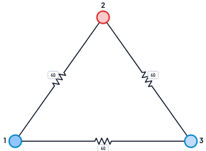
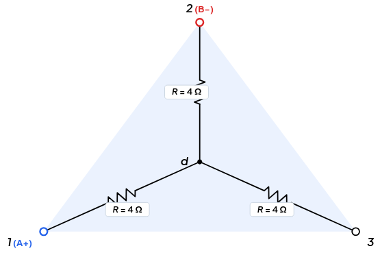
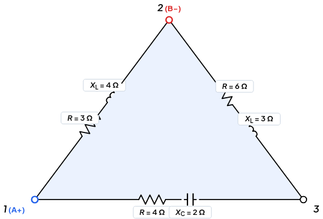
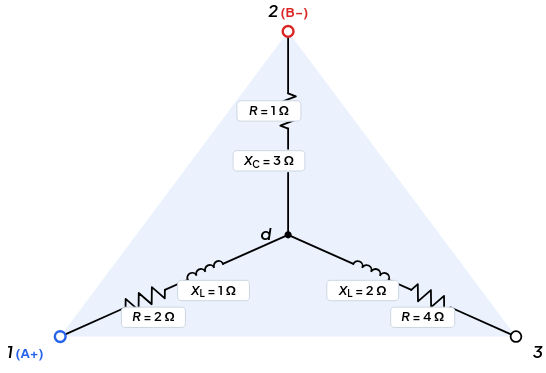
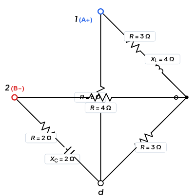
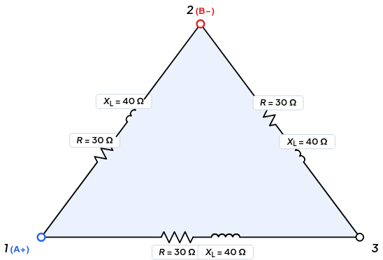
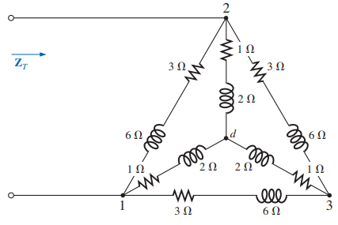

::: {.hero-banner-modern}
# Transformación Bidireccional $\Delta \leftrightarrow \text{Y}$ en CA {.unnumbered}
**Simplificación de redes complejas mediante equivalencia de impedancias en terminales.**

Una red eléctrica puede contener conexiones que no admiten una reducción directa mediante combinaciones de serie y paralelo. Cuando una parte de la red presenta una topología **Delta ($\Delta$)** o **Estrella ($\text{Y}$)**, podemos transformar su representación para obtener una red equivalente que resulte más conveniente para el análisis.
:::

::: {.callout-note}
### ⚡ Idea central

**La transformación $\Delta \leftrightarrow \text{Y}$ no tiene como objetivo cambiar físicamente el circuito.**

Su propósito es **cambiar la representación de una red manteniendo su comportamiento eléctrico visto desde sus terminales**.

$$
\boxed{
\text{Red original}
\;\longrightarrow\;
\text{Transformación equivalente}
\;\longrightarrow\;
\text{Red más fácil de analizar}
}
$$
:::

---

# ¿Qué problema resuelve la transformación $\Delta \leftrightarrow \text{Y}$?

En el análisis de circuitos, muchas redes pueden simplificarse directamente mediante: $Serie \leftrightarrow Paralelo$ 

Sin embargo, existen configuraciones donde estas reglas no pueden aplicarse de manera inmediata. 

- Cuando tres impedancias forman una conexión entre tres nodos en forma de: $\boxed{\Delta}$

- Cuando tres impedancias convergen en un nodo común:$\boxed{\text{Y}}$

En estos casos, una transformación apropiada puede convertir una topología difícil en otra que permita continuar el análisis mediante técnicas más sencillas.

## La idea de fondo

$$
\boxed{
\text{topología difícil}
\;\rightarrow\;
\text{topología equivalente}
\;\rightarrow\;
\text{simplificación}
\;\rightarrow\;
\text{análisis}
}
$$

Por eso, **$\Delta \leftrightarrow \text{Y}$ es una herramienta de simplificación de redes**, no un procedimiento que deba aplicarse automáticamente cada vez que aparezca un triángulo o una estrella.

---

# ¿Qué son las configuraciones $\Delta$ y $\text{Y}$?

## Configuración Delta ($\Delta$)

En una red Delta, tres impedancias están conectadas entre tres pares de terminales:

$$
A-B,\qquad B-C,\qquad C-A
$$



La red forma un lazo cerrado entre tres nodos.

## Configuración Estrella ($\text{Y}$)

En una red Estrella, tres impedancias se conectan a un nodo común:

$$
A-O,\qquad B-O,\qquad C-O
$$



donde $O$ representa el nodo central de la estrella.

::: {.callout-tip}
### No confundir topología con transformación

Una carga puede estar **físicamente conectada** en $\Delta$ o en $\text{Y}$.

Pero una transformación $\Delta \leftrightarrow \text{Y}$ puede utilizarse como **herramienta matemática de análisis**, aunque el circuito físico no se modifique.

Por tanto:

$$
\boxed{
\text{transformar la representación}
\neq
\text{reconstruir físicamente el circuito}
}
$$
:::

---

# ¿Por qué son importantes estas transformaciones?

La importancia de $\Delta \leftrightarrow \text{Y}$ aparece cuando una topología impide utilizar directamente una simplificación conveniente.

Una transformación bien elegida puede convertir:

$$
\boxed{
\text{red que bloquea el análisis}
\rightarrow
\text{red equivalente}
\rightarrow
\text{serie/paralelo}
}
$$

Esto permite continuar posteriormente con otros métodos de análisis, por ejemplo:

- reducción serie-paralelo;
- análisis de nodos;
- análisis de mallas;
- cálculo de impedancia equivalente;
- determinación de corrientes y tensiones.

### Aplicaciones típicas

**Análisis de circuitos:** redes en puente, redes con lazos y otras conexiones de tres terminales que no se reducen directamente.

**Circuitos de corriente alterna:** las ramas pueden tener impedancias complejas,

$$
\mathbf Z=R+jX
$$

por lo que la transformación debe realizarse utilizando álgebra compleja.

**Sistemas trifásicos:** las cargas pueden representarse en $\Delta$ o en $\text{Y}$, y la transformación puede facilitar determinadas etapas del análisis.

::: {.callout-note}
### Idea importante

**$\Delta \leftrightarrow \text{Y}$ no es exclusivamente una técnica de circuitos trifásicos.**

Es una técnica general de equivalencia para redes de **tres terminales** y puede utilizarse tanto con resistencias como con impedancias complejas.
:::

---

# ¿Qué significa que dos redes sean equivalentes?

Esta es la idea conceptual más importante del método.

Consideremos dos redes diferentes conectadas a los mismos tres terminales:

$$
A,\quad B,\quad C
$$

Una red puede tener forma $\Delta$ y la otra forma $\text{Y}$.

Aunque su estructura interna sea diferente, podemos construir una red equivalente si ambas presentan el mismo comportamiento eléctrico visto desde esos terminales.



::: {.callout-important}
### ⚡ Principio de Equivalencia Terminal

Dos redes de tres terminales son equivalentes cuando, para las condiciones de excitación correspondientes aplicadas en sus terminales, presentan la misma relación entre tensiones y corrientes terminales.

En otras palabras:

$$
\boxed{
\text{misma respuesta externa}
\neq
\text{misma estructura interna}
}
$$
:::

Por eso la transformación puede utilizarse sin alterar las magnitudes eléctricas que interesan al análisis externo de la red.

---

# ¿Cuándo se requiere una transformación?

La pregunta correcta no es:

> **¿Hay una $\Delta$ o una $\text{Y}$?**

La pregunta correcta es:

> **¿La transformación me permitirá analizar la red con mayor facilidad?**

Una estrategia útil es:

::: {style="max-width: 460px; margin: 1.5rem auto;"}
```{mermaid}
%%| fig-align: center
%%{init: {
  'theme': 'base',
  'themeVariables': {
    'primaryColor': '#ffffff',
    'primaryTextColor': '#1e293b',
    'primaryBorderColor': '#94a3b8',
    'lineColor': '#64748b',
    'fontSize': '45px',
    'nodePadding': '20px',
    'fontFamily': 'system-ui, -apple-system, sans-serif'
  }
}}%%
flowchart TD
     IN["<div style='padding: 10px 20px;'>⚡ Circuito de estudio</div>"] --> Q1{"¿Admite reducción directa<br>en serie o paralelo?"}
    
    Q1 -- Sí --> T_DY_1[["Reducción Serie / Paralelo"]]
    Q1 -- No --> Q2{"¿Presenta configuración Δ o Y?"}
    
    Q2 -- Sí --> T_DY[["Transformación Δ ↔ Y"]]
    Q2 -- No --> M_GEN["Análisis Sistemático (Mallas o Nodos)"]
    
    T_DY --> CONT(["Continuar simplificación"])
    T_DY_1 --> CONT

    %% Estilos elegantes
    style IN fill:#e9c5f4ff,stroke:#0f17d2a,color:#f8fafc,stroke-width:1px
    style CONT fill:#f0fdf4,stroke:#16a34a,color:#14532d,stroke-width:1.5px
    style Q1 fill:#f8fafc,stroke:#64748b,color:#0f172a,stroke-width:1.5px
    style Q2 fill:#f8fafc,stroke:#64748b,color:#0f172a,stroke-width:1.5px
    style T_DY fill:#eff6ff,stroke:#2563eb,color:#1e40af,stroke-width:1.5px
    style T_DY_1 fill:#eff6ff,stroke:#2563eb,color:#1e40af,stroke-width:1.5px
    
    style M_GEN fill:#f8fafc,stroke:#cbd5e1,color:#64748b,stroke-width:1px
```

:::


::: {.callout-tip}
### Regla de decisión

**No transformes por transformar.**

Transforma cuando la nueva representación permita continuar el análisis de una manera más sencilla, clara o directa.
:::

---

# ¿Cuándo conviene $\Delta \rightarrow \text{Y}$?

La transformación $\Delta \rightarrow \text{Y}$ puede ser conveniente cuando la estrella resultante permite crear combinaciones que antes no eran posibles y, especialmente, cuando facilita una reducción posterior en serie o paralelo.

$$
\boxed{
\Delta
\;\rightarrow\;
\text{Y}
\;\rightarrow\;
\text{serie/paralelo}
}
$$

La elección debe hacerse observando **qué conexiones aparecerán después de la transformación**.

No basta con reconocer la figura: hay que anticipar qué estructura tendrá la red resultante.

---

# ¿Cuándo conviene $\text{Y} \rightarrow \Delta$?

De manera análoga, $\text{Y} \rightarrow \Delta$ puede resultar conveniente cuando la nueva configuración permite establecer combinaciones que antes no eran posibles.

$$
\boxed{
\text{Y}
\;\rightarrow\;
\Delta
\;\rightarrow\;
\text{serie/paralelo o reducción posterior}
}
$$

La dirección de transformación debe elegirse según la **topología completa del circuito**, no únicamente según la forma local de la red.

---

# ¿Cómo se debe abordar un problema $\Delta \leftrightarrow \text{Y}$?

Antes de escribir una sola ecuación, conviene seguir una secuencia de razonamiento.

### Paso 1 — Identificar la red

Localiza los tres terminales y determina si la subred está conectada en:

$$
\Delta
\qquad\text{ó}\qquad
\text{Y}
\qquad\text{ó}\qquad
\text{Mixto ($\Delta$ - Y)}
$$

### Paso 2 — Identificar el objetivo

Pregunta qué necesitas encontrar:

$$
Z_{eq},\quad I,\quad V,\quad P,\quad \text{etc.}
$$

### Paso 3 — Buscar simplificaciones directas

Comprueba primero si la red puede resolverse mediante:

$$
\text{serie}
\qquad\text{o}\qquad
\text{paralelo}
$$

sin transformar nada.

### Paso 4 — Identificar la transformación útil

Si la red no puede reducirse directamente, determina si conviene:

$$
\Delta\rightarrow\text{Y}
$$

o:

$$
\text{Y}\rightarrow\Delta
$$

## Criterios de Decisión en Circuitos Mixtos ($\Delta \text{ — } \text{Y}$)

En problemas avanzados suelen coexistir estructuras $\Delta$ y $\text{Y}$ interactuando simultáneamente (como redes concéntricas o filtros en doble T). En estos casos, la elección de la dirección de transformación obedece a un principio fundamental de simplificación: **la eliminación de nodos interiores para posibilitar asociaciones en paralelo directo**.

### 1. Redes Concéntricas (Delta Exterior con Estrella Interior Conectada al Neutro)

Cuando una red posee una estrella interior cuyos tres terminales convergen en los mismos tres nodos periféricos ($1, 2, 3$) de una delta exterior:

* **Estrategia óptima:** Convertir siempre la **estrella interior a delta ($\text{Y} \to \Delta$)**.
* **Criterio físico y causal:** 
  1. Al transformar la estrella interna ($1-d$, $2-d$, $3-d$), el nodo neutro interno $d$ desaparece del circuito.
  2. Las tres nuevas impedancias resultantes del delta equivalente ($\mathbf{Z}'_{12}, \mathbf{Z}'_{23}, \mathbf{Z}'_{31}$) quedan conectadas exactamente entre los mismos pares de terminales perimétricos $(1-2)$, $(2-3)$ y $(3-1)$.
  3. Cada rama transformada queda **en paralelo estricto** con la rama preexistente del delta original:
     $$\mathbf{Z}_{12,\text{total}} = \mathbf{Z}_{12,\text{orig}} \parallel \mathbf{Z}'_{12,\text{transf}}, \qquad \mathbf{Z}_{23,\text{total}} = \mathbf{Z}_{23,\text{orig}} \parallel \mathbf{Z}'_{23,\text{transf}}, \qquad \mathbf{Z}_{31,\text{total}} = \mathbf{Z}_{31,\text{orig}} \parallel \mathbf{Z}'_{31,\text{transf}}$$
  4. La red completa colapsa instantáneamente en un **único triángulo Delta equivalente** de 3 ramas simples, resoluble de inmediato por asociación serie-paralelo convencional.
* **¿Por qué NO convertir el Delta exterior a Estrella ($\Delta \to \text{Y}$)?**
  Si transformáramos el delta exterior a estrella, se crearía un nuevo nodo central ficticio $d'$, teniendo entonces dos estrellas unidas en los extremos $1, 2, 3$ pero con **dos neutros independientes ($d$ y $d'$)**. Dicha configuración no permite asociar las ramas directamente en paralelo y complica la topología en lugar de simplificarla.

### 2. Redes en Doble T (Estrellas en Paralelo $\to$ Doble $\Pi$ en Paralelo)

En redes de filtrado (como el filtro notch de doble T), dos subredes en T (que son topológicamente dos estrellas con centros neutros $O_1$ y $O_2$) están conectadas en paralelo entre los nodos de entrada ($1$), salida ($2$) y referencia de tierra ($0$):

* **Estrategia óptima:** Transformar **ambas redes $\text{T}$ a su equivalente $\Pi$ ($\text{Y} \to \Delta$)**.
* **Criterio causal:** Al eliminar los nodos intermedios $O_1$ y $O_2$, ambas configuraciones $\Pi$ comparten los mismos tres nodos de frontera exterior ($1, 2, 0$). Los tres brazos homólogos resultan en paralelo dos a dos:
  $$\mathbf{Z}_{A,\text{eq}} = \mathbf{Z}_{A1} \parallel \mathbf{Z}_{A2} \quad (\text{entre 1 y 2})$$
  $$\mathbf{Z}_{B,\text{eq}} = \mathbf{Z}_{B1} \parallel \mathbf{Z}_{B2} \quad (\text{entre 1 y 0})$$
  $$\mathbf{Z}_{C,\text{eq}} = \mathbf{Z}_{C1} \parallel \mathbf{Z}_{C2} \quad (\text{entre 2 y 0})$$
  obteniéndose un único $\Pi$ ($\Delta$) equivalente directamente resoluble.

### Paso 5 — Transformar

Aplica la relación correspondiente a las tres impedancias.

### Paso 6 — Continuar el análisis

La transformación es un **paso intermedio**. Una vez obtenida la red equivalente, continúa con el método que resulte adecuado.

### Paso 7 — Verificar

Comprueba que los resultados sean coherentes con:

- las unidades;
- la magnitud de las impedancias;
- el signo de la reactancia;
- la topología resultante;
- las condiciones originales del circuito.

### Paso 8 — Interpretar

Finalmente, pregunta:

> **¿Qué simplificación conseguí y por qué esta representación es más conveniente?**

::: {.callout-important}
### Cadena de razonamiento

$$
\boxed{
\text{Identificar}
\rightarrow
\text{Decidir}
\rightarrow
\text{Transformar}
\rightarrow
\text{Simplificar}
\rightarrow
\text{Calcular}
\rightarrow
\text{Verificar}
\rightarrow
\text{Interpretar}
}
$$

La transformación no es el final del problema: es una herramienta dentro de una estrategia de análisis.
:::

---

# Topologías y Esquemas de Conexión

La transformación se entiende mejor cuando se observa simultáneamente la estructura original y la estructura equivalente.

## Topología Delta a Estrella (△ → Y)


## Topologia Estrella a Delta (Y → △)


## Topología Puente (△–Y)


## Topología Doble T (Y–△)


## Topología Celosía


## Topología Doble Transformación


---

# Delta–Estrella con impedancias complejas

En corriente alterna, las ramas pueden contener resistencia, inductancia y capacitancia. Por ello, una impedancia puede expresarse como:

$$
\boxed{\mathbf Z = R+jX}
$$

Por ejemplo:

$$
\mathbf Z_R=R
$$

$$
\mathbf Z_L=j\omega L
$$

$$
\mathbf Z_C=\frac{1}{j\omega C}
$$

Por tanto, la transformación $\Delta \leftrightarrow \text{Y}$ debe realizarse con **impedancias complejas**, respetando tanto su parte real como su parte imaginaria.

::: {.callout-note}
### Conexión con el análisis fasorial

La transformación Delta–Estrella no constituye un método separado del análisis fasorial.

Es una operación de redes que utiliza las impedancias obtenidas en el dominio fasorial:

$$
v(t),\,i(t)
\;\longrightarrow\;
\mathbf V,\,\mathbf I
\;\longrightarrow\;
\mathbf Z
\;\longrightarrow\;
\Delta\leftrightarrow\text{Y}
$$

Así, Delta–Estrella se integra naturalmente dentro de la cadena de análisis de circuitos de CA.
:::

---

# Fórmulas de Transformación para Impedancias Complejas

## De Delta a Estrella ($\Delta \to \text{Y}$)

Dado un triángulo formado por las impedancias complejas $\mathbf{Z}_A$ (opuesta al nodo 1), $\mathbf{Z}_B$ (opuesta al nodo 2) y $\mathbf{Z}_C$ (opuesta al nodo 3), definimos la suma de impedancias del delta:

$$
\mathbf{Z}_\Sigma = \mathbf{Z}_A + \mathbf{Z}_B + \mathbf{Z}_C
$$

Las impedancias equivalentes en estrella conectadas a cada nodo $(1, 2, 3)$ hacia el neutro común $O$ son:

$$
\mathbf{Z}_1 = \frac{\mathbf{Z}_B \mathbf{Z}_C}{\mathbf{Z}_\Sigma}, \qquad
\mathbf{Z}_2 = \frac{\mathbf{Z}_A \mathbf{Z}_C}{\mathbf{Z}_\Sigma}, \qquad
\mathbf{Z}_3 = \frac{\mathbf{Z}_A \mathbf{Z}_B}{\mathbf{Z}_\Sigma}
$$

> **Regla mnemotécnica ($\Delta \to \text{Y}$):** Cada rama de la estrella es igual al *producto de las dos impedancias adyacentes del delta* dividido por la *suma total de las tres impedancias del delta*.

---

## De Estrella a Delta ($\text{Y} \to \Delta$)

Dada una estrella con ramas $\mathbf{Z}_1, \mathbf{Z}_2, \mathbf{Z}_3$ conectadas al nodo común neutro $O$, definimos la suma de productos dos a dos:

$$
\Sigma_2 = \mathbf{Z}_1 \mathbf{Z}_2 + \mathbf{Z}_2 \mathbf{Z}_3 + \mathbf{Z}_3 \mathbf{Z}_1
$$

Las impedancias correspondientes del triángulo delta equivalentes son:

$$
\mathbf{Z}_A = \frac{\Sigma_2}{\mathbf{Z}_1}, \qquad
\mathbf{Z}_B = \frac{\Sigma_2}{\mathbf{Z}_2}, \qquad
\mathbf{Z}_C = \frac{\Sigma_2}{\mathbf{Z}_3}
$$

> **Regla mnemotécnica ($\text{Y} \to \Delta$):** Cada impedancia del delta es igual a la *suma de los productos dos a dos de las impedancias de la estrella* dividida entre la *impedancia opuesta de la estrella*.

---

# Caso particular: redes equilibradas

Cuando las tres impedancias de la red son iguales, las expresiones generales se simplifican.

Para una red equilibrada:

$$
\mathbf Z_\Delta = 3\mathbf Z_Y
$$

y, equivalentemente,

$$
\mathbf Z_Y=\frac{\mathbf Z_\Delta}{3}
$$

::: {.callout-warning}
### Atención al contexto

Esta relación es un **caso particular de una red equilibrada**. No debe utilizarse como sustituto de las expresiones generales cuando las tres impedancias son diferentes.
:::

En sistemas trifásicos equilibrados, esta propiedad permite establecer relaciones muy útiles entre las configuraciones $\Delta$ y $\text{Y}$.

---

# Errores Frecuentes en la Conversión $\Delta \leftrightarrow \text{Y}$

1. **Confusión entre la transformación de redes y las relaciones de línea/fase:** transformar una subred de impedancias $\Delta \leftrightarrow \text{Y}$ no equivale automáticamente a aplicar relaciones de tensión y corriente de un sistema trifásico.

2. **Aplicación indiscriminada de fórmulas puramente resistivas:** en CA, todas las operaciones involucran **números complejos** $\mathbf{Z}=R+jX$. Sumar solo las partes reales u omitir los signos en reactancias inductivas ($+j$) o capacitivas ($-j$) produce resultados erróneos.

3. **Desbalance de impedancias:** cuando las tres ramas no son iguales, deben utilizarse las relaciones generales de transformación elemento por elemento.

4. **Ignorar el nodo neutro ficticio en Estrella:** en la configuración $\text{Y}$ aparece un nodo central que no existía en el $\Delta$. Dicho nodo tiene un potencial eléctrico definido y no debe confundirse con la referencia de tierra salvo que esté expresamente conectado a ella.

5. **Elegir la transformación sin observar la red completa:** una transformación matemáticamente válida puede no ser la más conveniente para resolver el problema.

---

# Ejercicios Resueltos

Los siguientes ejercicios cubren los seis casos típicos que aparecen en un curso de Circuitos Eléctricos. Cada uno incluye el **netlist equivalente** para que puedas verificar el resultado en el módulo interactivo que aparece más adelante.

## Ejercicio 1 — Delta a Estrella (resistivo equilibrado)

:::: {.columns}

::: {.column width="50%"}
**Enunciado.** Una red Delta está formada por tres resistencias iguales $\mathbf{Z}_A=\mathbf{Z}_B=\mathbf{Z}_C=6\,\Omega$. Determinar la estrella equivalente.
:::

::: {.column width="50%"}
{width=100% fig-align="center"}
:::

::::


**Solución.** Como es equilibrado, $\mathbf{Z}_\Sigma = 18\,\Omega$:

$$
\mathbf{Z}_1 = \mathbf{Z}_2 = \mathbf{Z}_3 = \frac{6 \cdot 6}{18} = 2\,\Omega
$$

**Resultado.** Estrella equivalente equilibrada con ramas $\mathbf{Z}_1 = \mathbf{Z}_2 = \mathbf{Z}_3 = 2\,\Omega$.

**Verificación con la regla del caso equilibrado.** $\mathbf{Z}_Y = \frac{\mathbf{Z}_\Delta}{3} = \frac{6}{3} = 2\,\Omega$. ✓

::: {.callout-note collapse="false"}
### 💡 Interpretación de Resultados y Comparación con el Solver

¿Por qué la respuesta analítica es **$2\,\Omega$** pero el solver reporta **$Z_T = 4\,\Omega$**?

* **Impedancia por Rama ($\mathbf{Z}_Y = 2\,\Omega$):** Corresponde al valor interno de cada uno de los tres brazos individuales de la estrella ($\mathbf{Z}_1, \mathbf{Z}_2, \mathbf{Z}_3$) que convergen en el nuevo nodo neutro central $N$.
* **Impedancia Terminal del Solver ($Z_T = 4\,\Omega$):** El solver siempre mide la **Impedancia Equivalente Total entre dos bornes externos específicos** (Terminal **A = 1** y Terminal **B = 2**).

**Comprobación de la equivalencia física exterior:**

1. **Visto desde la Estrella resultante:** Al medir entre los terminales 1 y 2, la corriente entra por la rama $\mathbf{Z}_1$ ($2\,\Omega$) hacia el neutro y sale por $\mathbf{Z}_2$ ($2\,\Omega$). Como la rama $\mathbf{Z}_3$ queda en circuito abierto, ambas ramas quedan en **serie**:
   $$Z_T(1,2) = \mathbf{Z}_1 + \mathbf{Z}_2 = 2\,\Omega + 2\,\Omega = \mathbf{4\,\Omega}$$
2. **Visto desde el Delta original:** Entre los terminales 1 y 2 existe una resistencia directa de $6\,\Omega$ en **paralelo** con la trayectoria formada por los lados 1–3 y 3–2 ($6\,\Omega + 6\,\Omega = 12\,\Omega$):
   $$Z_T(1,2) = 6\,\Omega \parallel (6\,\Omega + 6\,\Omega) = \frac{6 \cdot 12}{6 + 12} = \frac{72}{18} = \mathbf{4\,\Omega}$$

> **Conclusión clave:** La transformación $\Delta \leftrightarrow \text{Y}$ **no altera la impedancia global que percibe una fuente exterior**, sino que reorganiza la topología interna para permitir reducciones en serie y paralelo directas.
:::

**Netlist para verificar en el solver:**

```text
1 2 6 0
2 3 6 0
1 3 6 0
```
*(Configurar **Terminal A = 1** y **Terminal B = 2** para comprobar $Z_T = 4\,\Omega$)*.


## Ejercicio 2 — Estrella a Delta (resistivo equilibrado)


:::: {.columns}

::: {.column width="50%"}
**Enunciado.** Una estrella tiene $\mathbf{Z}_1 = \mathbf{Z}_2 = \mathbf{Z}_3 = 4\,\Omega$. Encontrar el delta equivalente.
:::

::: {.column width="50%"}
{width=100% fig-align="center"}
:::

::::

**Solución.**

$$
\Sigma_2 = 4\cdot 4 + 4\cdot 4 + 4\cdot 4 = 48\,\Omega^2
$$

$$
\mathbf{Z}_A = \mathbf{Z}_B = \mathbf{Z}_C = \frac{48}{4} = 12\,\Omega
$$

**Resultado.** Delta equivalente con ramas $\mathbf{Z}_A = \mathbf{Z}_B = \mathbf{Z}_C = 12\,\Omega$.

**Verificación con la regla del caso equilibrado.** $\mathbf{Z}_\Delta = 3 \cdot \mathbf{Z}_Y = 3 \cdot 4 = 12\,\Omega$. ✓

::: {.callout-note collapse="false"}
### 💡 Interpretación de Resultados y Comparación con el Solver

* **Impedancia de cada rama del Delta resultante:** $\mathbf{Z}_\Delta = 12\,\Omega$.
* **Impedancia Terminal del Solver ($Z_T$ entre bornes 1 y 2):**
  * **Desde la Estrella original ($4\,\Omega$ por rama):** La corriente recorre en serie $\mathbf{Z}_1$ y $\mathbf{Z}_2$, dando $Z_T(1,2) = 4\,\Omega + 4\,\Omega = \mathbf{8\,\Omega}$.
  * **Desde el Delta equivalente ($12\,\Omega$ por lado):** El lado directo 1–2 ($12\,\Omega$) queda en paralelo con los otros dos lados en serie ($12 + 12 = 24\,\Omega$):
    $$Z_T(1,2) = 12\,\Omega \parallel 24\,\Omega = \frac{12 \cdot 24}{12 + 24} = \frac{288}{36} = \mathbf{8\,\Omega}$$
:::

**Netlist para verificar en el solver:**

```text
1 d 4 0
2 d 4 0
3 d 4 0
```
*(Configurar **Terminal A = 1** y **Terminal B = 2** para comprobar $Z_T = 8\,\Omega$)*.

---

## Ejercicio 3 — Delta a Estrella (impedancias complejas)

:::: {.columns}

::: {.column width="50%"}
**Enunciado.** Convertir una red en delta formada por tres impedancias complejas desequilibradas: $\mathbf{Z}_A = 6 + j3\,\Omega$ (entre terminales 2–3), $\mathbf{Z}_B = 4 - j2\,\Omega$ (entre terminales 1–3) y $\mathbf{Z}_C = 3 + j4\,\Omega$ (entre terminales 1–2), a su estrella equivalente ($\mathbf{Z}_1, \mathbf{Z}_2, \mathbf{Z}_3$).
:::

::: {.column width="50%"}
{width=100% fig-align="center"}
:::

::::

**Solución.** Calculamos primero la suma fasorial de las tres impedancias del delta $\mathbf{Z}_\Sigma$:

$$
\mathbf{Z}_\Sigma = \mathbf{Z}_A + \mathbf{Z}_B + \mathbf{Z}_C = (6 + j3) + (4 - j2) + (3 + j4) = 13 + j5\,\Omega
$$

Aplicando la regla de transformación $\Delta \to \text{Y}$ (producto de las ramas adyacentes dividido entre la suma total $\mathbf{Z}_\Sigma$):

$$
\mathbf{Z}_1 = \frac{\mathbf{Z}_B \cdot \mathbf{Z}_C}{\mathbf{Z}_\Sigma} = \frac{(4 - j2)(3 + j4)}{13 + j5} = \frac{20 + j10}{13 + j5} = \frac{(20 + j10)(13 - j5)}{194} \approx 1.598 + j0.155\,\Omega \approx 1.605\,\angle\,5.53^\circ\,\Omega
$$

$$
\mathbf{Z}_2 = \frac{\mathbf{Z}_A \cdot \mathbf{Z}_C}{\mathbf{Z}_\Sigma} = \frac{(6 + j3)(3 + j4)}{13 + j5} = \frac{6 + j33}{13 + j5} = \frac{(6 + j33)(13 - j5)}{194} \approx 1.253 + j2.057\,\Omega \approx 2.408\,\angle\,58.66^\circ\,\Omega
$$

$$
\mathbf{Z}_3 = \frac{\mathbf{Z}_A \cdot \mathbf{Z}_B}{\mathbf{Z}_\Sigma} = \frac{(6 + j3)(4 - j2)}{13 + j5} = \frac{30 + j0}{13 + j5} = \frac{30(13 - j5)}{194} \approx 2.010 - j0.773\,\Omega \approx 2.154\,\angle\,-21.04^\circ\,\Omega
$$

**Resultado.** Estrella equivalente con ramas conectadas al nuevo neutro central $N$:
$\mathbf{Z}_1 \approx 1.598 + j0.155\,\Omega$, $\mathbf{Z}_2 \approx 1.253 + j2.057\,\Omega$, $\mathbf{Z}_3 \approx 2.010 - j0.773\,\Omega$.

::: {.callout-note collapse="false"}
### 💡 Interpretación de Resultados y Comparación con el Solver

¿Qué relación existe entre las impedancias de rama calculadas y la impedancia terminal $Z_T$ que mide el solver entre los bornes 1 y 2?

* **Impedancias de rama ($\mathbf{Z}_1, \mathbf{Z}_2, \mathbf{Z}_3$):** Representan los brazos individuales conectados desde cada terminal exterior (1, 2 y 3) hacia el nodo neutro ficticio interior $N$.
* **Impedancia Terminal del Solver ($Z_T$ entre bornes 1 y 2):**

1. **Visto desde la Estrella resultante:** Al medir entre los terminales 1 y 2, la corriente fluye en serie a través de las ramas $\mathbf{Z}_1$ y $\mathbf{Z}_2$ (la rama $\mathbf{Z}_3$ queda en circuito abierto al no haber retorno por ella):
   $$Z_T(1,2) = \mathbf{Z}_1 + \mathbf{Z}_2 = (1.598 + j0.155) + (1.253 + j2.057) = \mathbf{2.851 + j2.211\,\Omega} \approx 3.608\,\angle\,37.80^\circ\,\Omega$$

2. **Visto desde el Delta original:** La rama directa entre los terminales 1 y 2 ($\mathbf{Z}_C = 3 + j4\,\Omega$) se encuentra en paralelo con la trayectoria serie formada por $\mathbf{Z}_A$ y $\mathbf{Z}_B$ ($6+j3 + 4-j2 = 10+j1\,\Omega$):
   $$Z_T(1,2) = \mathbf{Z}_C \parallel (\mathbf{Z}_A + \mathbf{Z}_B) = \frac{(3+j4)(10+j1)}{13+j5} = \frac{26+j43}{13+j5} = \mathbf{2.851 + j2.211\,\Omega}$$

> **Conclusión clave:** Aunque las impedancias de rama contienen partes reactivas inductivas y capacitivas desbalanceadas, la impedancia terminal exterior es estrictamente invariable entre ambas topologías.
:::

**Netlist para verificar en el solver:**

```text
# Delta original (Terminal A = 1, Terminal B = 2)
1 2 3 4
2 3 6 3
1 3 4 -2
```
*(Configurar **Terminal A = 1** y **Terminal B = 2** para comprobar $Z_T \approx 2.851 + j2.211\,\Omega$ | Módulo $\approx 3.61\,\Omega$)*.

---

## Ejercicio 4 — Estrella a Delta (impedancias complejas)

:::: {.columns}

::: {.column width="50%"}
**Enunciado.** Convertir una red en estrella con impedancias por rama $\mathbf{Z}_1 = 2 + j1\,\Omega$, $\mathbf{Z}_2 = 1 - j3\,\Omega$ y $\mathbf{Z}_3 = 4 + j2\,\Omega$ (unidas en el neutro central $N$) a su delta equivalente ($\mathbf{Z}_A, \mathbf{Z}_B, \mathbf{Z}_C$).
:::

::: {.column width="50%"}
{width=100% fig-align="center"}
:::

::::

**Solución.** Calculamos primero los tres productos dos a dos y su suma fasorial $\Sigma_2$:

$$
\mathbf{Z}_1\mathbf{Z}_2 = (2 + j1)(1 - j3) = 2 - j6 + j1 + 3 = 5 - j5\,\Omega^2
$$

$$
\mathbf{Z}_2\mathbf{Z}_3 = (1 - j3)(4 + j2) = 4 + j2 - j12 + 6 = 10 - j10\,\Omega^2
$$

$$
\mathbf{Z}_3\mathbf{Z}_1 = (4 + j2)(2 + j1) = 8 + j4 + j4 - 2 = 6 + j8\,\Omega^2
$$

$$
\Sigma_2 = (5 - j5) + (10 - j10) + (6 + j8) = 21 - j7\,\Omega^2
$$

Aplicando la transformación $\text{Y} \to \Delta$ (suma de productos dos a dos dividida entre la impedancia opuesta):

$$
\mathbf{Z}_A = \frac{\Sigma_2}{\mathbf{Z}_1} = \frac{21 - j7}{2 + j1} = \frac{(21 - j7)(2 - j1)}{5} = \frac{35 - j35}{5} = 7 - j7\,\Omega \approx 9.899\,\angle\,-45.00^\circ\,\Omega
$$

$$
\mathbf{Z}_B = \frac{\Sigma_2}{\mathbf{Z}_2} = \frac{21 - j7}{1 - j3} = \frac{(21 - j7)(1 + j3)}{10} = \frac{42 + j56}{10} = 4.2 + j5.6\,\Omega \approx 7.000\,\angle\,53.13^\circ\,\Omega
$$

$$
\mathbf{Z}_C = \frac{\Sigma_2}{\mathbf{Z}_3} = \frac{21 - j7}{4 + j2} = \frac{(21 - j7)(4 - j2)}{20} = \frac{70 - j70}{20} = 3.5 - j3.5\,\Omega \approx 4.950\,\angle\,-45.00^\circ\,\Omega
$$

**Resultado.** Delta equivalente con ramas:
$\mathbf{Z}_A = 7 - j7\,\Omega$ (entre terminales 2–3), $\mathbf{Z}_B = 4.2 + j5.6\,\Omega$ (entre terminales 1–3), $\mathbf{Z}_C = 3.5 - j3.5\,\Omega$ (entre terminales 1–2).

::: {.callout-note collapse="false"}
### 💡 Interpretación de Resultados y Comparación con el Solver

* **Impedancia Terminal del Solver ($Z_T$ entre bornes 1 y 2):**
  * **Desde la Estrella original:** La corriente entra por el terminal 1 hacia el nodo neutro a través de $\mathbf{Z}_1$ y retorna por el terminal 2 a través de $\mathbf{Z}_2$ en **serie**:
    $$Z_T(1,2) = \mathbf{Z}_1 + \mathbf{Z}_2 = (2 + j1) + (1 - j3) = \mathbf{3 - j2\,\Omega} \approx 3.606\,\angle\,-33.69^\circ\,\Omega$$
  * **Desde el Delta equivalente:** El lado directo entre 1 y 2 ($\mathbf{Z}_C = 3.5 - j3.5\,\Omega$) queda en **paralelo** con la rama formada por $\mathbf{Z}_A + \mathbf{Z}_B = (7-j7) + (4.2+j5.6) = 11.2 - j1.4\,\Omega$:
    $$Z_T(1,2) = \mathbf{Z}_C \parallel (\mathbf{Z}_A + \mathbf{Z}_B) = \frac{(3.5 - j3.5)(11.2 - j1.4)}{(3.5 - j3.5) + (11.2 - j1.4)} = \frac{34.3 - j44.1}{14.7 - j4.9} = \mathbf{3 - j2\,\Omega}$$

> **Conclusión clave:** La reducción produce la misma impedancia fasorial exacta en ambos casos ($3 - j2\,\Omega$, comportamiento capacitivo neto), ratificando la conservación de admitancias de transferencia entre nodos externos.
:::

**Netlist para verificar en el solver:**

```text
# Estrella original (nodo central neutro = d)
1 d 2 1
2 d 1 -3
3 d 4 2
```
*(Configurar **Terminal A = 1** y **Terminal B = 2** para comprobar $Z_T = 3 - j2\,\Omega$ | Módulo $\approx 3.61\,\Omega$)*.

---

## Ejercicio 5 — Red en Puente desbalanceada con reactancias

:::: {.columns}

::: {.column width="50%"}
**Enunciado.** Un circuito en puente de cinco impedancias tiene terminales exteriores $A$ y $B$, y ramas internas:
$\mathbf{Z}_{AC} = 3 + j4\,\text{k}\Omega$, $\mathbf{Z}_{AD} = 6\,\text{k}\Omega$, $\mathbf{Z}_{CB} = 4\,\text{k}\Omega$, $\mathbf{Z}_{DB} = 2 - j2\,\text{k}\Omega$ y rama transversal central $\mathbf{Z}_{CD} = 3\,\text{k}\Omega$.
Determinar la impedancia equivalente total $\mathbf{Z}_{eq}$ vista entre los terminales $A$ y $B$.
:::

::: {.column width="50%"}
{width=80% fig-align="center"}
:::

::::

**Solución.** La presencia de la impedancia central $\mathbf{Z}_{CD}$ impide cualquier agrupación directa en serie o paralelo. Transformamos el lazo en delta formado por los nodos $A-C-D$ a una estrella equivalente con ramas $\mathbf{Z}_A', \mathbf{Z}_C', \mathbf{Z}_D'$ unidas en un nuevo nodo central $N$.

Suma de impedancias del lazo delta $A-C-D$:

$$
\mathbf{Z}_\Sigma = \mathbf{Z}_{AC} + \mathbf{Z}_{AD} + \mathbf{Z}_{CD} = (3 + j4) + 6 + 3 = 12 + j4\,\text{k}\Omega
$$

Ramas de la estrella equivalente:

$$
\mathbf{Z}_A' = \frac{\mathbf{Z}_{AC} \cdot \mathbf{Z}_{AD}}{\mathbf{Z}_\Sigma} = \frac{(3 + j4)\cdot 6}{12 + j4} = \frac{18 + j24}{12 + j4} = \frac{(18 + j24)(12 - j4)}{160} = 1.950 + j1.350\,\text{k}\Omega
$$

$$
\mathbf{Z}_C' = \frac{\mathbf{Z}_{AC} \cdot \mathbf{Z}_{CD}}{\mathbf{Z}_\Sigma} = \frac{(3 + j4)\cdot 3}{12 + j4} = \frac{9 + j12}{12 + j4} = \frac{(9 + j12)(12 - j4)}{160} = 0.975 + j0.675\,\text{k}\Omega
$$

$$
\mathbf{Z}_D' = \frac{\mathbf{Z}_{AD} \cdot \mathbf{Z}_{CD}}{\mathbf{Z}_\Sigma} = \frac{6 \cdot 3}{12 + j4} = \frac{18}{12 + j4} = \frac{18(12 - j4)}{160} = 1.350 - j0.450\,\text{k}\Omega
$$

Una vez sustituido el delta por la estrella, la red se reduce a dos ramas en serie que se combinan en paralelo hacia el borne $B$:

- **Rama superior ($N \to C \to B$):**
  $$\mathbf{Z}_{NCB} = \mathbf{Z}_C' + \mathbf{Z}_{CB} = (0.975 + j0.675) + 4 = 4.975 + j0.675\,\text{k}\Omega$$
- **Rama inferior ($N \to D \to B$):**
  $$\mathbf{Z}_{NDB} = \mathbf{Z}_D' + \mathbf{Z}_{DB} = (1.350 - j0.450) + (2 - j2) = 3.350 - j2.450\,\text{k}\Omega$$

Combinación en paralelo de ambas trayectorias:

$$
\mathbf{Z}_{par} = \mathbf{Z}_{NCB} \parallel \mathbf{Z}_{NDB} = \frac{(4.975 + j0.675)(3.350 - j2.450)}{(4.975 + j0.675) + (3.350 - j2.450)} \approx 2.348 - j0.692\,\text{k}\Omega
$$

Impedancia total entre bornes $A$ y $B$ (sumando en serie $\mathbf{Z}_A'$):

$$
\mathbf{Z}_{eq} = \mathbf{Z}_A' + \mathbf{Z}_{par} = (1.950 + j1.350) + (2.348 - j0.692) = \mathbf{4.298 + j0.658\,\text{k}\Omega}
$$

En forma polar:

$$
\boxed{\mathbf{Z}_{eq} \approx 4.348\,\angle\,8.71^\circ\,\text{k}\Omega}
$$

**Resultado.** La impedancia equivalente entre los bornes de entrada del puente es $\mathbf{Z}_{AB} \approx 4.298 + j0.658\,\text{k}\Omega$ ($\approx 4.348\,\angle\,8.71^\circ\,\text{k}\Omega$).

::: {.callout-note collapse="false"}
### 💡 Interpretación de Resultados y Comparación con el Solver

* **Desbalance del puente:** Debido a que los productos cruzados $\mathbf{Z}_{AC}\mathbf{Z}_{DB} \neq \mathbf{Z}_{AD}\mathbf{Z}_{CB}$, el puente está desbalanceado y por la rama transversal central $C-D$ circula corriente neta.
* **Resolución mediante el Solver Nodal:** El solver formula la matriz de admitancias nodales $[\mathbf{Y}][\mathbf{V}] = [\mathbf{I}]$ de la topología completa sin necesidad de simplificaciones topológicas manuales.
* **Coincidencia matemática:**
  * Al ingresar el netlist completo de 5 elementos en el solver entre los terminales **1 ($A$)** y **2 ($B$)**, el solver reporta exactamente $Z_T \approx 4.298 + j0.658\,\text{k}\Omega$, ratificando la exactitud de la transformación $\Delta \to \text{Y}$.
:::

**Netlist para verificar en el solver:**

```text
# Terminal A = 1, Terminal B = 2, Nodos internos = c, d
1 c 3 4
1 d 6 0
c 2 4 0
d 2 2 -2
c d 3 0
```
*(Configurar **Terminal A = 1** y **Terminal B = 2** para comprobar $Z_T \approx 4.298 + j0.658\,\text{k}\Omega$ | Módulo $\approx 4.35\,\text{k}\Omega$)*.

---

## Ejercicio 6 — Aplicación: Transformación de carga trifásica y cálculo de línea

:::: {.columns}

::: {.column width="50%"}
**Enunciado.** Una carga trifásica equilibrada conectada en delta presenta una impedancia por fase de $\mathbf{Z}_\Delta = 30 + j40\,\Omega$. Se desea representarla como una estrella equivalente ($\text{Y}$) para conectarla a una red trifásica equilibrada de $V_L = 380\,\text{V}$ (tensión de línea eficaz) a $50\,\text{Hz}$.
:::

::: {.column width="50%"}
{width=100% fig-align="center"}
:::

::::
Determinar:

(a) La impedancia por fase de la estrella equivalente ($\mathbf{Z}_Y$).
(b) La tensión de fase ($V_F$), la corriente de línea ($I_L$) y el factor de potencia ($\text{FP}$) de la carga.

**Solución.**

**(a) Impedancia de fase equivalente en estrella:**
Al ser una red trifásica equilibrada, aplicamos la relación simplificada $\mathbf{Z}_Y = \mathbf{Z}_\Delta / 3$:

$$
\mathbf{Z}_Y = \frac{\mathbf{Z}_\Delta}{3} = \frac{30 + j40}{3} = 10 + j13.333\,\Omega
$$

En forma polar:

$$
|\mathbf{Z}_Y| = \sqrt{10^2 + (13.333)^2} \approx 16.667\,\Omega, \qquad \theta = \arctan\left(\frac{13.333}{10}\right) \approx 53.13^\circ
$$

$$
\mathbf{Z}_Y \approx 16.667\,\angle\,53.13^\circ\,\Omega
$$

**(b) Tensión de fase, corriente de línea y factor de potencia:**
Para un sistema conectado en estrella con tensión de línea $V_L = 380\,\text{V}$:

$$
V_F = \frac{V_L}{\sqrt{3}} = \frac{380}{\sqrt{3}} \approx 219.39\,\text{V}
$$

En la configuración en estrella, la corriente de línea es idéntica a la corriente de fase ($I_L = I_F$):

$$
I_L = \frac{V_F}{|\mathbf{Z}_Y|} = \frac{219.39\,\text{V}}{16.667\,\Omega} \approx \mathbf{13.16\,\text{A}}
$$

El factor de potencia de la carga:

$$
\text{FP} = \cos\theta = \frac{R_Y}{|\mathbf{Z}_Y|} = \frac{10}{16.667} = \mathbf{0.60} \quad (\text{inductivo})
$$

Potencia activa total trifásica consumida:

$$
P_T = \sqrt{3} \cdot V_L \cdot I_L \cdot \cos\varphi = \sqrt{3} \cdot 380 \cdot 13.163 \cdot 0.60 \approx \mathbf{5198\,\text{W}} \approx 5.20\,\text{kW}
$$

**Resultado.** Estrella equivalente equilibrada con ramas $\mathbf{Z}_Y = 10 + j13.333\,\Omega$, corriente de línea $I_L \approx 13.16\,\text{A}$ y factor de potencia $0.60$ inductivo.

::: {.callout-note collapse="false"}
### 💡 Interpretación de Resultados y Comparación con el Solver

¿Qué mide el solver si ingresamos la carga trifásica en delta completa entre dos terminales de fase (por ejemplo, entre fase 1 y fase 2)?

* **Impedancia Terminal entre dos fases ($Z_T(1,2)$):**
  * **Visto desde la Estrella equivalente:** La corriente entra por la fase 1 hacia el neutro central $N$ y sale por la fase 2; ambas ramas $\mathbf{Z}_Y$ quedan en **serie**:
    $$Z_T(1,2) = \mathbf{Z}_1 + \mathbf{Z}_2 = 2 \cdot \mathbf{Z}_Y = 2 \cdot (10 + j13.333) = \mathbf{20 + j26.67\,\Omega} \approx 33.33\,\angle\,53.13^\circ\,\Omega$$
  * **Visto desde el Delta original:** La rama directa entre 1 y 2 ($30 + j40\,\Omega$) queda en **paralelo** con las otras dos ramas en serie ($60 + j80\,\Omega$):
    $$Z_T(1,2) = \frac{\mathbf{Z}_\Delta \cdot 2\mathbf{Z}_\Delta}{3\mathbf{Z}_\Delta} = \frac{2}{3}\mathbf{Z}_\Delta = \frac{2}{3}(30 + j40) = \mathbf{20 + j26.67\,\Omega}$$

> **Conclusión clave:** La transformación $\Delta \to \text{Y}$ preserva la potencia total activa y reactiva consumida por la instalación trifásica sin alterar las magnitudes de línea.
:::

**Netlist para verificar en el solver:**

```text
# Carga trifásica completa en Delta (Fases 1, 2, 3)
1 2 30 40
2 3 30 40
1 3 30 40
```
*(Configurar **Terminal A = 1** y **Terminal B = 2** para comprobar $Z_T = 20 + j26.67\,\Omega$ | Módulo $\approx 33.33\,\Omega$)*.

O alternativamente, verificar **una sola fase** de la estrella equivalente:
```text
# Rama monofásica de fase a neutro
1 n 10 13.33
```
*(Configurar **Terminal A = 1** y **Terminal B = n** para comprobar $Z_Y = 10 + j13.33\,\Omega$ | Módulo $\approx 16.67\,\Omega$)*.

---

## Ejercicio 7 — Red Mixta Concéntrica Delta–Estrella en Paralelo (Ejemplo 17.21)

:::: {.columns}

::: {.column width="50%"}
**Enunciado.** Para la red mixta mostrada en la figura, compuesta por una red Delta exterior formada por los nodos $1, 2, 3$ con impedancias $\mathbf{Z}_\Delta = 3 + j6\,\Omega$ por rama ($R = 3\,\Omega, X_L = 6\,\Omega$), en paralelo con una red Estrella interior conectada al nodo neutro central $d$ con impedancias $\mathbf{Z}_Y = 1 + j2\,\Omega$ por rama ($R = 1\,\Omega, X_L = 2\,\Omega$):

Determinar la impedancia total de entrada $\mathbf{Z}_T$ vista desde los terminales $1$ y $2$.
:::

::: {.column width="50%"}
{width=85% fig-align="center"}
:::

::::

**Estrategia y Criterio de Selección:**

1. **Identificación topológica:** La red posee dos subredes acopladas a los mismos tres nodos perimétricos ($1, 2, 3$): una delta exterior ($\mathbf{Z}_{12}, \mathbf{Z}_{23}, \mathbf{Z}_{31}$) y una estrella interior ($\mathbf{Z}_{1d}, \mathbf{Z}_{2d}, \mathbf{Z}_{3d}$).
2. **Criterio de transformación ($\text{Y} \to \Delta$):** Si transformamos la estrella interior a delta, el nodo neutro interior $d$ desaparece del circuito. Los tres nuevos brazos equivalentes $\mathbf{Z}'_{12}, \mathbf{Z}'_{23}, \mathbf{Z}'_{31}$ conectan directamente entre los mismos pares de nodos perimétricos $(1-2, 2-3, 3-1)$, quedando en **estricto paralelo directo** con las ramas originales del delta exterior.

**Solución paso a paso:**

**Paso 1 — Transformación $\text{Y} \to \Delta$ de la estrella interior:**
Al ser una estrella simétrica equilibrada con $\mathbf{Z}_Y = 1 + j2\,\Omega$, aplicamos la relación del caso equilibrado $\mathbf{Z}'_\Delta = 3\mathbf{Z}_Y$:

$$
\mathbf{Z}'_\Delta = 3(1 + j2) = 3 + j6\,\Omega
$$

*(O mediante la fórmula general $\Sigma_2 / \mathbf{Z}_Y$: $\Sigma_2 = 3(1+j2)^2 = 3(-3+j4) = -9+j12\,\Omega^2 \implies \mathbf{Z}'_\Delta = \frac{-9+j12}{1+j2} = 3+j6\,\Omega$)*.

**Paso 2 — Fusión en paralelo con la delta exterior original:**
Cada rama del delta transformado $\mathbf{Z}'_\Delta$ queda en paralelo con la rama correspondiente de la delta exterior $\mathbf{Z}_\Delta = 3 + j6\,\Omega$:

$$
\mathbf{Z}_{12,\text{eq}} = \mathbf{Z}_{12} \parallel \mathbf{Z}'_{12} = (3 + j6) \parallel (3 + j6) = \frac{3 + j6}{2} = 1.5 + j3\,\Omega
$$

$$
\mathbf{Z}_{23,\text{eq}} = \mathbf{Z}_{23} \parallel \mathbf{Z}'_{23} = (3 + j6) \parallel (3 + j6) = 1.5 + j3\,\Omega
$$

$$
\mathbf{Z}_{31,\text{eq}} = \mathbf{Z}_{31} \parallel \mathbf{Z}'_{31} = (3 + j6) \parallel (3 + j6) = 1.5 + j3\,\Omega
$$

La red completa se reduce a un **único triángulo Delta equivalente equilibrado** con ramas de $\mathbf{Z}_{\text{eq}} = 1.5 + j3\,\Omega$.

**Paso 3 — Cálculo de la impedancia total $\mathbf{Z}_T$ entre los bornes 1 y 2:**
Visto desde los terminales $1$ y $2$, la rama directa $1–2$ ($\mathbf{Z}_{12,\text{eq}} = 1.5 + j3\,\Omega$) queda en paralelo con la trayectoria en serie formada por los lados $1–3$ y $3–2$ ($\mathbf{Z}_{31,\text{eq}} + \mathbf{Z}_{23,\text{eq}} = (1.5+j3) + (1.5+j3) = 3 + j6\,\Omega$):

$$
\mathbf{Z}_T = \mathbf{Z}_{12,\text{eq}} \parallel (\mathbf{Z}_{31,\text{eq}} + \mathbf{Z}_{23,\text{eq}}) = (1.5 + j3) \parallel (3 + j6)
$$

$$
\mathbf{Z}_T = \frac{(1.5 + j3)(3 + j6)}{(1.5 + j3) + (3 + j6)} = \frac{2}{3}(1.5 + j3) = \mathbf{1 + j2\,\Omega}
$$

En forma polar:

$$
\boxed{\mathbf{Z}_T = 1 + j2\,\Omega = \sqrt{1^2 + 2^2}\,\angle\,\arctan(2) \approx 2.236\,\angle\,63.43^\circ\,\Omega}
$$

**Resultado.** La impedancia equivalente total entre los terminales 1 y 2 es $\mathbf{Z}_T = 1 + j2\,\Omega$ ($2.236\,\angle\,63.43^\circ\,\Omega$).

::: {.callout-note collapse="false"}
### 💡 Interpretación de Resultados y Comparación con el Solver

* **Por qué el resultado final es $1 + j2\,\Omega$:** Observe la notable simetría: dos redes idénticas en delta de $3 + j6\,\Omega$ en paralelo forman un delta equivalente de $1.5 + j3\,\Omega$. La impedancia terminal de cualquier delta equilibrado entre dos bornes es exactamente $\frac{2}{3}\mathbf{Z}_\Delta$:
  $$Z_T = \frac{2}{3}(1.5 + j3\,\Omega) = 1 + j2\,\Omega$$
* **Verificación en el Solver Nodal:** Al introducir las 6 ramas (3 del delta exterior y 3 de la estrella interior unidas en el nodo $d$), el solver calcula exactamente $Z_T = 1 + j2\,\Omega$ ($2.236\,\angle\,63.43^\circ\,\Omega$), confirmando la equivalencia topológica.
:::

**Netlist para verificar en el solver:**

```text
# Delta exterior (Ramas 1-2, 2-3, 3-1)
1 2 3 6
2 3 3 6
1 3 3 6
# Estrella interior conectada a d (Ramas 1-d, 2-d, 3-d)
1 d 1 2
2 d 1 2
3 d 1 2
```
*(Configurar **Terminal A = 1** y **Terminal B = 2** para comprobar $Z_T = 1 + j2\,\Omega$ | Módulo $\approx 2.24\,\Omega$)*.

---

## Ejercicio 8 — Red en Doble T (Estrellas en Paralelo a Doble $\Pi$ Equivalente)

:::: {.columns}

::: {.column width="50%"}
**Enunciado.** Para la red en doble T (filtro notch en paralelo) conectada entre los terminales de entrada $A$ (nodo 1), salida $B$ (nodo 2) y tierra (nodo 0), con los siguientes valores de impedancia en cada una de sus dos estrellas:

* **T superior (Estrella 1 con centro en $O_1$):** $\mathbf{Z}_1 = 2\,\Omega$, $\mathbf{Z}_2 = 2\,\Omega$, $\mathbf{Z}_3 = -j4\,\Omega$ (capacitiva hacia tierra).
* **T inferior (Estrella 2 con centro en $O_2$):** $\mathbf{Z}_4 = j4\,\Omega$, $\mathbf{Z}_5 = j4\,\Omega$, $\mathbf{Z}_6 = 2\,\Omega$ (resistiva hacia tierra).

Determinar:
(a) Las impedancias equivalentes en $\Pi$ ($\Delta$) de cada subred ($\mathbf{Z}_{A1}, \mathbf{Z}_{B1}, \mathbf{Z}_{C1}$ y $\mathbf{Z}_{A2}, \mathbf{Z}_{B2}, \mathbf{Z}_{C2}$).
(b) La red $\Pi$ equivalente global resultante de la combinación en paralelo de ambas subredes ($\mathbf{Z}_{A,\text{eq}}, \mathbf{Z}_{B,\text{eq}}, \mathbf{Z}_{C,\text{eq}}$).
(c) La impedancia terminal de transferencia de entrada-salida $\mathbf{Z}_T$ medida entre los bornes 1 y 2.
:::

::: {.column width="50%"}

:::

::::


**Solución paso a paso:**

**Paso 1 — Transformación de la T superior ($Y_1 \to \Pi_1$):**
Calculamos la suma de productos dos a dos $\Sigma_{2,1}$:

$$
\Sigma_{2,1} = \mathbf{Z}_1\mathbf{Z}_2 + \mathbf{Z}_2\mathbf{Z}_3 + \mathbf{Z}_3\mathbf{Z}_1 = (2)(2) + (2)(-j4) + (-j4)(2) = 4 - j16\,\Omega^2
$$

Las ramas de la red $\Pi_1$ equivalente son:

$$
\mathbf{Z}_{A1} = \frac{\Sigma_{2,1}}{\mathbf{Z}_3} = \frac{4 - j16}{-j4} = 4 + j1\,\Omega
$$

$$
\mathbf{Z}_{B1} = \frac{\Sigma_{2,1}}{\mathbf{Z}_2} = \frac{4 - j16}{2} = 2 - j8\,\Omega
$$

$$
\mathbf{Z}_{C1} = \frac{\Sigma_{2,1}}{\mathbf{Z}_1} = \frac{4 - j16}{2} = 2 - j8\,\Omega
$$

**Paso 2 — Transformación de la T inferior ($Y_2 \to \Pi_2$):**
Calculamos la suma de productos dos a dos $\Sigma_{2,2}$:

$$
\Sigma_{2,2} = \mathbf{Z}_4\mathbf{Z}_5 + \mathbf{Z}_5\mathbf{Z}_6 + \mathbf{Z}_6\mathbf{Z}_4 = (j4)(j4) + (j4)(2) + (2)(j4) = -16 + j16\,\Omega^2
$$

Las ramas de la red $\Pi_2$ equivalente son:

$$
\mathbf{Z}_{A2} = \frac{\Sigma_{2,2}}{\mathbf{Z}_6} = \frac{-16 + j16}{2} = -8 + j8\,\Omega
$$

$$
\mathbf{Z}_{B2} = \frac{\Sigma_{2,2}}{\mathbf{Z}_5} = \frac{-16 + j16}{j4} = 4 + j4\,\Omega
$$

$$
\mathbf{Z}_{C2} = \frac{\Sigma_{2,2}}{\mathbf{Z}_4} = \frac{-16 + j16}{j4} = 4 + j4\,\Omega
$$

**Paso 3 — Fusión en paralelo de los brazos homólogos entre nodos $(1, 2, 0)$:**
Como ambas configuraciones $\Pi$ comparten los mismos terminales exteriores $(1, 2, 0)$, sus ramas quedan en paralelo directo:

* **Rama superior horizontal (entre 1 y 2):**
  $$\mathbf{Z}_{A,\text{eq}} = \mathbf{Z}_{A1} \parallel \mathbf{Z}_{A2} = (4 + j1) \parallel (-8 + j8) = \frac{(4 + j1)(-8 + j8)}{(4 + j1) + (-8 + j8)} = \frac{376 + j264}{97} \approx 3.876 + j2.722\,\Omega$$
* **Rama lateral izquierda (entre 1 y 0):**
  $$\mathbf{Z}_{B,\text{eq}} = \mathbf{Z}_{B1} \parallel \mathbf{Z}_{B2} = (2 - j8) \parallel (4 + j4) = \frac{(2 - j8)(4 + j4)}{(2 - j8) + (4 + j4)} = \frac{336 + j16}{52} \approx 6.462 + j0.308\,\Omega$$
* **Rama lateral derecha (entre 2 y 0):**
  $$\mathbf{Z}_{C,\text{eq}} = \mathbf{Z}_{C1} \parallel \mathbf{Z}_{C2} = (2 - j8) \parallel (4 + j4) \approx 6.462 + j0.308\,\Omega$$

**Paso 4 — Cálculo de la impedancia terminal $\mathbf{Z}_T$ entre bornes 1 y 2:**
Visto entre el borne $1$ ($A$) y el borne $2$ ($B$), la rama horizontal $\mathbf{Z}_{A,\text{eq}}$ está en paralelo con la serie formada por las dos ramas de derivación a tierra $\mathbf{Z}_{B,\text{eq}} + \mathbf{Z}_{C,\text{eq}} = 2 \cdot (6.462 + j0.308) = 12.923 + j0.615\,\Omega$:

$$
\mathbf{Z}_T(1,2) = \mathbf{Z}_{A,\text{eq}} \parallel (\mathbf{Z}_{B,\text{eq}} + \mathbf{Z}_{C,\text{eq}}) = \mathbf{3.2 + j1.6\,\Omega}
$$

En forma polar:

$$
\boxed{\mathbf{Z}_T(1,2) = 3.2 + j1.6\,\Omega \approx 3.578\,\angle\,26.57^\circ\,\Omega}
$$

**Resultado.** Red $\Pi$ equivalente global con $\mathbf{Z}_{A,\text{eq}} \approx 3.876 + j2.722\,\Omega$, $\mathbf{Z}_{B,\text{eq}} = \mathbf{Z}_{C,\text{eq}} \approx 6.462 + j0.308\,\Omega$, e impedancia terminal entre bornes $\mathbf{Z}_T = 3.2 + j1.6\,\Omega$ ($3.578\,\angle\,26.57^\circ\,\Omega$).

::: {.callout-note collapse="false"}
### 💡 Interpretación de Resultados y Comparación con el Solver

* **Eliminación de los nodos internos $O_1$ y $O_2$:** Transformar cada subred en T a su equivalente $\Pi$ permite prescindir del análisis de las corrientes internas de neutro y consolidar toda la respuesta del cuadripolo en una sola celda $\Pi$.
* **Verificación en el Solver Nodal:** El netlist describe exactamente las dos ramas en T conectadas en paralelo a los nodos $1, 2, 0$ con neutros independientes `o1` y `o2`. Al medir entre los terminales **1** y **2**, el solver entrega exactamente $Z_T = 3.2 + j1.6\,\Omega$, confirmando la precisión del cálculo analítico.
:::

**Netlist para verificar en el solver:**

```text
# T superior (Estrella 1 con centro en o1)
1 o1 2 0
2 o1 2 0
o1 o2 0 -4     
# T inferior (Estrella 2 con centro en o2)
1 o2 0 4
2 o2 0 4
o2 0 2 0
```
*(Configurar **Terminal A = 1** y **Terminal B = 2** para comprobar $Z_T = 3.2 + j1.6\,\Omega$ | Módulo $\approx 3.58\,\Omega$)*.

---

# Módulos Interactivos de Simulación y Análisis

A continuación tienes a tu disposición tres herramientas interactivas complementarias para el estudio y verificación de redes $\Delta \leftrightarrow \text{Y}$:

## 1. Calculadora Directa de Transformación $\Delta \leftrightarrow \text{Y}$

Ingresa las impedancias de rama para obtener la conversión analítica directa ($\mathbf{Z}_1, \mathbf{Z}_2, \mathbf{Z}_3 \leftrightarrow \mathbf{Z}_A, \mathbf{Z}_B, \mathbf{Z}_C$) y comprobar que $Z_T$ sea idéntica entre bornes:



---

## 2. Solver Nodal de Impedancia Terminal Total ($Z_T$) en Redes Arbitrarias

Para analizar redes con múltiples ramas en paralelo, puentes o topologías más complejas mediante netlist:



---

## 3. Analizador de Corrientes de Rama y Potencias bajo Tensión de Excitación ($\mathbf{V}_s$)

Determina la corriente total suministrada ($I_T$), las corrientes fasoriales individuales por cada elemento y el balance de potencia activa y reactiva:



---

# Navegación del Módulo

<div class="d-flex flex-wrap gap-2 my-3">
  <a href="teoria_fasores.qmd" class="btn btn-outline-secondary"><i class="bi bi-arrow-left me-1"></i> Análisis Fasorial</a>
  <a href="analisis_nodal.qmd" class="btn btn-primary"><i class="bi bi-diagram-2 me-1"></i> Siguiente: Análisis Nodal</a>
  <a href="analisis_mallas.qmd" class="btn btn-outline-primary"><i class="bi bi-grid me-1"></i> Análisis de Mallas</a>
  <a href="circuito_thevenin.qmd" class="btn btn-outline-primary"><i class="bi bi-cpu me-1"></i> Teorema de Thévenin</a>
  <a href="index.qmd" class="btn btn-outline-secondary"><i class="bi bi-house me-1"></i> Índice</a>
</div>


