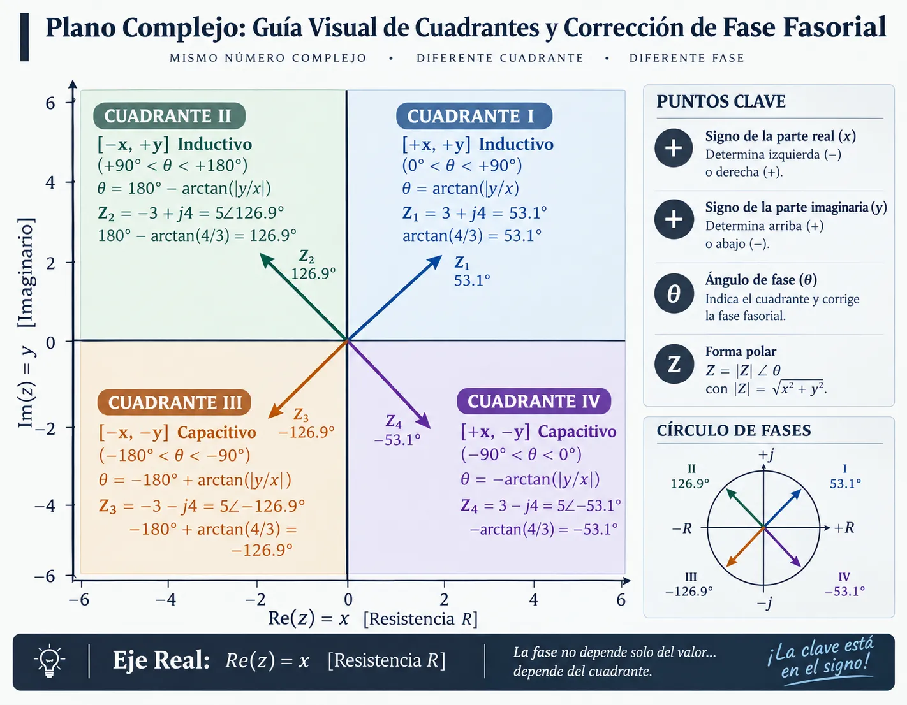



::: {.callout-note}
⚡ Idea central

El análisis fasorial no consiste en memorizar conversiones. Consiste en aprender una **cadena de razonamiento**:

$$
\boxed{
\text{Señal temporal}
\;\longrightarrow\;
\text{Coseno canónico}
\;\longrightarrow\;
\text{Fasor}
\;\longrightarrow\;
\text{Álgebra compleja}
\;\longrightarrow\;
\text{Circuito CA}
}
$$

El objetivo de esta guía es que puedas recorrer esa cadena **sin perder el significado físico de cada paso**.
:::

---

# Ruta de aprendizaje

::: {.grid style="margin: 1.5rem 0;"}

::: {.g-col-12 .g-col-md-3}
::: {.card-module style="border-top: 4px solid #0284c7;"}
**01 · SEÑAL**

Identifica:

- amplitud
- frecuencia
- $\omega$
- fase
- signo

$v(t)$

:::
:::

::: {.g-col-12 .g-col-md-3}
::: {.card-module style="border-top: 4px solid #f59e0b;"}
**02 · NORMALIZAR**

Lleva la señal a:

$$
V_m\cos(\omega t+\phi)
$$

Aquí se resuelven seno y signos negativos.
:::
:::

::: {.g-col-12 .g-col-md-3}
::: {.card-module style="border-top: 4px solid #10b981;"}
**03 · FASOR**

Elimina la dependencia explícita del tiempo:

$$
\mathbf V=V\angle\phi
$$

Usa pico o RMS, pero no los mezcles.
:::
:::

::: {.g-col-12 .g-col-md-3}
::: {.card-module style="border-top: 4px solid #8b5cf6;"}
**04 · RESOLVER**

Usa:

- rectangular → sumar/restar
- polar → multiplicar/dividir
- impedancias → circuitos

:::
:::

:::

::: {.callout-tip}
### 🎯 Resultado esperado

Al terminar, no solo deberías poder calcular un fasor. Deberías poder **explicar qué significa su magnitud, su ángulo y su signo** dentro de un circuito eléctrico.
:::

---

# Señales sinusoidales: el punto de partida

Una señal sinusoidal puede escribirse como:

$$
v(t)=V_m\cos(\omega t+\phi)
$$

donde:

| Magnitud | Significado | Unidad |
|:---:|:---:|:---:|
| $V_m$ | amplitud máxima | V |
| $\omega$ | frecuencia angular | rad/s |
| $\phi$ | fase inicial | ° o rad |
| $t$ | tiempo | s |{tbl-colwidths="[20,20,20]"}

La frecuencia angular $\omega$ se relaciona con la frecuencia $f$: $\quad \boxed{\omega=2\pi f}$

$\qquad \qquad \qquad \qquad \qquad \qquad \qquad \qquad$ y el período $T$: $\quad \boxed{T=\frac{1}{f}}$

$\qquad \qquad \qquad \qquad \qquad \qquad \qquad \qquad$ Por tanto: $\qquad \quad  \boxed{\omega=\frac{2\pi}{T}}$

::: {.callout-important}
### ⚠️ La frecuencia es fundamental

Cuando pasamos al dominio fasorial, la variable $t$ deja de aparecer explícitamente, pero **la frecuencia no desaparece del circuito**.

En particular:

$$
X_L=\omega L
$$

$$
X_C=\frac{1}{\omega C}
$$

La frecuencia termina determinando la impedancia y, por tanto, las corrientes y tensiones.
:::

---

# ¿Qué es realmente un fasor?

Un fasor es una representación compleja de la **magnitud y fase** de una señal sinusoidal respecto a una frecuencia angular determinada.

Partimos de:

$$
v(t)=V_m\cos(\omega t+\phi)
$$

y definimos:

$$
\boxed{\mathbf V=V_m\angle\phi}
$$

La reconstrucción temporal se expresa como:

$$
\boxed{
v(t)=\operatorname{Re}\left\{\mathbf V e^{j\omega t}\right\}
}
$$

Por tanto:

$$
\mathbf V=V_m\angle\phi
\quad\Longleftrightarrow\quad
v(t)=V_m\cos(\omega t+\phi)
$$



::: {.callout-note}
### 🧠 Fasor ≠ señal temporal

El fasor **no contiene el tiempo explícitamente**.

Contiene la información necesaria para representar la amplitud y fase de una sinusoidal de frecuencia conocida. La dependencia temporal se recupera mediante $e^{j\omega t}$.
:::

## El sinor y la proyección temporal

El concepto geométrico puede visualizarse como un vector rotatorio cuya proyección sobre el eje real produce la sinusoidal.

{width=100%}

La imagen debe interpretarse como una **representación geométrica**, no como la definición matemática completa del fasor.

---

# De seno a coseno: normalización antes de obtener el fasor

La convención utilizada en esta guía es:

$$
\boxed{V_m\cos(\omega t+\phi)}
$$

Por eso, antes de extraer el fasor debemos normalizar la señal.

## Identidades esenciales

$$
\boxed{\sin(\theta)=\cos(\theta-90^\circ)}
$$

$$
\boxed{-\sin(\theta)=\cos(\theta+90^\circ)}
$$

$$
\boxed{-\cos(\theta)=\cos(\theta\pm180^\circ)}
$$

### Tabla de conversión

| Señal original | Forma coseno | Cambio de fase |
|---|---|---:|
| $+\sin(\omega t+\theta)$ | $\cos(\omega t+\theta-90^\circ)$ | $-90^\circ$ |
| $-\sin(\omega t+\theta)$ | $\cos(\omega t+\theta+90^\circ)$ | $+90^\circ$ |
| $+\cos(\omega t+\theta)$ | ya está normalizada | $0^\circ$ |
| $-\cos(\omega t+\theta)$ | $\cos(\omega t+\theta+180^\circ)$ | $+180^\circ$ |

::: {.callout-tip}
### Regla práctica

**Primero normaliza la función. Después extrae el fasor.**

No intentes memorizar directamente un fasor para cada combinación de seno, coseno y signo.
:::

## Ejemplo

Sea: $\qquad \qquad \qquad i(t)=-4\sin(10t+15^\circ)\ \mathrm A$

Normalizamos: $\qquad -4\sin(10t+15^\circ) = 4\cos(10t+15^\circ+90^\circ)$

Entonces: $\qquad \qquad i(t)=4\cos(10t+105^\circ)$

$\qquad \qquad \qquad \qquad \boxed{\mathbf I=4\angle105^\circ\ \mathrm A}$

---

# Valor pico y valor eficaz RMS

Para una sinusoidal:

$$
V_{\mathrm{rms}}=\frac{V_m}{\sqrt2}
$$

por tanto:

$$
\boxed{
V_{\mathrm{rms}}\approx0.7071V_m
}
$$

La fase **no cambia** al convertir de pico a RMS:

$$
\boxed{
\mathbf V_{\mathrm{rms}}
=
\frac{V_m}{\sqrt2}\angle\phi
}
$$

## Ejemplo

$$
v(t)=120\cos(\omega t+30^\circ)\ \mathrm V
$$

Fasor pico:

$$
\mathbf V_p=120\angle30^\circ\ \mathrm V
$$

Fasor RMS:

$$
\mathbf V_{\mathrm{rms}}
=
\frac{120}{\sqrt2}\angle30^\circ
=
84.85\angle30^\circ\ \mathrm V
$$

::: {.callout-important}
### ⚠️ Regla crítica

En una misma ecuación fasorial, utiliza **todos los valores en pico o todos en RMS**.

Nunca mezcles:

$$
V_{\mathrm{rms}}
\quad\text{con}\quad
I_{\mathrm{pico}}
$$

sin realizar antes la conversión correspondiente.
:::

---

# ¿Cuándo puedo utilizar fasores?

La representación fasorial convencional se utiliza para:

- señales sinusoidales;
- régimen permanente;
- una frecuencia angular determinada;
- sistemas lineales donde las operaciones fasoriales sean aplicables.

::: {.callout-warning}
### ⚠️ No cualquier señal se convierte en un único fasor

Una señal no sinusoidal general no puede representarse mediante un único fasor.

Por ejemplo:

$$
x(t)=\sin(10t)+\sin(100t)
$$

contiene **dos frecuencias diferentes**.

Cada componente puede analizarse por separado mediante herramientas apropiadas, pero no existe un único fasor que represente toda la señal.
:::

---

# El plano complejo

Un número complejo puede representarse como:

$$
\boxed{\mathbf z=x+jy}
$$

donde:

- $x$ es la componente real;
- $y$ es la componente imaginaria;
- $j=\sqrt{-1}$.

También puede escribirse en forma polar:

$$
\boxed{\mathbf z=r\angle\theta}
$$

o exponencial:

$$
\boxed{\mathbf z=re^{j\theta}}
$$

## Conversión rectangular $(x + jy)$ $\;\implies\;$  polar $(r\angle\theta)$

Para obtener la magnitud $r$ y el ángulo $\theta$ a partir de las coordenadas cartesianas $(x, y)$:

$$
\boxed{r=\sqrt{x^2+y^2}}
$$


Para obtener el ángulo $\theta$ a partir de las coordenadas cartesianas $(x, y)$:

$$
\boxed{\theta=\operatorname{atan2}(y,x)}
$$


$$
{ó}
$$


$$
\boxed{\theta=\operatorname{\tan^{-1}(y/x) \quad ó \quad \operatorname{atan}(y,x)}}
$$
Pero el ángulo $\theta$ debe calcularse realizando un **ajuste de cuadrante**, considerando estrictamente el
**signo de $x$** \
y el **signo de $y$**

### Correccion de angulo $\theta$ cuando se usa la funcion $\tan^{-1}(y/x)$

| Cuadrante | Signos | $\theta = \arctan(y/x)$ | $\theta = \operatorname{atan2}(y, x)$ |
| :---: | :---: | :---: | :---: |
| I | $(+, +)$ | $\phi$ | $\phi$ |
| II | $(-, +)$ | $\phi - 180^\circ$ | $\phi$ |
| III | $(-, -)$ | $\phi$ | $\phi - 180^\circ$ |
| IV | $(+, -)$ | $\phi - 180^\circ$ o $\phi$ | $\phi$ |

::: {.callout-note}
### 🧭 ¿Por qué `atan2` y no solo $\arctan(y/x)$?

La función arco tangente estándar $\arctan(y/x)$ de las matemáticas continuas únicamente devuelve valores en el rango $(-90^\circ, +90^\circ)$ (correspondientes a los Cuadrantes I y IV). 

Si un número complejo tiene **$x < 0$ (Cuadrantes II y III)** o **$x = 0$ (sobre el eje imaginario)**, la división algebraica $y/x$ pierde la información de los signos individuales o produce una indeterminación matemática.

La función $\operatorname{atan2}(y, x)$ analiza **ambos signos de forma independiente**, entregando el ángulo geométrico verdadero en todo el plano complejo $(-180^\circ, +180^\circ]$.

---

#### 🧪 Suite de Pruebas (Unit Testing de Cuadrantes)

A continuación se presenta una batería de pruebas automatizadas (*Unit Tests*) que ilustra exactamente qué sucede si un estudiante o programa aplica la fórmula ciega $\arctan(y/x)$ frente al resultado esperado real ($\operatorname{atan2}$ o corrección por cuadrante):

| Eje | Entrada Compleja ($z = x + jy$) | Cuadrante / Ubicación | Cálculo Ciego $\arctan(y/x)$ | Resultado Real $\operatorname{atan2}(y, x)$ | Estado de Prueba ($\arctan$) | Diagnóstico del Error |
| :---: | :--- | :---: | :---: | :---: | :---: | :--- |
| `1` | $\mathbf{Z} = 3 + j4$ | **Cuadrante I** \ ($+x, +y$) | $\arctan(4/3) = \mathbf{+53.13^\circ}$ | $\mathbf{+53.13^\circ}$ | `PASA` ✅ | Ambos signos positivos. Coincide exactamente. |
| `2` | $\mathbf{Z} = -5 + j5$ *(Ejercicio 2)* | **Cuadrante II** \ ($-x, +y$) | $\arctan(5/-5) = \mathbf{-45^\circ}$ | $\mathbf{+135^\circ}$ | `NO PASA` ❌ | **Desfase de $180^\circ$**. La división no sabe si el signo menos era de $x$ o de $y$; apunta al Cuadrante IV. Requiere: $180^\circ - 45^\circ = 135^\circ$. |
| `3` | $\mathbf{Z} = -4 - j4$ | **Cuadrante III** \ ($-x, -y$) | $\arctan(-4/-4) = \mathbf{+45^\circ}$ | $\mathbf{-135^\circ}$ | `NO PASA` ❌ | **Desfase de $180^\circ$**. Menos entre menos da más ($(-)/(-) = +$). La calculadora cree erróneamente que está en el Cuadrante I. Requiere: $-180^\circ + 45^\circ = -135^\circ$. |
| `4` | $\mathbf{Z} = 3 - j4$ | **Cuadrante IV** \ ($+x, -y$) | $\arctan(-4/3) = \mathbf{-53.13^\circ}$ | $\mathbf{-53.13^\circ}$ | `PASA` ✅ | Coincide. El ángulo cae naturalmente en $(-90^\circ, 0^\circ)$. |
| `5` | $\mathbf{Z} = 5 + j0$ | **Eje $+x$** ($+x, y=0$) | $\arctan(0/5) = \mathbf{0^\circ}$ | $\mathbf{0^\circ}$ | `PASA` ✅ | **Parte imaginaria nula ($j=0$)**. Vector sobre el semieje real positivo ($5\angle 0^\circ$). Coincide. |
| `6` | $\mathbf{Z} = 0 + j5$ | **Eje $+j$** ($x=0, +y$) | $\arctan(5/0) \to$ `ZeroDivisionError` | $\mathbf{+90^\circ}$ | `ERROR` 💥 | **Indeterminación matemática**. Pendiente vertical infinita ($\infty$); $\operatorname{atan2}$ devuelve $+90^\circ$ de forma directa y robusta. |
| `7` | $\mathbf{Z} = -5 + j0$ | **Eje $-x$** ($-x, y=0$) | $\arctan(0/-5) = \mathbf{0^\circ}$ | $\mathbf{180^\circ}$ | `NO PASA` ❌ | Entrega $0^\circ$ (semieje positivo) ignorando que la coordenada real es estrictamente negativa. |

```python
# =====================================================================
# Suite de Pruebas Automatizadas con Reporte en Consola (Python)
# =====================================================================
import math
import sys

# Forzar salida en UTF-8 para que la consola de Windows renderice superíndices (⁻¹) y emojis (✅)
if sys.stdout.encoding and sys.stdout.encoding.lower() != 'utf-8':
    sys.stdout.reconfigure(encoding='utf-8')

def angulo_polar_grados(x, y):
    """Calcula el ángulo de fase real con resolución completa de cuadrantes."""
    return math.degrees(math.atan2(y, x))

def arctan_sin_ajuste_grados(x, y):
    """Fórmula simple de calculadora (tan⁻¹(y/x)) sin corrección de cuadrante."""
    try:
        return math.degrees(math.atan(y / x))
    except ZeroDivisionError:
        return None

# Batería de pruebas: (Nombre del caso, x, y, Ángulo esperado, Observación didáctica)
casos_de_prueba = [
    ("Q1 (+, +)",      3,  4,   53.13, "Coinciden"),
    ("Q2 (-, +)",     -5,  5,  135.00, "Ejercicio 2: Desfase 180°"),
    ("Q3 (-, -)",     -4, -4, -135.00, "Signos se cancelan (+ vs -)"),
    ("Q4 (+, -)",      3, -4,  -53.13, "Coinciden"),
    ("Eje +x (j=0)",   5,  0,    0.00, "Resistivo puro / Referencia"),
    ("Eje +j (x=0)",   0,  5,   90.00, "División entre cero evitada"),
    ("Eje -x (y=0)",  -5,  0,  180.00, "Contrafase a 180°")
]

print("=" * 80)
print(f"{'CASO':<14} | {'ENTRADA z':<10} | {'tan⁻¹(y/x)':<12} | {'ATAN2 REAL':<11} | {'ESTADO tan⁻¹'}")
print("=" * 80)

for caso, x, y, ang_esperado, observacion in casos_de_prueba:
    texto_z = f"{x:+d}{y:+d}j" if y != 0 else f"{x:+d}+0j"
    ang_atan2_real = angulo_polar_grados(x, y)
    ang_sin_ajuste = arctan_sin_ajuste_grados(x, y)
    
    # Aserción de prueba unitaria (valida que atan2 entregue el ángulo real esperado)
    assert round(ang_atan2_real, 2) == round(ang_esperado, 2)
    
    texto_sin_ajuste = f"{ang_sin_ajuste:+6.1f}°" if ang_sin_ajuste is not None else "ERROR (y/0)"

    # Evaluamos si la fórmula simple arctan(y/x) acierta o falla:
    if ang_sin_ajuste is None:
        estado_arctan = "ERROR 💥"
    elif round(ang_sin_ajuste, 2) == round(ang_esperado, 2):
        estado_arctan = "PASA ✅"
    else:
        estado_arctan = "NO PASA ❌"

    print(f"{caso:<14} | {texto_z:<10} | {texto_sin_ajuste:<12} | {ang_atan2_real:+7.2f}°   | {estado_arctan} ({observacion})")

print("=" * 80)
print("🎯 Conclusión: atan2(y, x) supera el 100% de las pruebas de cuadrante y utilizar tan⁻¹(y/x) requiere ajuste manual de cuadrante.")
```

> **📌 Regla mnemotécnica para estudiantes:**  
> Siempre que la parte real sea negativa ($x < 0$), la fórmula ciega $\tan^{-1}(y/x)$ **siempre fallará por exactamente $\pm 180^\circ$**. Por esta razón, cuando uses una calculadora en modo manual, debes aplicar el ajuste del **Método 2** mostrado abajo.
:::

::: {.callout-tip}
### 📟 ¿Cómo calcularlo en tu calculadora científica física? (Casio / Sharp / TI)

En tu calculadora física **no existe una tecla llamada `atan2` ni `atan`**. Tienes 3 formas prácticas de calcularlo en exámenes y laboratorio:

#### 🥇 Método 1: La función directa `Pol(` (El `atan2` de la calculadora)
Las calculadoras científicas estándar (Casio fx-570, fx-991, fx-82, etc.) incluyen la función de conversión automática de coordenadas con ajuste de cuadrante incluido:

1. Presiona `SHIFT` + `+` $\longrightarrow$ Aparece en pantalla **`Pol(`**.
2. Digita la parte real $x$, luego la coma con `SHIFT` + `)` y la parte imaginaria $y$.  
   *Ejemplo:* digita `Pol(-3, 4)` y presiona `=`.
3. **Resultado instantáneo:** `r = 5`, `θ = 126.87°` *(el ángulo ya viene con el cuadrante exacto)*.

---

#### 🥈 Método 2: Con la tecla `tan⁻¹` y ajuste manual de cuadrante
Si calculas por partes mediante $r = \sqrt{x^2+y^2}$ y la tecla `tan⁻¹` (`SHIFT` + `tan`):

1. Calcula el ángulo base con valores absolutos: $\alpha = \tan^{-1}\left(\left|\frac{y}{x}\right|\right)$.
2. Aplica la regla según los signos de $(x, y)$:

| Cuadrante | Signos $(x, y)$ | Fórmula de Corrección en Calculadora | Ejemplo con $|x|=3, |y|=4$ ($\alpha = 53.13^\circ$) |
| :--- | :---: | :--- | :--- |
| **I** | $(+x, +y)$ | $\theta = \alpha$ | $\mathbf{Z} = 3 + j4 \implies \theta = \mathbf{+53.13^\circ}$ |
| **II** | $(-x, +y)$ | $\theta = 180^\circ - \alpha$ | $\mathbf{Z} = -3 + j4 \implies \theta = 180^\circ - 53.13^\circ = \mathbf{+126.87^\circ}$ |
| **III** | $(-x, -y)$ | $\theta = -180^\circ + \alpha$ | $\mathbf{Z} = -3 - j4 \implies \theta = -180^\circ + 53.13^\circ = \mathbf{-126.87^\circ}$ |
| **IV** | $(+x, -y)$ | $\theta = -\alpha$ | $\mathbf{Z} = 3 - j4 \implies \theta = \mathbf{-53.13^\circ}$ |

---

#### 🥉 Método 3: Modo Números Complejos (`MODE 2: CMPLX`)
El método más rápido para resolver circuitos completos:

1. **Activar modo complejo:** Presiona `MODE` $\longrightarrow$ `2: CMPLX`.
2. Verifica que tu calculadora esté en grados sexagesimales (indicador **`D`** o `Deg` en la parte superior).
3. Escribe el número directamente en pantalla:  
   Digita `-3 + 4` e inserta la unidad imaginaria $j$ presionando la tecla **`ENG`** (aparece la $i$).
4. **Convertir a Polar:**  
   - En Casio clásica: Presiona `SHIFT` + `2` (menú CMPLX) $\longrightarrow$ selecciona `3: ▶r∠θ` $\longrightarrow$ `=`.
   - En Casio ClassWiz: Presiona `OPTN` $\longrightarrow$ flecha abajo $\longrightarrow$ `1: ▶r∠θ` $\longrightarrow$ `=`.
5. La pantalla mostrará directamente: `5 ∠ 126.87°`.

---

##### 🎬 Videotutoriales paso a paso según tu modelo de calculadora:
- 📺 **Casio fx-9750GIII (Gráfica):** [Ver tutorial paso a paso](https://www.youtube.com/watch?v=-QkvEE_9P4M&t=17s){target="_blank"}
- 📺 **Casio fx-991ES PLUS / fx-570ES:** [Ver tutorial paso a paso](https://www.youtube.com/watch?v=mrMpLfHkxRk){target="_blank"}
- 📺 **Casio fx-82MS / fx-350MS:** [Ver tutorial paso a paso](https://www.youtube.com/watch?v=Em3XkHxGPn4){target="_blank"}
- 📺 **Calculadora Científica Universal / Genérica:** [Ver tutorial paso a paso](https://www.youtube.com/watch?v=_OXVmNMPaKY){target="_blank"}
:::

## Conversión polar $(r\angle\theta)$ $\implies$ rectangular $(x + jy)$

Para descomponer un fasor de magnitud $r$ y ángulo de fase $\theta$ en sus componentes rectangulares $(x, y)$:

$$
\boxed{x=r\cos\theta}
$$

$$
\boxed{y=r\sin\theta}
$$

por tanto, en forma binómica o rectangular:

$$
\boxed{
r\angle\theta
=
r\cos\theta+jr\sin\theta
}
$$

::: {.callout-note}
### 💡 Sin ambigüedad de cuadrante
A diferencia de la conversión inversa, las funciones directas $\cos(\theta)$ y $\sin(\theta)$ evalúan el círculo trigonométrico completo (de $-180^\circ$ a $+180^\circ$) y entregan **automáticamente el signo algebraico correcto** para cada componente:

- Por ejemplo, para $\mathbf{Z} = 5\angle126.87^\circ$ (Cuadrante II):
  $$x = 5\cos(126.87^\circ) = -3 \quad (\text{negativo})$$
  $$y = 5\sin(126.87^\circ) = +4 \quad (\text{positivo})$$
- Por lo tanto, en la conversión polar a rectangular **no se requiere ningún ajuste de cuadrante ni funciones especiales como `atan2`**.
:::

::: {.callout-tip}
### 📟 ¿Cómo calcularlo en tu calculadora científica física? (Polar → Rectangular)

Para convertir un fasor dado en forma polar $r\angle\theta$ a su forma rectangular $x + jy$ en tu calculadora física, cuentas con 3 métodos:

#### 🥇 Método 1: La función directa `Rec(` (Conversión directa de coordenadas)
La función **`Rec(`** es la función inversa de `Pol(` y está integrada en todas las calculadoras Casio (fx-82, fx-350, fx-570, fx-991, ClassWiz) y modelos compatibles:

1. Presiona `SHIFT` + `−` (tecla de resta) $\longrightarrow$ Aparece en pantalla **`Rec(`**.
2. Digita la magnitud $r$, luego la coma con `SHIFT` + `)` y el ángulo de fase $\theta$ en grados sexagesimales.  
   *Ejemplo:* digita `Rec(5, 126.87)` y presiona `=`.
3. **Resultado en pantalla:**  
   - `X = -3` (componente real $x$)
   - `Y = 4` (componente imaginaria $y$, asociada a $j$)  
   *Forma rectangular final:* $-3 + j4$.  
   *(Tip: En modelos de una sola línea como la fx-82MS, para consultar la componente $Y$ presiona la tecla `RCL` y luego `tan` para la memoria $Y$, o `RCL` `)` para $X$)*.

---

#### 🥈 Método 2: Por componentes trigonométricas directas
Puedes calcular cada componente de forma independiente en la pantalla principal:

- **Parte real ($x$):** Digita $5 \times \cos(126.87)$ y presiona `=` $\longrightarrow$ Obtienes **$-3$**.
- **Parte imaginaria ($y$):** Digita $5 \times \sin(126.87)$ y presiona `=` $\longrightarrow$ Obtienes **$+4$**.

*(Asegúrate de que la calculadora esté en modo grados sexagesimales: letra **`D`** o `Deg` en la barra superior)*.

---

#### 🥉 Método 3: Modo Números Complejos (`MODE 2: CMPLX`) con la tecla de ángulo ($\angle$)
Este es el método más rápido y potente cuando estás resolviendo leyes de Kirchhoff, mallas o nodos:

1. **Activar modo complejo:** Presiona `MODE` $\longrightarrow$ `2: CMPLX`.
2. **Ingresar el fasor con la tecla $\angle$:**
   - Digita la magnitud: `5`.
   - Inserta el símbolo de ángulo $\angle$ presionando **`SHIFT` + `(-)`** (la tecla del signo negativo entre paréntesis).
   - Digita el ángulo de fase: `126.87`.  
   *(En la pantalla se leerá: `5 ∠ 126.87`)*.
3. **Convertir a forma rectangular ($a + bi$):**
   - En **Casio clásica (fx-570ES / fx-991ES PLUS / MS):** Presiona `SHIFT` + `2` (menú CMPLX) $\longrightarrow$ selecciona `4: ▶a+bi` $\longrightarrow$ presiona `=`.
   - En **Casio ClassWiz (fx-991LA X / CW):** Presiona `OPTN` $\longrightarrow$ flecha hacia abajo $\longrightarrow$ selecciona `2: ▶a+bi` $\longrightarrow$ presiona `=`.
4. La pantalla mostrará directamente: **`-3 + 4i`** (es decir, $-3 + j4$).

---

##### 🎬 Videotutoriales paso a paso según tu modelo de calculadora:
- 📺 **Casio fx-9750GIII (Gráfica):** [Ver tutorial paso a paso](https://www.youtube.com/watch?v=-QkvEE_9P4M&t=17s){target="_blank"}
- 📺 **Casio fx-991ES PLUS / fx-570ES:** [Ver tutorial paso a paso](https://www.youtube.com/watch?v=mrMpLfHkxRk){target="_blank"}
- 📺 **Casio fx-82MS / fx-350MS:** [Ver tutorial paso a paso](https://www.youtube.com/watch?v=Em3XkHxGPn4){target="_blank"}
- 📺 **Calculadora Científica Universal / Genérica:** [Ver tutorial paso a paso](https://www.youtube.com/watch?v=_OXVmNMPaKY){target="_blank"}
:::

---

# Cuadrantes: magnitud y fase con significado

{width=100%}

| Cuadrante | $x$ | $y$ | Interpretación angular |
|---:|:---:|:---:|---|
| I | $+$ | $+$ | $0^\circ<\theta<90^\circ$ |
| II | $-$ | $+$ | $90^\circ<\theta<180^\circ$ |
| III | $-$ | $-$ | $-180^\circ<\theta<-90^\circ$ |
| IV | $+$ | $-$ | $-90^\circ<\theta<0^\circ$ |

### Ejes de frontera: cuando una componente es cero ($x=0$ \quad ó \quad $y=0$)

Los cuadrantes describen áreas abiertas entre los ejes, pero en el análisis de circuitos fasoriales muchas variables caen **exactamente sobre los ejes coordenados**:

| Eje Coordenado | Condición | Forma Rectangular | Forma Polar | Significado Físico en Circuitos |
| :-- | :--: | :--: | :--: | :--- |
| **Semieje Real Positivo ($+x$)** | $x > 0,\ y = 0$ | $x + j0$ | $\mathbf{x\angle 0^\circ}$ | **Referencia / En fase:** Fuentes de tensión de referencia ($\mathbf V = 120\angle 0^\circ\ \mathrm V$), corriente de referencia, resistores puros ($\mathbf Z_R = R\angle 0^\circ$) o circuitos en resonancia ($X_L = X_C$). |
| **Semieje Imaginario Positivo ($+j$)** | $x = 0,\ y > 0$ | $0 + jy$ | $\mathbf{y\angle +90^\circ}$ | **Inductivo puro:** Inductores ideales ($\mathbf Z_L = j\omega L = X_L\angle 90^\circ$) o tensiones adelantadas exactamente $90^\circ$. |
| **Semieje Real Negativo ($-x$)** | $x < 0,\ y = 0$ | $-x + j0$ | $\mathbf{x\angle 180^\circ}$ | **Contrafase / Inversión:** Tensión o corriente invertida $180^\circ$ respecto a la referencia (equivalente a invertir terminales o signo negativo). |
| **Semieje Imaginario Negativo ($-j$)** | $x = 0,\ y < 0$ | $0 - jy$ | $\mathbf{y\angle -90^\circ}$ | **Capacitivo puro:** Condensadores ideales ($\mathbf Z_C = -j\frac{1}{\omega C} = X_C\angle -90^\circ$) o corrientes adelantadas $90^\circ$ a la tensión. |
: {tbl-colwidths="[20, 15, 16, 14, 38]"}

::: {.callout-note}
### 💡 ¿El caso $j=0$ ($5 + j0 \iff 5\angle 0^\circ$) solo existe en impedancias resistivas?

**No, no es exclusivo de los resistores.** Cualquier magnitud física fasorial de corriente alterna puede tener parte imaginaria nula ($y = 0$):

1. **Voltajes de referencia:** Es el estándar en análisis de circuitos. En la inmensa mayoría de problemas se toma la fuente principal como origen de fase:  
   $$\mathbf{V}_s = 120\angle 0^\circ\ \mathrm{V} = 120 + j0\ \mathrm{V}$$
2. **Corrientes de referencia:** En circuitos en serie es común definir la corriente total del lazo como referencia de fase:  
   $$\mathbf{I} = 5\angle 0^\circ\ \mathrm{A} = 5 + j0\ \mathrm{A}$$
3. **Impedancia puramente resistiva:** Un resistor disipa calor pero no almacena energía en campos eléctricos ni magnéticos ($X = 0$), por lo que:  
   $$\mathbf{Z}_R = R + j0 = R\angle 0^\circ\ \Omega$$
   *(Esto también ocurre en circuitos completos RLC cuando entran en **resonancia**, donde $X_L = X_C$ y se cancelan mutuamente)*.
4. **Potencia aparente con factor de potencia unitario:** Si una carga no demanda reactivos ($Q = 0$, $\mathrm{FP} = 1.0$), la potencia compleja queda puramente activa:  
   $$\mathbf{S} = P + j0 = P\angle 0^\circ\ \mathrm{VA}$$

**Principio analítico:** Todo número real positivo $a > 0$ es un vector sobre el semieje horizontal de fase $0^\circ$:
$$
\boxed{a + j0 = a\angle 0^\circ}
$$
:::

::: {.callout-tip}
### Regla de oro

No corrijas el ángulo “a ojo” $\implies$  Primero identifica: $(x,y)$  $\implies$ después el cuadrante $\implies$ finalmente el ángulo.
:::

---

# El operador $j$: un giro de $90^\circ$

Una de las ideas más importantes de todo el análisis fasorial es:

$$
\boxed{j=1\angle90^\circ}
$$

Multiplicar por $j$ produce un giro antihorario de $90^\circ$:

$$
\boxed{j\mathbf Z=|\mathbf Z|\angle(\theta+90^\circ)}
$$

Multiplicar por $-j$ produce:

$$
\boxed{-j\mathbf Z=|\mathbf Z|\angle(\theta-90^\circ)}
$$

## Ciclo de potencias

$$
j^0=1
$$

$$
j^1=j
$$

$$
j^2=-1
$$

$$
j^3=-j
$$

$$
j^4=1
$$



El ciclo se repite cada cuatro potencias.

También:

$$
\boxed{\frac1j=-j}
$$

::: {.callout-note}
### 🧠 Interpretación física

En fasores, $j$ no es simplemente una letra algebraica.

Es un operador que representa un **desplazamiento angular de $+90^\circ$**.
:::

---

# Operaciones con números complejos

## Suma y resta

La forma rectangular es la más conveniente:

$$
(a+jb)+(c+jd)
=
(a+c)+j(b+d)
$$

## Multiplicación

La forma polar es especialmente conveniente:

$$
(r_1\angle\theta_1)(r_2\angle\theta_2)
=
r_1r_2\angle(\theta_1+\theta_2)
$$

## División

$$
\frac{r_1\angle\theta_1}{r_2\angle\theta_2}
=
\frac{r_1}{r_2}\angle(\theta_1-\theta_2)
$$

## Conjugado

$$
\boxed{
(a+jb)^*=a-jb
}
$$

y:

$$
\boxed{
(r\angle\theta)^*=r\angle(-\theta)
}
$$

El superíndice asterisco ($*$) representa la operación de **conjugación compleja**. Cuando se tiene $(a + jb)^*$, indica que se debe obtener el complejo conjugado de dicho número. En el contexto de números complejos y análisis fasorial:

### ¿Qué hace matemáticamente?

Cambia únicamente el signo de la parte imaginaria (la que acompaña al operador $j$):

- **Si es positivo, pasa a negativo:** $(a + jb)^* = a - jb$.
- **Si es negativo, pasa a positivo:** $(a - jb)^* = a + jb$.

### ¿Qué significa en forma polar (fasores)?

Si se expresa el fasor en forma polar con magnitud ($M$) y ángulo ($\theta$), el conjugado mantiene exactamente la misma magnitud e invierte el signo del ángulo de fase:

$$
(M\angle\theta)^* = M\angle(-\theta)
$$

### ¿Qué significa geométricamente?

En el plano complejo, aplicar el conjugado equivale a una **reflexión especular respecto al eje real (horizontal)**:

- El vector se refleja verticalmente.
- Si el fasor original apuntaba hacia arriba y a la derecha (primer cuadrante con ángulo $+\theta$), su conjugado apuntará hacia abajo y a la derecha (cuarto cuadrante con ángulo $-\theta$), con idéntica longitud.

::: {.callout-note}
### ⚡ ¿Para qué se usa en circuitos eléctricos?

El uso más común e importante del conjugado en fasores es para calcular la **potencia compleja** ($\mathbf{S}$) en corriente alterna:

$$
\mathbf{S} = \mathbf{V}\mathbf{I}^*
$$

Se utiliza el conjugado de la corriente ($\mathbf{I}^*$) para que el ángulo resultante de la potencia sea exactamente la diferencia angular de fases $(\theta_v - \theta_i)$:

$$
\mathbf{S} = (V\angle\theta_v)(I\angle\theta_i)^* = (V\angle\theta_v)(I\angle-\theta_i) = VI\angle(\theta_v - \theta_i)
$$

Esto permite que la potencia reactiva ($Q = VI\sin(\theta_v - \theta_i)$) tenga el signo convencional correcto:

- **Positiva ($+Q$)**: Circuito inductivo (la corriente se retrasa respecto a la tensión).
- **Negativa ($-Q$)**: Circuito capacitivo (la corriente se adelanta respecto a la tensión).
:::

## División rectangular

$$
\frac{a+jb}{c+jd}
=
\frac{(a+jb)(c-jd)}{c^2+d^2}
$$

por tanto:

$$
\boxed{
\frac{a+jb}{c+jd}
=
\frac{ac+bd}{c^2+d^2}
+
j\frac{bc-ad}{c^2+d^2}
}
$$


---

# Impedancia: donde el fasor se convierte en Ingeniería Eléctrica

La gran conexión entre fasores y circuitos es:

$$
\boxed{\mathbf V=\mathbf I\mathbf Z}
$$

o:

$$
\boxed{\mathbf I=\frac{\mathbf V}{\mathbf Z}}
$$

La impedancia es compleja:

$$
\boxed{\mathbf Z=R+jX}
$$

donde:

- $R$ → **resistencia** ($\Omega$): parte real, asociada a la disipación irreversible de potencia activa. En redes pasivas siempre se cumple $R \ge 0$.
- $X$ → **reactancia neta** ($\Omega$): parte imaginaria, asociada al almacenamiento y devolución de energía en campos magnéticos y eléctricos.

Su forma polar es:

$$
\boxed{\mathbf Z=|\mathbf Z|\angle\theta_Z}
$$

donde su módulo y ángulo de fase vienen dados por:

$$
|\mathbf Z| = \sqrt{R^2 + X^2}, \qquad \theta_Z = \operatorname{atan2}(X, R)
$$

::: {.callout-note}
### 🔍 ¿Qué representa realmente la reactancia $X$ cuando hay inductores y capacitores?

Una duda fundamental al ver la expresión general $\mathbf{Z} = R + jX$ es: *¿por qué tiene un signo positivo ($+jX$) si la impedancia de un capacitor es negativa ($-jX_C$)?*

La razón es que $X$ representa la **reactancia neta** de la rama o circuito. Si en una rama en serie coinciden resistencia, inductancia y capacitancia (rama RLC serie):

$$
\mathbf{Z} = \mathbf{Z}_R + \mathbf{Z}_L + \mathbf{Z}_C = R + jX_L - jX_C = R + j(X_L - X_C)
$$

Por lo tanto:

$$
\boxed{X = X_L - X_C}
$$

Como el inductor aporta reactancia positiva ($+jX_L$, con $X_L = \omega L$) y el capacitor reactancia negativa ($-jX_C$, con $X_C = \frac{1}{\omega C}$), ambos efectos compiten y se restan algebraicamente en el eje imaginario:

1. **Predominio inductivo ($X_L > X_C \implies X > 0$):**  
   Predomina la bobina. La reactancia neta es positiva:
   $$\mathbf{Z} = R + j|X| = |\mathbf{Z}|\angle+\theta_Z$$
   La tensión adelanta a la corriente ($0^\circ < \theta_Z \le 90^\circ$).

2. **Predominio capacitivo ($X_C > X_L \implies X < 0$):**  
   Predomina el condensador. La reactancia neta es negativa:
   $$\mathbf{Z} = R - j|X| = |\mathbf{Z}|\angle-\theta_Z$$
   La corriente adelanta a la tensión ($-90^\circ \le \theta_Z < 0^\circ$).

3. **Resonancia serie ($X_L = X_C \implies X = 0$):**  
   Ambos efectos se anulan con exactitud ($+jX_L - jX_C = 0$):
   $$\mathbf{Z} = R + j0 = R\angle0^\circ$$
   La rama se comporta como puramente resistiva, la impedancia se reduce al mínimo posible ($|\mathbf{Z}| = R$) y la corriente alcanza su valor máximo.
:::

---

# Elementos pasivos R, L y C

| Elemento | Relación temporal | Impedancia | $\theta_V-\theta_I$ |
|---|---|---|---:|
| Resistor | $v=Ri$ | $\mathbf Z_R=R$ | $0^\circ$ |
| Inductor | $v=L\,di/dt$ | $\mathbf Z_L=j\omega L$ | $+90^\circ$ |
| Capacitor | $i=C\,dv/dt$ | $\mathbf Z_C=1/(j\omega C)$ | $-90^\circ$ |

## Resistor

$$
\boxed{\mathbf Z_R=R=R\angle0^\circ}
$$

Tensión y corriente están en fase.

## Inductor

$$
\boxed{\mathbf Z_L=j\omega L=\omega L\angle90^\circ}
$$

Por tanto:

$$
\boxed{\mathbf V_L=j\omega L\mathbf I}
$$

La tensión adelanta a la corriente $90^\circ$.

### 🧠 ELI

**E** antes que **I** → en el inductor:

$$
V_L\text{ adelanta a }I
$$

## Capacitor

$$
\boxed{
\mathbf Z_C=
\frac1{j\omega C}
=
-j\frac1{\omega C}
}
$$

Por tanto:

$$
\boxed{
\mathbf V_C=-j\frac1{\omega C}\mathbf I
}
$$

La tensión atrasa a la corriente $90^\circ$.

### 🧠 ICE

**I** antes que **E** → en el capacitor:

$$
I\text{ adelanta a }V_C
$$

::: {.callout-tip}
### ELI e ICE son memoria, no demostración

La comprensión profunda está en:

$$
+j\Rightarrow+90^\circ
$$

$$
-j\Rightarrow-90^\circ
$$

Las reglas ELI/ICE sirven para recordar rápidamente el resultado.
:::

---

# Ejemplo integrado: de la señal al circuito RLC

Consideremos:

$$
R=30\ \Omega
$$

$$
L=50\ \mathrm{mH}
$$

$$
C=25\ \mu\mathrm F
$$

y:

$$
v(t)=120\cos(1000t+30^\circ)\ \mathrm V
$$

## Paso 1 — Frecuencia

$$
\omega=1000\ \mathrm{rad/s}
$$

## Paso 2 — Impedancias

Inductor:

$$
X_L=\omega L
=
1000(0.050)
=
50\ \Omega
$$

$$
\mathbf Z_L=j50\ \Omega
$$

Capacitor:

$$
X_C=\frac1{\omega C}
=
\frac1{1000(25\times10^{-6})}
=
40\ \Omega
$$

$$
\mathbf Z_C=-j40\ \Omega
$$

## Paso 3 — Impedancia equivalente

Al ser un circuito serie:

$$
\mathbf Z_T
=
R+\mathbf Z_L+\mathbf Z_C
$$

$$
\mathbf Z_T
=
30+j50-j40
$$

$$
\boxed{\mathbf Z_T=30+j10\ \Omega}
$$

En polar:

$$
|\mathbf Z_T|
=
\sqrt{30^2+10^2}
=
31.62\ \Omega
$$

$$
\theta_Z
=
\arctan\left(\frac{10}{30}\right)
=
18.43^\circ
$$

por tanto:

$$
\boxed{\mathbf Z_T=31.62\angle18.43^\circ\ \Omega}
$$

## Paso 4 — Corriente

Usando fasores pico:

$$
\mathbf V=120\angle30^\circ\ \mathrm V
$$

entonces:

$$
\mathbf I
=
\frac{\mathbf V}{\mathbf Z_T}
$$

$$
\mathbf I
=
\frac{120\angle30^\circ}
{31.62\angle18.43^\circ}
$$

$$
\boxed{
\mathbf I
=
3.80\angle11.57^\circ\ \mathrm A
}
$$

La señal temporal:

$$
\boxed{
i(t)=3.80\cos(1000t+11.57^\circ)\ \mathrm A
}
$$

## Paso 5 — Tensiones individuales

Resistor:

$$
\mathbf V_R
=
\mathbf I R
=
114.0\angle11.57^\circ\ \mathrm V
$$

Inductor:

$$
\mathbf V_L
=
\mathbf I(j50)
=
190.0\angle101.57^\circ\ \mathrm V
$$

Capacitor:

$$
\mathbf V_C
=
\mathbf I(-j40)
=
152.0\angle-78.43^\circ\ \mathrm V
$$

### Paso 6 — Comprobación por Ley de Tensiones de Kirchhoff (LVK)

De acuerdo con la Ley de Kirchhoff de tensiones, la suma de las caídas de tensión en cada elemento pasivo debe igualar exactamente a la tensión suministrada por la fuente:

$$
\boxed{\mathbf V_R + \mathbf V_L + \mathbf V_C = \mathbf V}
$$

::: {.callout-warning}
### ⚠️ Error conceptual clásico: No sumar magnitudes escalares
Un error muy frecuente en análisis de circuitos de CA es sumar directamente las magnitudes en forma polar:
$$114.0\text{ V} + 190.0\text{ V} + 152.0\text{ V} = 456.0\text{ V} \neq 120.0\text{ V}$$
¡Esto es completamente falso! Como las tres tensiones están desfasadas en el tiempo, **la suma fasorial exige operar vectorialmente en forma rectangular**.
:::

#### 1. Conversión de cada tensión fasorial a forma rectangular:
Utilizando la función `Rec(` o trigonometría directa ($x = r\cos\theta$, $y = r\sin\theta$):

- **Resistor:**
  $$\mathbf V_R = 114.0\angle 11.57^\circ\ \mathrm V = 114.0\cos(11.57^\circ) + j114.0\sin(11.57^\circ) = 111.69 + j22.87\ \mathrm V$$

- **Inductor:**
  $$\mathbf V_L = 190.0\angle 101.57^\circ\ \mathrm V = 190.0\cos(101.57^\circ) + j190.0\sin(101.57^\circ) = -38.11 + j186.14\ \mathrm V$$

- **Capacitor:**
  $$\mathbf V_C = 152.0\angle -78.43^\circ\ \mathrm V = 152.0\cos(-78.43^\circ) + j152.0\sin(-78.43^\circ) = 30.49 - j148.91\ \mathrm V$$

#### 2. Suma directa agrupando componentes reales e imaginarias:
Aplicando la regla de suma en forma rectangular, sumamos todas las partes reales juntas y todas las partes imaginarias juntas en un solo paso:

$$
\begin{aligned}
\mathbf V_{\text{total}} &= (111.69 - 38.11 + 30.49) + j(22.87 + 186.14 - 148.91) \\
&= 104.07 + j60.10\ \mathrm V
\end{aligned}
$$

#### 3. Conversión final a forma polar:
Calculamos la magnitud y la fase de la tensión resultante:

$$
|\mathbf V_{\text{total}}| = \sqrt{(104.07)^2 + (60.10)^2} = \sqrt{10830.56 + 3612.01} = 120.18\ \mathrm V \approx 120.0\ \mathrm V
$$

$$
\theta_V = \operatorname{atan2}(60.10, 104.07) = 29.99^\circ \approx 30.0^\circ
$$

Por tanto:

$$
\boxed{\mathbf V_{\text{total}} = 120.0\angle 30.0^\circ\ \mathrm V = \mathbf V}
$$

*(La mínima diferencia de $0.18\ \mathrm V$ y $0.01^\circ$ se debe exclusivamente a los redondeos de tres cifras significativas en el valor de la corriente $\mathbf I = 3.80\angle11.57^\circ\ \mathrm A$)*.

::: {.callout-tip}
### 💡 Comprobación directa en tu calculadora física (Modo CMPLX)
En un examen o laboratorio no necesitas descomponer cada fasor en papel. En tu calculadora física (en `MODE 2: CMPLX`), escribe la suma continua en una sola línea usando la tecla del ángulo ($\angle$ con `SHIFT` + `(-)`):

$$114.0\angle 11.57 + 190.0\angle 101.57 + 152.0\angle -78.43 =$$

La calculadora realiza la conversión rectangular y la suma vectorial internamente, entregándote directamente $\mathbf V = 120\angle 30^\circ\ \mathrm V$.
:::

Esta es la conexión fundamental:

$$
\boxed{
v(t)
\rightarrow
\mathbf V
\rightarrow
\mathbf Z
\rightarrow
\mathbf I
\rightarrow
i(t)
}
$$

---

# Diagrama fasorial: no basta con calcular

Un diagrama fasorial debe permitir responder preguntas como:

- ¿Cuál es la referencia?
- ¿Qué fasor adelanta?
- ¿Qué fasor atrasa?
- ¿Por qué?
- ¿Cuál es la suma resultante?
- ¿Qué indica el ángulo de la impedancia?

::: {.callout-note}
### 🎯 Interpretación del ángulo de impedancia

Si:

$$
\mathbf Z=|\mathbf Z|\angle\theta_Z
$$

entonces:

$$
\theta_V-\theta_I=\theta_Z
$$

Por tanto:

- $\theta_Z>0$ → comportamiento inductivo;
- $\theta_Z=0$ → comportamiento resistivo;
- $\theta_Z<0$ → comportamiento capacitivo.
:::
 


---

# Banco de Ejercicios y Problemas de Práctica

A continuación se presenta un compendio graduado desde niveles fundamentales hasta análisis de circuitos completos en CA. 

Cada ejercicio sigue una metodología de **aprendizaje activo**: primero intenta resolverlo por tu cuenta a partir del enunciado; si necesitas orientación, despliega la **Pista Conceptual**; luego verifica tu procedimiento con la **Solución Paso a Paso** y consolida el razonamiento con el **Sentido Físico / Comprobación**.

---

## 🟢 Nivel 1: Fundamentos y Transformaciones

### Ejercicio 1 — Conversión de señales temporales a fasores {.unnumbered}

::: {.card .p-4 .my-3 style="border-left: 5px solid #0284c7; background: #ffffff; box-shadow: 0 4px 6px -1px rgba(0,0,0,0.05);"}
##### 📋 Enunciado

Dadas las siguientes señales temporales de tensión y corriente:

$$
v(t) = 120\sqrt{2}\cos(377t - 45^\circ)\ \mathrm V
$$

$$
i(t) = -10\sin(377t + 30^\circ)\ \mathrm A
$$

**Determinar:**

1. El fasor en valor pico ($\mathbf V_p, \mathbf I_p$).
2. El fasor en valor eficaz o RMS ($\mathbf V_{\mathrm{rms}}, \mathbf I_{\mathrm{rms}}$).
:::

::: {.callout-tip collapse="true"}
#### 💡 Pista Conceptual
- La forma estándar de referencia es la función coseno positiva: $A\cos(\omega t + \theta) \longleftrightarrow A\angle\theta$.
- Para convertir una función seno negativa a coseno positivo, utiliza la identidad trigonométrica:
  $$
  -\sin(\alpha) = \cos(\alpha + 90^\circ)
  $$
- En señales sinusoidales puras, la relación entre el valor pico y el valor eficaz es:
  $$
  X_{\mathrm{rms}} = \frac{X_p}{\sqrt{2}}
  $$
:::

::: {.callout-note collapse="true"}
#### 📝 Solución Paso a Paso

**1. Para la tensión $v(t)$:**
- Como ya se encuentra en forma coseno positiva:
  $$
  \mathbf V_p = 120\sqrt{2}\angle -45^\circ \approx 169.71\angle -45^\circ\ \mathrm V
  $$
- Para el valor eficaz o RMS:
  $$
  V_{\mathrm{rms}} = \frac{120\sqrt{2}}{\sqrt{2}} = 120\ \mathrm V \implies \mathbf V_{\mathrm{rms}} = 120\angle -45^\circ\ \mathrm V
  $$

**2. Para la corriente $i(t)$:**
- Transformamos a la forma coseno canónica:
  $$
  i(t) = -10\sin(377t + 30^\circ) = 10\cos(377t + 30^\circ + 90^\circ) = 10\cos(377t + 120^\circ)\ \mathrm A
  $$
- **Fasor pico:**
  $$
  \mathbf I_p = 10\angle 120^\circ\ \mathrm A
  $$
- **Fasor RMS:**
  $$
  I_{\mathrm{rms}} = \frac{10}{\sqrt{2}} \approx 7.07\ \mathrm A \implies \mathbf I_{\mathrm{rms}} = 7.07\angle 120^\circ\ \mathrm A
  $$
:::

::: {.callout-caution appearance="simple"}
**🔍 Sentido Físico / Comprobación:**  
La pulsación $\omega = 377\ \mathrm{rad/s}$ corresponde a la frecuencia industrial estándar de $f = \frac{377}{2\pi} \approx 60\ \mathrm{Hz}$. El ángulo de fase de la tensión es $-45^\circ$ mientras que el de la corriente es $+120^\circ$; esto indica una diferencia de fase total de $\Delta\phi = 120^\circ - (-45^\circ) = 165^\circ$ entre ambas variables.
:::

---

### Ejercicio 2 — Conversión entre formas rectangular y polar {.unnumbered}

::: {.card .p-4 .my-3 style="border-left: 5px solid #0284c7; background: #ffffff; box-shadow: 0 4px 6px -1px rgba(0,0,0,0.05);"}
##### 📋 Enunciado

Realizar las siguientes conversiones entre representaciones complejas:

1. Convertir a forma polar:
   $$
   \mathbf Z_1 = 6 + j8\ \Omega
   $$
   $$
   \mathbf Z_2 = -5 + j5\ \Omega
   $$

2. Convertir a forma rectangular:
   $$
   \mathbf I = 10\angle -60^\circ\ \mathrm A
   $$
:::

::: {.callout-tip collapse="true"}
#### 💡 Pista Conceptual
- Para rectangular a polar ($z = x + jy \implies r\angle\theta$):
  - Módulo: $r = \sqrt{x^2 + y^2}$.
  - Ángulo: Identifica el cuadrante antes de usar la función arcotangente:
    - **Cuadrante I** ($x>0, y>0$): $\theta = \arctan(y/x)$
    - **Cuadrante II** ($x<0, y>0$): $\theta = 180^\circ - \arctan(|y/x|)$ o $\arctan(y/x) + 180^\circ$
    - **Cuadrante IV** ($x>0, y<0$): $\theta = -\arctan(|y/x|)$
- Para polar a rectangular ($r\angle\theta \implies x + jy$):
  - $x = r\cos\theta$, $y = r\sin\theta$.
:::

::: {.callout-note collapse="true"}
#### 📝 Solución Paso a Paso

**1. Para $\mathbf Z_1 = 6 + j8\ \Omega$ (Cuadrante I):**
- Módulo: $|\mathbf Z_1| = \sqrt{6^2 + 8^2} = \sqrt{36 + 64} = \sqrt{100} = 10\ \Omega$
- Ángulo: $\theta_1 = \arctan\left(\frac{8}{6}\right) \approx 53.13^\circ$
$$
\mathbf Z_1 = 10\angle 53.13^\circ\ \Omega
$$

**2. Para $\mathbf Z_2 = -5 + j5\ \Omega$ (Cuadrante II):**
- Módulo: $|\mathbf Z_2| = \sqrt{(-5)^2 + 5^2} = \sqrt{50} = 5\sqrt{2} \approx 7.07\ \Omega$
- Ángulo: Al estar en el cuadrante II ($x < 0, y > 0$), $\theta_2 = 180^\circ - \arctan(5/5) = 180^\circ - 45^\circ = 135^\circ$
$$
\mathbf Z_2 = 5\sqrt{2}\angle 135^\circ \approx 7.07\angle 135^\circ\ \Omega
$$

**3. Para $\mathbf I = 10\angle -60^\circ\ \mathrm A$ (Cuadrante IV):**
- Parte real: $I_x = 10\cos(-60^\circ) = 10(0.5) = 5\ \mathrm A$
- Parte imaginaria: $I_y = 10\sin(-60^\circ) = 10\left(-\frac{\sqrt{3}}{2}\right) \approx -8.66\ \mathrm A$
$$
\mathbf I = 5 - j8.66\ \mathrm A
$$
:::

::: {.callout-caution appearance="simple"}
**🔍 Sentido Físico / Comprobación:**  
$\mathbf Z_1 = 6+j8$ corresponde al triángulo rectángulo notable 3-4-5 escalado por un factor 2 ($6, 8, 10$). En $\mathbf I = 10\angle -60^\circ$, la parte real positiva ($5\ \mathrm A$) y la parte imaginaria negativa ($-8.66\ \mathrm A$) confirman que el vector reside en el cuarto cuadrante.
:::

---

## 🟡 Nivel 2: Operaciones Complejas e Impedancias

::: {.callout-important}
#### 📌 Principio Físico: Impedancia en Circuitos Pasivos
En redes eléctricas pasivas (sin fuentes dependientes ni generadores internos), la parte resistiva es estrictamente no negativa ($R \ge 0$). Esto confina la impedancia $\mathbf Z = R + jX$ exclusivamente a los **cuadrantes I y IV** del plano complejo (semiplano derecho, $-90^\circ \le \theta_Z \le +90^\circ$).

- **$X > 0$ ($\theta_Z > 0$):** Comportamiento globalmente **inductivo** (la tensión adelanta a la corriente).
- **$X < 0$ ($\theta_Z < 0$):** Comportamiento globalmente **capacitivo** (la corriente adelanta a la tensión).
- **$X = 0$ ($\theta_Z = 0^\circ$):** Comportamiento **resistivo puro** (tensión y corriente en fase).
:::

### Ejercicio 3 — Suma fasorial en un nodo (Ley de Kirchhoff de Corrientes) {.unnumbered}

::: {.card .p-4 .my-3 style="border-left: 5px solid #f59e0b; background: #ffffff; box-shadow: 0 4px 6px -1px rgba(0,0,0,0.05);"}
##### 📋 Enunciado

En un nodo de un circuito de corriente alterna convergen dos corrientes:

$$
i_1(t) = 4\cos(\omega t + 30^\circ)\ \mathrm A
$$

$$
i_2(t) = 6\sin(\omega t + 60^\circ)\ \mathrm A
$$

**Determinar:**  
La corriente total $i_T(t) = i_1(t) + i_2(t)$ en el dominio del tiempo.
:::

::: {.callout-tip collapse="true"}
#### 💡 Pista Conceptual
1. **Regla de oro:** Nunca sumes directamente las amplitudes temporales ($4 + 6 \neq 10$).
2. Homogeneiza ambas señales a cosenos positivos mediante identidades trigonométricas: $\sin(\alpha) = \cos(\alpha - 90^\circ)$.
3. Convierte a fasores en polar y luego a rectangular para sumar componentes reales con reales e imaginarias con imaginarias.
4. Convierte el fasor resultante de rectangular a polar y regresa al dominio del tiempo.
:::

::: {.callout-note collapse="true"}
#### 📝 Solución Paso a Paso

**Paso 1: Homogeneización y conversión a fasores:**
- $\mathbf I_1 = 4\angle 30^\circ\ \mathrm A$
- $i_2(t) = 6\sin(\omega t + 60^\circ) = 6\cos(\omega t + 60^\circ - 90^\circ) = 6\cos(\omega t - 30^\circ)\ \mathrm A$  
  $\implies \mathbf I_2 = 6\angle -30^\circ\ \mathrm A$

**Paso 2: Conversión a componentes rectangulares:**
$$
\mathbf I_1 = 4\cos(30^\circ) + j4\sin(30^\circ) = 2\sqrt{3} + j2 \approx 3.4641 + j2.0000\ \mathrm A
$$
$$
\mathbf I_2 = 6\cos(-30^\circ) + j6\sin(-30^\circ) = 3\sqrt{3} - j3 \approx 5.1962 - j3.0000\ \mathrm A
$$

**Paso 3: Suma fasorial algebraicamente:**
$$
\mathbf I_T = \mathbf I_1 + \mathbf I_2 = (3.4641 + 5.1962) + j(2.0000 - 3.0000) = 8.6603 - j1.0000\ \mathrm A
$$

**Paso 4: Conversión a polar y retorno al dominio temporal:**
- Módulo: $|\mathbf I_T| = \sqrt{8.6603^2 + (-1.0000)^2} = \sqrt{75 + 1} = \sqrt{76} \approx 8.7178\ \mathrm A$
- Ángulo: $\theta = \arctan\left(\frac{-1.0000}{8.6603}\right) \approx -6.59^\circ$

$$
\mathbf I_T \approx 8.72\angle -6.59^\circ\ \mathrm A
$$
$$
\boxed{i_T(t) = 8.72\cos(\omega t - 6.59^\circ)\ \mathrm A}
$$
:::

::: {.callout-caution appearance="simple"}
**🔍 Sentido Físico / Comprobación:**  
La amplitud total resultante ($8.72\ \mathrm A$) es menor que la suma aritmética simple ($4 + 6 = 10\ \mathrm A$) debido al desfase de $60^\circ$ existente entre ambas corrientes, lo que produce una interferencia destructiva parcial.
:::

---

### Ejercicio 4 — Evaluación de expresión compleja con conjugado {.unnumbered}

::: {.card .p-4 .my-3 style="border-left: 5px solid #f59e0b; background: #ffffff; box-shadow: 0 4px 6px -1px rgba(0,0,0,0.05);"}
##### 📋 Enunciado

Calcular el valor del número complejo $\mathbf X$:

$$
\mathbf X = \left[ \frac{(4 + j3)(2 - j4)}{-1 + j2} + 5\angle -45^\circ \right]^*
$$

Exprese el resultado en forma rectangular y polar.
:::

::: {.callout-tip collapse="true"}
#### 💡 Pista Conceptual
- Desarrolla primero el producto del numerador recordando que $j^2 = -1$.
- Para dividir por un número complejo en forma rectangular, multiplica el numerador y el denominador por el conjugado del denominador: $(-1 - j2)$.
- Pasa el término polar $5\angle -45^\circ$ a rectangular antes de sumarlo.
- Finalmente, aplica el operador de conjugación $(\ )^*$, el cual invierte el signo de la parte imaginaria: $(a + jb)^* = a - jb$.
:::

::: {.callout-note collapse="true"}
#### 📝 Solución Paso a Paso

**Paso 1: Multiplicación en el numerador ($j^2 = -1$):**
$$
(4+j3)(2-j4) = 8 - j16 + j6 - j^2(12) = 8 - j10 + 12 = 20 - j10
$$

**Paso 2: División multiplicando por el conjugado $(-1 - j2)$:**
$$
\frac{20 - j10}{-1 + j2} \cdot \frac{-1 - j2}{-1 - j2} = \frac{-20 - j40 + j10 + j^2(20)}{(-1)^2 + (2)^2} = \frac{-40 - j30}{5} = -8 - j6
$$

**Paso 3: Convertir $5\angle -45^\circ$ a rectangular y sumar:**
$$
5\angle -45^\circ = 5\cos(-45^\circ) + j5\sin(-45^\circ) = \frac{5\sqrt{2}}{2} - j\frac{5\sqrt{2}}{2} \approx 3.5355 - j3.5355
$$
$$
\mathbf Z_{\text{interior}} = (-8 - j6) + (3.5355 - j3.5355) = -4.4645 - j9.5355
$$

**Paso 4: Aplicación del operador conjugado $(\ )^*$:**
$$
\mathbf X = (\mathbf Z_{\text{interior}})^* = (-4.4645 - j9.5355)^* = \boxed{-4.4645 + j9.5355}
$$

**Paso 5: Conversión a forma polar (Cuadrante II):**
- Módulo: $|\mathbf X| = \sqrt{(-4.4645)^2 + (9.5355)^2} \approx 10.529$
- Ángulo: $\theta = 180^\circ - \arctan\left(\frac{9.5355}{4.4645}\right) \approx 180^\circ - 64.91^\circ = +115.09^\circ$

$$
\boxed{\mathbf X \approx 10.529\angle 115.09^\circ}
$$
:::

::: {.callout-caution appearance="simple"}
**🔍 Sentido Físico / Comprobación:**  
El operador conjugado refleja el fasor respecto al eje real (mantiene constante la parte real y niega la parte imaginaria, o bien cambia el signo del ángulo de fase: $\theta \to -\theta$).
:::

---

### Ejercicio 5 — Impedancias en paralelo ($Z_1 \parallel Z_2$) {.unnumbered}

::: {.card .p-4 .my-3 style="border-left: 5px solid #f59e0b; background: #ffffff; box-shadow: 0 4px 6px -1px rgba(0,0,0,0.05);"}
##### 📋 Enunciado

Dos impedancias pasivas se conectan en paralelo:

$$
\mathbf Z_1 = 10 + j15\ \Omega
$$

$$
\mathbf Z_2 = 20 - j10\ \Omega
$$

**Determinar:**

1. La impedancia equivalente $\mathbf Z_{eq} = \dfrac{\mathbf Z_1 \mathbf Z_2}{\mathbf Z_1 + \mathbf Z_2}$.
2. Indicar si el conjunto resultante tiene comportamiento global inductivo o capacitivo.
:::

::: {.callout-tip collapse="true"}
#### 💡 Pista Conceptual
- Para la suma del denominador ($\mathbf Z_1 + \mathbf Z_2$), opera en forma rectangular: suma partes reales y partes imaginarias.
- Para el producto del numerador ($\mathbf Z_1 \cdot \mathbf Z_2$), puedes multiplicar algebraicamente en rectangular o convertir ambos a polar.
- El carácter del circuito equivalente lo determina el signo de la reactancia equivalente $X_{eq}$: si $X_{eq} > 0$ es inductivo; si $X_{eq} < 0$ es capacitivo.
:::

::: {.callout-note collapse="true"}
#### 📝 Solución Paso a Paso

**Paso 1: Suma en el denominador ($\mathbf Z_1 + \mathbf Z_2$):**
$$
\mathbf Z_1 + \mathbf Z_2 = (10 + 20) + j(15 - 10) = 30 + j5\ \Omega
$$

**Paso 2: Producto en el numerador ($\mathbf Z_1 \cdot \mathbf Z_2$):**
$$
\mathbf Z_1 \cdot \mathbf Z_2 = (10 + j15)(20 - j10) = 200 - j100 + j300 - j^2(150) = 350 + j200\ \Omega^2
$$

**Paso 3: División multiplicando por el conjugado $(30 - j5)$:**
$$
\mathbf Z_{eq} = \frac{350 + j200}{30 + j5} \cdot \frac{30 - j5}{30 - j5} = \frac{(350\cdot 30 + 200\cdot 5) + j(200\cdot 30 - 350\cdot 5)}{30^2 + 5^2}
$$
$$
\mathbf Z_{eq} = \frac{11500 + j4250}{925} \approx \boxed{12.43 + j4.59\ \Omega}
$$

**Paso 4: Conversión a forma polar:**
- Módulo: $|\mathbf Z_{eq}| = \sqrt{12.4324^2 + 4.5946^2} \approx 13.25\ \Omega$
- Ángulo: $\theta_{Z} = \arctan\left(\frac{4.5946}{12.4324}\right) \approx +20.28^\circ$

$$
\boxed{\mathbf Z_{eq} \approx 13.25\angle 20.28^\circ\ \Omega}
$$
:::

::: {.callout-caution appearance="simple"}
**🔍 Sentido Físico / Comprobación:**  
Como la reactancia equivalente es positiva ($X_{eq} = +4.59\ \Omega$) y $\theta_Z = +20.28^\circ > 0$, el circuito se comporta de forma globalmente **inductiva** (la tensión en bornes adelanta a la corriente total absorbida). Observa además que $R_{eq} = 12.43\ \Omega > 0$, cumpliendo la condición de pasividad.
:::

---

## 🔴 Nivel 3: Circuitos RLC en Régimen Permanente

### Ejercicio 6 — Análisis completo de un circuito RLC serie {.unnumbered}

::: {.card .p-4 .my-3 style="border-left: 5px solid #ef4444; background: #ffffff; box-shadow: 0 4px 6px -1px rgba(0,0,0,0.05);"}
##### 📋 Enunciado

Un circuito RLC serie está alimentado por una fuente de tensión sinusoidal:

$$
v(t) = 100\cos(200t + 10^\circ)\ \mathrm V
$$

Los componentes pasivos tienen los siguientes valores:
- Resistencia: $R = 4\ \Omega$
- Inductancia: $L = 25\ \mathrm{mH}$
- Capacitancia: $C = 500\ \mu\mathrm{F}$

**Calcular:**

1. Las impedancias complejas $\mathbf Z_R, \mathbf Z_L, \mathbf Z_C$ y la impedancia equivalente total $\mathbf Z_{eq}$.
2. La corriente fasorial $\mathbf I$ en el circuito.
3. Las caídas de tensión fasoriales en el inductor $\mathbf V_L$ y en el capacitor $\mathbf V_C$.
4. Determinar si el circuito se encuentra en adelanto o en atraso.
:::

::: {.callout-tip collapse="true"}
#### 💡 Pista Conceptual
1. Identifica la pulsación angular $\omega$ y el fasor de tensión $\mathbf V$ directamente de la expresión de $v(t)$.
2. Calcula $\mathbf Z_L = j\omega L$ y $\mathbf Z_C = \frac{1}{j\omega C} = -j\frac{1}{\omega C}$.
3. La impedancia equivalente serie es la suma algebraica directa: $\mathbf Z_{eq} = \mathbf Z_R + \mathbf Z_L + \mathbf Z_C$.
4. Aplica la Ley de Ohm fasorial: $\mathbf I = \frac{\mathbf V}{\mathbf Z_{eq}}$.
5. Las tensiones parciales resultan de $\mathbf V_L = \mathbf I \mathbf Z_L$ y $\mathbf V_C = \mathbf I \mathbf Z_C$.
:::

::: {.callout-note collapse="true"}
#### 📝 Solución Paso a Paso

**Paso 1: Parámetros de excitación e impedancias individuales:**  
De la fuente obtenemos $\omega = 200\ \mathrm{rad/s}$ y $\mathbf V = 100\angle 10^\circ\ \mathrm V$.

- $\mathbf Z_R = 4\ \Omega$
- $\mathbf Z_L = j\omega L = j(200)(25 \times 10^{-3}) = j5\ \Omega$
- $\mathbf Z_C = \frac{1}{j\omega C} = \frac{-j}{(200)(500 \times 10^{-6})} = -j10\ \Omega$

**Impedancia equivalente total:**
$$
\mathbf Z_{eq} = 4 + j5 - j10 = 4 - j5\ \Omega
$$

En forma polar:
- Módulo: $|\mathbf Z_{eq}| = \sqrt{4^2 + (-5)^2} = \sqrt{16 + 25} = \sqrt{41} \approx 6.403\ \Omega$
- Ángulo: $\theta_Z = \arctan\left(\frac{-5}{4}\right) \approx -51.34^\circ$
$$
\mathbf Z_{eq} \approx 6.403\angle -51.34^\circ\ \Omega
$$

**Paso 2: Corriente en el circuito (Ley de Ohm fasorial):**
$$
\mathbf I = \frac{\mathbf V}{\mathbf Z_{eq}} = \frac{100\angle 10^\circ}{6.403\angle -51.34^\circ} = \left(\frac{100}{6.403}\right)\angle [10^\circ - (-51.34^\circ)] = \boxed{15.62\angle 61.34^\circ\ \mathrm A}
$$

**Paso 3: Caídas de tensión en el inductor y en el capacitor:**
- **Tensión en el inductor:**
  $$
  \mathbf V_L = \mathbf I \cdot \mathbf Z_L = (15.62\angle 61.34^\circ)(5\angle 90^\circ) = \boxed{78.10\angle 151.34^\circ\ \mathrm V}
  $$
- **Tensión en el capacitor:**
  $$
  \mathbf V_C = \mathbf I \cdot \mathbf Z_C = (15.62\angle 61.34^\circ)(10\angle -90^\circ) = \boxed{156.20\angle -28.66^\circ\ \mathrm V}
  $$
:::

::: {.callout-caution appearance="simple"}
**🔍 Sentido Físico / Comprobación:**  
Como la reactancia capacitiva predomina sobre la inductiva ($X_C = 10\ \Omega > X_L = 5\ \Omega$), la impedancia total tiene ángulo negativo ($\theta_Z = -51.34^\circ$). Por tanto, el circuito es **capacitivo** y la corriente **adelanta a la tensión de entrada** en $51.34^\circ$. 

*Fenómeno notable:* Observa que $|\mathbf V_C| = 156.20\ \mathrm V$, valor superior a los $100\ \mathrm V$ de la fuente; este efecto de sobretensión es característico del intercambio resonante de energía reactiva en circuitos de CA.
:::

---

### Ejercicio 7 — Divisor de corriente y tensión común en paralelo {.unnumbered}

::: {.card .p-4 .my-3 style="border-left: 5px solid #ef4444; background: #ffffff; box-shadow: 0 4px 6px -1px rgba(0,0,0,0.05);"}
##### 📋 Enunciado

Una fuente de corriente sinusoidal $\mathbf I_s = 5\angle 0^\circ\ \mathrm A$ alimenta dos ramas conectadas en paralelo:
- **Rama A:** $\mathbf Z_A = 6 + j8\ \Omega$ (Carga Inductiva)
- **Rama B:** $\mathbf Z_B = 12 - j16\ \Omega$ (Carga Capacitiva)

**Calcular:**

1. La corriente $\mathbf I_A$ que fluye por la rama A utilizando la regla del divisor de corriente:
   $$
   \mathbf I_A = \mathbf I_s \cdot \frac{\mathbf Z_B}{\mathbf Z_A + \mathbf Z_B}
   $$
2. La tensión común $\mathbf V$ en bornes del circuito en paralelo.
:::

::: {.callout-tip collapse="true"}
#### 💡 Pista Conceptual
- En la fórmula del divisor de corriente, la corriente por una rama se calcula multiplicando la corriente total por la impedancia de la **otra** rama dividida entre la suma de ambas.
- Para el denominador $\mathbf Z_A + \mathbf Z_B$, suma primero en rectangular y luego convierte a polar para facilitar la división.
- La tensión en bornes es común para ambas ramas: $\mathbf V = \mathbf I_A \mathbf Z_A = \mathbf I_B \mathbf Z_B$.
:::

::: {.callout-note collapse="true"}
#### 📝 Solución Paso a Paso

**Paso 1: Suma de impedancias en el denominador:**
$$
\mathbf Z_A + \mathbf Z_B = (6 + 12) + j(8 - 16) = 18 - j8\ \Omega
$$

Convertimos a forma polar:
- Módulo: $|\mathbf Z_A + \mathbf Z_B| = \sqrt{18^2 + (-8)^2} = \sqrt{324 + 64} = \sqrt{388} \approx 19.70\ \Omega$
- Ángulo: $\theta_{\text{suma}} = \arctan\left(\frac{-8}{18}\right) \approx -23.96^\circ \implies \mathbf Z_A + \mathbf Z_B \approx 19.70\angle -23.96^\circ\ \Omega$

**Paso 2: Formas polares del numerador:**
- $\mathbf I_s = 5\angle 0^\circ\ \mathrm A$
- $\mathbf Z_B = 12 - j16\ \Omega = \sqrt{12^2 + (-16)^2}\angle\arctan(-16/12) = 20\angle -53.13^\circ\ \Omega$

**Paso 3: Aplicación del divisor de corriente:**
$$
\mathbf I_A = \frac{(5\angle 0^\circ)(20\angle -53.13^\circ)}{19.70\angle -23.96^\circ} = \frac{100\angle -53.13^\circ}{19.70\angle -23.96^\circ}
$$
$$
\mathbf I_A = \left(\frac{100}{19.70}\right)\angle [-53.13^\circ - (-23.96^\circ)] = \boxed{5.08\angle -29.17^\circ\ \mathrm A}
$$

**Paso 4: Tensión común en bornes $\mathbf V$:**  
Calculamos $\mathbf V = \mathbf I_A \cdot \mathbf Z_A$ con $\mathbf Z_A = 6 + j8\ \Omega = 10\angle 53.13^\circ\ \Omega$:
$$
\mathbf V = (5.08\angle -29.17^\circ)(10\angle 53.13^\circ) = \boxed{50.80\angle 23.96^\circ\ \mathrm V}
$$
:::

::: {.callout-caution appearance="simple"}
**🔍 Sentido Físico / Comprobación:**  
Observa que la corriente por la rama A ($5.08\ \mathrm A$) resulta ligeramente superior a la corriente total de entrada suministrada por la fuente ($5.00\ \mathrm A$). Este fenómeno ocurre porque la rama inductiva y la rama capacitiva intercambian reactivos internamente (resonancia paralela parcial), lo cual eleva las corrientes en las ramas individuales.
:::

---

# Reto de interpretación {.unnumbered}

::: {.card .p-4 .my-3 style="border-left: 5px solid #8b5cf6; background: #ffffff; box-shadow: 0 4px 6px -1px rgba(0,0,0,0.05);"}
##### 🧠 No calcules todavía. Razona.

Si una carga pasiva presenta la impedancia:

$$
\mathbf Z = 8 + j6\ \Omega
$$

Responde a las siguientes preguntas conceptuales:

1. ¿Es un comportamiento inductivo o capacitivo?
2. ¿Cuál es la magnitud y el ángulo de fase de $\mathbf Z$?
3. ¿La tensión adelanta o atrasa a la corriente?
4. ¿Qué ocurriría si la parte imaginaria fuese negativa ($-j6$)?
:::

::: {.callout-tip collapse="true"}
### 💡 Solución conceptual y análisis de cuadrante

**1. Tipo de comportamiento:**  
Como la reactancia es estrictamente positiva ($X = +6 > 0$), el circuito presenta un comportamiento **inductivo**.

**2. Magnitud y ángulo de fase:**  
- Módulo: $|\mathbf Z| = \sqrt{8^2 + 6^2} = \sqrt{64 + 36} = \sqrt{100} = 10\ \Omega$ (triángulo notable 3-4-5 duplicado).
- Ángulo: $\theta_Z = \arctan\left(\frac{+6}{+8}\right) \approx +36.87^\circ$.
$$
\mathbf Z = 10\angle 36.87^\circ\ \Omega
$$

**3. Relación de fase tensión-corriente:**  
Al ser un circuito inductivo ($\theta_Z > 0$), la **tensión adelanta a la corriente** en $36.87^\circ$ (o equivalentemente, la corriente atrasa a la tensión en $36.87^\circ$).

**4. Si la parte imaginaria fuese negativa ($X = -6\ \Omega$):**  
- La impedancia sería $\mathbf Z = 8 - j6 = 10\angle -36.87^\circ\ \Omega$.
- El comportamiento pasaría a ser **capacitivo**, por lo que la corriente adelantaría a la tensión en $36.87^\circ$.
:::

---




::: {.callout-note}
### ¿Qué debes observar?

La herramienta no reemplaza el procedimiento.

Primero identifica mentalmente el cuadrante y estima el resultado. Después utiliza la calculadora para comprobarlo.
:::

---

# Herramienta interactiva: Operaciones con Números Complejos

::: {.card-module}
### 🧮 Calculadora de Operaciones entre Dos Fasores ($Z_1 \pm Z_2$, $Z_1 \times Z_2$, $Z_1 / Z_2$) {.unnumbered}


:::

---

# Tabla maestra de referencia

| Concepto | Expresión | Interpretación |
|---|---|---|
| Fasor | $\mathbf V=V\angle\phi$ | magnitud + fase |
| Rectangular | $x+jy$ | componentes |
| Polar | $r\angle\theta$ | magnitud + ángulo |
| Exponencial | $re^{j\theta}$ | forma compacta |
| Giro $+90^\circ$ | $j\mathbf V$ | operador inductivo |
| Giro $-90^\circ$ | $-j\mathbf V$ | operador capacitivo |
| Resistor | $Z_R=R$ | fase $0^\circ$ |
| Inductor | $Z_L=j\omega L$ | fase $+90^\circ$ |
| Capacitor | $Z_C=-j/(\omega C)$ | fase $-90^\circ$ |
| Ley de Ohm CA | $\mathbf V=\mathbf I\mathbf Z$ | relación fasorial |
| Corriente | $\mathbf I=\mathbf V/\mathbf Z$ | resolución de circuito |

---

# La cadena causal completa

::: {.callout-note style="border-left: 5px solid #0284c7;"}
### ⚡ El orden no es arbitrario: Flujo Secuencial Obligatorio

Para resolver cualquier problema en régimen sinusoidal permanente sin perder el sentido físico, reconstruye siempre la siguiente cadena causal:



Esta es la competencia analítica que debe quedar consolidada antes de avanzar hacia el análisis de potencia en corriente alterna.
:::

---

# ¿Qué sigue después de Fasores?

El análisis fasorial es la **puerta de entrada fundamental**, no el final del estudio de CA. A continuación se presenta la **hoja de ruta progresiva** para dominar los circuitos eléctricos y sistemas de potencia:




::: {.callout-tip}
### 🚀 Siguientes temas del módulo

Una vez dominada esta guía, puedes profundizar en los métodos y teoremas de redes o continuar hacia el análisis de potencia:

1. **Métodos de Redes:** [Transformación Delta–Estrella (Δ–Y)](delta_estrella.qmd), [Análisis Nodal](analisis_nodal.qmd) y [Análisis de Mallas](analisis_mallas.qmd).
2. **Teoremas Fundamentales:** [Teorema de Thévenin](circuito_thevenin.qmd) y [Teorema de Norton](circuito_norton.qmd).
3. **Potencia en Régimen Permanente:** [Potencia en CA & Triángulo de Potencias](potencia_ca.qmd).
:::

---

## Recursos y Enlaces Rápidos

<div class="d-flex flex-wrap gap-2 my-3">
  <a href="delta_estrella.qmd" class="btn btn-outline-primary"><i class="bi bi-triangle me-1"></i> Transformación Δ–Y</a>
  <a href="analisis_nodal.qmd" class="btn btn-outline-primary"><i class="bi bi-diagram-2 me-1"></i> Análisis Nodal</a>
  <a href="analisis_mallas.qmd" class="btn btn-outline-primary"><i class="bi bi-grid me-1"></i> Análisis de Mallas</a>
  <a href="circuito_thevenin.qmd" class="btn btn-outline-primary"><i class="bi bi-cpu me-1"></i> Teorema de Thévenin</a>
  <a href="circuito_norton.qmd" class="btn btn-outline-primary"><i class="bi bi-bezier2 me-1"></i> Teorema de Norton</a>
  <a href="potencia_ca.qmd" class="btn btn-primary"><i class="bi bi-lightning-charge me-1"></i> Potencia en CA</a>
  <a href="index.qmd" class="btn btn-outline-secondary"><i class="bi bi-house me-1"></i> Índice Circuitos</a>
</div>

