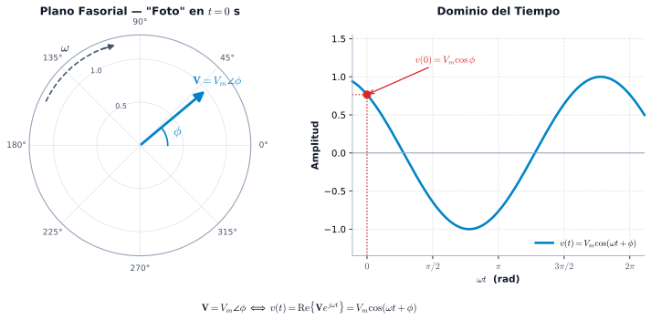
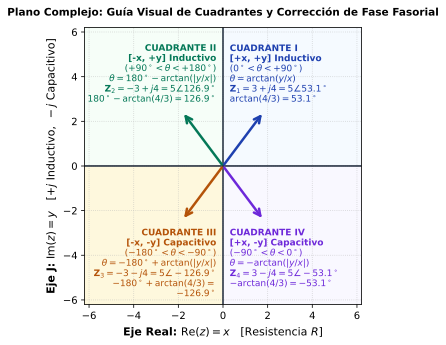

````{=html}
<div id="quick-links-sidebar" class="card p-3 shadow-sm" style="border-left: 5px solid #ef4444;">
  <div class="fw-bold text-dark mb-2 pb-1 border-bottom" style="font-size: 0.84rem;">
    <i class="bi bi-lightning-charge-fill text-danger me-1"></i> Recursos Rápidos
  </div>

  <div class="d-flex flex-column gap-2">
    <div>
      <div class="text-muted fw-bold mb-1" style="font-size: 0.68rem; text-transform: uppercase; letter-spacing: 0.4px;">Sistema Resistivo, Inductivo y Capacitivo, referencia Angulo de desfase entre Tensión y Corriente.</div>
      <a href="https://www.youtube.com/shorts/wjWy1FEaulM" target="_blank" class="btn btn-danger btn-sm text-start w-100">
        <i class="bi bi-youtube me-1"></i> @CANALELECTRICO1
      </a>
    </div>

    <div>
      <div class="text-muted fw-bold mb-1" style="font-size: 0.68rem; text-transform: uppercase; letter-spacing: 0.4px;">Inductor y capacitor en corriente alterna</div>
      <a href="https://www.youtube.com/shorts/1fX9t5c6kw0" target="_blank" class="btn btn-danger btn-sm text-start w-100">
        <i class="bi bi-youtube me-1"></i> @ingenierosenserie
      </a>
    </div>

    <div>
      <div class="text-muted fw-bold mb-1" style="font-size: 0.68rem; text-transform: uppercase; letter-spacing: 0.4px;">Tutorial Polar ↔ Rectangular (Casio fx-9750GIII)</div>
      <a href="https://www.youtube.com/watch?v=-QkvEE_9P4M&t=17s" target="_blank" class="btn btn-danger btn-sm text-start w-100" title="Tutorial Como transformar de polar a rectangular y viceversa Casio fx-9750GIII">
        <i class="bi bi-youtube me-1"></i> Tutorial Casio fx-9750GIII
      </a>
    </div>

    <div>
      <div class="text-muted fw-bold mb-1" style="font-size: 0.68rem; text-transform: uppercase; letter-spacing: 0.4px;">Tutorial Polar ↔ Rectangular (Casio fx-991ES PLUS)</div>
      <a href="https://www.youtube.com/watch?v=mrMpLfHkxRk" target="_blank" class="btn btn-danger btn-sm text-start w-100" title="Tutorial Como transformar de polar a rectangular y viceversa Casio fx-991ES PLUS">
        <i class="bi bi-youtube me-1"></i> Tutorial Casio fx-991ES PLUS
      </a>
    </div>

    <div>
      <div class="text-muted fw-bold mb-1" style="font-size: 0.68rem; text-transform: uppercase; letter-spacing: 0.4px;">Tutorial Polar ↔ Rectangular (Casio fx-82MS)</div>
      <a href="https://www.youtube.com/watch?v=Em3XkHxGPn4" target="_blank" class="btn btn-danger btn-sm text-start w-100" title="Tutorial Polar a Rectangular Casio fx-82MS / fx-350MS">
        <i class="bi bi-youtube me-1"></i> Tutorial Casio fx-82MS
      </a>
    </div>

    <div>
      <div class="text-muted fw-bold mb-1" style="font-size: 0.68rem; text-transform: uppercase; letter-spacing: 0.4px;">Tutorial Polar ↔ Rectangular (Calculadora Genérica / China)</div>
      <a href="https://www.youtube.com/watch?v=_OXVmNMPaKY" target="_blank" class="btn btn-danger btn-sm text-start w-100" title="Tutorial Polar a Rectangular Calculadora China Universal">
        <i class="bi bi-youtube me-1"></i> Tutorial Calc. Universal / China
      </a>
    </div>

    <div>
      <div class="text-muted fw-bold mb-1" style="font-size: 0.68rem; text-transform: uppercase; letter-spacing: 0.4px;">Documento Offline</div>
      <a href="teoria_fasores.pdf" download class="btn btn-outline-danger btn-sm text-start w-100">
        <i class="bi bi-file-earmark-pdf-fill me-1"></i> Descargar Guía en PDF
      </a>
    </div>

    <div>
      <div class="text-muted fw-bold mb-1" style="font-size: 0.68rem; text-transform: uppercase; letter-spacing: 0.4px;">Siguiente Módulo</div>
      <a href="potencia_ca.qmd" class="btn btn-primary btn-sm text-start w-100">
        <i class="bi bi-lightning-charge me-1"></i> Módulo Potencia CA
      </a>
    </div>

    <div>
      <div class="text-muted fw-bold mb-1" style="font-size: 0.68rem; text-transform: uppercase; letter-spacing: 0.4px;">Código Fuente</div>
      <a href="../descargas/calculo_fasores.py" class="btn btn-outline-primary btn-sm text-start w-100">
        <i class="bi bi-download me-1"></i> Script Python
      </a>
    </div>

    <div>
      <div class="text-muted fw-bold mb-1" style="font-size: 0.68rem; text-transform: uppercase; letter-spacing: 0.4px;">Navegación</div>
      <a href="index.qmd" class="btn btn-outline-secondary btn-sm text-start w-100">
        <i class="bi bi-book me-1"></i> Índice Circuitos
      </a>
    </div>
  </div>
</div>
````

::: {.callout-note}
⚡ Idea central

El análisis fasorial no consiste en memorizar conversiones. Consiste en aprender una **cadena de razonamiento**:

$$
\boxed{
\text{Señal temporal}
\;\longrightarrow\;
\text{Coseno canónico}
\;\longrightarrow\;
\text{Fasor}
\;\longrightarrow\;
\text{Álgebra compleja}
\;\longrightarrow\;
\text{Circuito CA}
}
$$

El objetivo de esta guía es que puedas recorrer esa cadena **sin perder el significado físico de cada paso**.
:::

---

# Ruta de aprendizaje

::: {.grid style="margin: 1.5rem 0;"}

::: {.g-col-12 .g-col-md-3}
::: {.card-module style="border-top: 4px solid #0284c7;"}
**01 · SEÑAL**

Identifica:

- amplitud
- frecuencia
- $\omega$
- fase
- signo

$v(t)$

:::
:::

::: {.g-col-12 .g-col-md-3}
::: {.card-module style="border-top: 4px solid #f59e0b;"}
**02 · NORMALIZAR**

Lleva la señal a:

$$
V_m\cos(\omega t+\phi)
$$

Aquí se resuelven seno y signos negativos.
:::
:::

::: {.g-col-12 .g-col-md-3}
::: {.card-module style="border-top: 4px solid #10b981;"}
**03 · FASOR**

Elimina la dependencia explícita del tiempo:

$$
\mathbf V=V\angle\phi
$$

Usa pico o RMS, pero no los mezcles.
:::
:::

::: {.g-col-12 .g-col-md-3}
::: {.card-module style="border-top: 4px solid #8b5cf6;"}
**04 · RESOLVER**

Usa:

- rectangular → sumar/restar
- polar → multiplicar/dividir
- impedancias → circuitos

:::
:::

:::

::: {.callout-tip}
### 🎯 Resultado esperado

Al terminar, no solo deberías poder calcular un fasor. Deberías poder **explicar qué significa su magnitud, su ángulo y su signo** dentro de un circuito eléctrico.
:::

---

# Señales sinusoidales: el punto de partida

Una señal sinusoidal puede escribirse como:

$$
v(t)=V_m\cos(\omega t+\phi)
$$

donde:

| Magnitud | Significado | Unidad |
|:---:|:---:|:---:|
| $V_m$ | amplitud máxima | V |
| $\omega$ | frecuencia angular | rad/s |
| $\phi$ | fase inicial | ° o rad |
| $t$ | tiempo | s |{tbl-colwidths="[20,20,20]"}

La frecuencia angular $\omega$ se relaciona con la frecuencia $f$: $\quad \boxed{\omega=2\pi f}$

$\qquad \qquad \qquad \qquad \qquad \qquad \qquad \qquad$ y el período $T$: $\quad \boxed{T=\frac{1}{f}}$

$\qquad \qquad \qquad \qquad \qquad \qquad \qquad \qquad$ Por tanto: $\qquad \quad  \boxed{\omega=\frac{2\pi}{T}}$

::: {.callout-important}
### ⚠️ La frecuencia es fundamental

Cuando pasamos al dominio fasorial, la variable $t$ deja de aparecer explícitamente, pero **la frecuencia no desaparece del circuito**.

En particular:

$$
X_L=\omega L
$$

$$
X_C=\frac{1}{\omega C}
$$

La frecuencia termina determinando la impedancia y, por tanto, las corrientes y tensiones.
:::

---

# ¿Qué es realmente un fasor?

Un fasor es una representación compleja de la **magnitud y fase** de una señal sinusoidal respecto a una frecuencia angular determinada.

Partimos de:

$$
v(t)=V_m\cos(\omega t+\phi)
$$

y definimos:

$$
\boxed{\mathbf V=V_m\angle\phi}
$$

La reconstrucción temporal se expresa como:

$$
\boxed{
v(t)=\operatorname{Re}\left\{\mathbf V e^{j\omega t}\right\}
}
$$

Por tanto:

$$
\mathbf V=V_m\angle\phi
\quad\Longleftrightarrow\quad
v(t)=V_m\cos(\omega t+\phi)
$$

::: {.callout-note}
### 🧠 Fasor ≠ señal temporal

El fasor **no contiene el tiempo explícitamente**.

Contiene la información necesaria para representar la amplitud y fase de una sinusoidal de frecuencia conocida. La dependencia temporal se recupera mediante $e^{j\omega t}$.
:::

## El sinor y la proyección temporal

El concepto geométrico puede visualizarse como un vector rotatorio cuya proyección sobre el eje real produce la sinusoidal.

{width=100%}

La imagen debe interpretarse como una **representación geométrica**, no como la definición matemática completa del fasor.

---

# De seno a coseno: normalización antes de obtener el fasor

La convención utilizada en esta guía es:

$$
\boxed{V_m\cos(\omega t+\phi)}
$$

Por eso, antes de extraer el fasor debemos normalizar la señal.

## Identidades esenciales

$$
\boxed{\sin(\theta)=\cos(\theta-90^\circ)}
$$

$$
\boxed{-\sin(\theta)=\cos(\theta+90^\circ)}
$$

$$
\boxed{-\cos(\theta)=\cos(\theta\pm180^\circ)}
$$

### Tabla de conversión

| Señal original | Forma coseno | Cambio de fase |
|---|---|---:|
| $+\sin(\omega t+\theta)$ | $\cos(\omega t+\theta-90^\circ)$ | $-90^\circ$ |
| $-\sin(\omega t+\theta)$ | $\cos(\omega t+\theta+90^\circ)$ | $+90^\circ$ |
| $+\cos(\omega t+\theta)$ | ya está normalizada | $0^\circ$ |
| $-\cos(\omega t+\theta)$ | $\cos(\omega t+\theta+180^\circ)$ | $+180^\circ$ |

::: {.callout-tip}
### Regla práctica

**Primero normaliza la función. Después extrae el fasor.**

No intentes memorizar directamente un fasor para cada combinación de seno, coseno y signo.
:::

## Ejemplo

Sea: $\qquad \qquad \qquad i(t)=-4\sin(10t+15^\circ)\ \mathrm A$

Normalizamos: $\qquad -4\sin(10t+15^\circ) = 4\cos(10t+15^\circ+90^\circ)$

Entonces: $\qquad \qquad i(t)=4\cos(10t+105^\circ)$

$\qquad \qquad \qquad \qquad \boxed{\mathbf I=4\angle105^\circ\ \mathrm A}$

---

# Valor pico y valor eficaz RMS

Para una sinusoidal:

$$
V_{\mathrm{rms}}=\frac{V_m}{\sqrt2}
$$

por tanto:

$$
\boxed{
V_{\mathrm{rms}}\approx0.7071V_m
}
$$

La fase **no cambia** al convertir de pico a RMS:

$$
\boxed{
\mathbf V_{\mathrm{rms}}
=
\frac{V_m}{\sqrt2}\angle\phi
}
$$

## Ejemplo

$$
v(t)=120\cos(\omega t+30^\circ)\ \mathrm V
$$

Fasor pico:

$$
\mathbf V_p=120\angle30^\circ\ \mathrm V
$$

Fasor RMS:

$$
\mathbf V_{\mathrm{rms}}
=
\frac{120}{\sqrt2}\angle30^\circ
=
84.85\angle30^\circ\ \mathrm V
$$

::: {.callout-important}
### ⚠️ Regla crítica

En una misma ecuación fasorial, utiliza **todos los valores en pico o todos en RMS**.

Nunca mezcles:

$$
V_{\mathrm{rms}}
\quad\text{con}\quad
I_{\mathrm{pico}}
$$

sin realizar antes la conversión correspondiente.
:::

---

# ¿Cuándo puedo utilizar fasores?

La representación fasorial convencional se utiliza para:

- señales sinusoidales;
- régimen permanente;
- una frecuencia angular determinada;
- sistemas lineales donde las operaciones fasoriales sean aplicables.

::: {.callout-warning}
### ⚠️ No cualquier señal se convierte en un único fasor

Una señal no sinusoidal general no puede representarse mediante un único fasor.

Por ejemplo:

$$
x(t)=\sin(10t)+\sin(100t)
$$

contiene **dos frecuencias diferentes**.

Cada componente puede analizarse por separado mediante herramientas apropiadas, pero no existe un único fasor que represente toda la señal.
:::

---

# El plano complejo

Un número complejo puede representarse como:

$$
\boxed{\mathbf z=x+jy}
$$

donde:

- $x$ es la componente real;
- $y$ es la componente imaginaria;
- $j=\sqrt{-1}$.

También puede escribirse en forma polar:

$$
\boxed{\mathbf z=r\angle\theta}
$$

o exponencial:

$$
\boxed{\mathbf z=re^{j\theta}}
$$

## Conversión rectangular → polar

Para obtener la magnitud $r$ y el ángulo $\theta$ a partir de las coordenadas cartesianas $(x, y)$:

$$
\boxed{r=\sqrt{x^2+y^2}}
$$

y el ángulo $\theta$ debe calcularse considerando estrictamente el **signo de $x$ y de $y$ (ajuste de cuadrante)**:

$$
\boxed{\theta=\operatorname{atan2}(y,x)}
$$

::: {.callout-note}
### 🧭 ¿Por qué `atan2` y no solo $\arctan(y/x)$?

La función arco tangente estándar $\arctan(y/x)$ de las matemáticas continuas únicamente devuelve valores en el rango $(-90^\circ, +90^\circ)$ (Cuadrantes I y IV). 

Si un número complejo tiene $x < 0$ (Cuadrantes II y III), la división $y/x$ arroja un signo ambiguo:
- $\frac{4}{-3} = -1.33 \implies \arctan(-1.33) = -53.13^\circ$ *(¡Falso! El punto $(-3, 4)$ está en el Cuadrante II a $126.87^\circ$)*.

La función matemática $\operatorname{atan2}(y,x)$ analiza **ambos signos independientemente** para entregar el ángulo geométrico verdadero en $(-180^\circ, +180^\circ]$.
:::

::: {.callout-tip}
### 📟 ¿Cómo calcularlo en tu calculadora científica física? (Casio / Sharp / TI)

En tu calculadora física **no existe una tecla llamada `atan2` ni `atan`**. Tienes 3 formas prácticas de calcularlo en exámenes y laboratorio:

#### 🥇 Método 1: La función directa `Pol(` (El `atan2` de la calculadora)
Las calculadoras científicas estándar (Casio fx-570, fx-991, fx-82, etc.) incluyen la función de conversión automática de coordenadas con ajuste de cuadrante incluido:

* **De Rectangular a Polar:**  
  1. Presiona `SHIFT` + `+` $\longrightarrow$ Aparece en pantalla **`Pol(`**.
  2. Digita la parte real $x$, luego la coma con `SHIFT` + `)` y la parte imaginaria $y$.  
     *Ejemplo:* `Pol(-3, 4)` y presiona `=`.
  3. **Resultado instantáneo:** `r = 5`, `θ = 126.87°` *(el ángulo ya viene con el cuadrante exacto)*.
* **De Polar a Rectangular:**  
  1. Presiona `SHIFT` + `-` $\longrightarrow$ Aparece **`Rec(`**.
  2. Digita `Rec(r, θ)`. *Ejemplo:* `Rec(5, 126.87) =` $\longrightarrow$ Entrega `X = -3`, `Y = 4`.

---

#### 🥈 Método 2: Con la tecla `tan⁻¹` y ajuste manual de cuadrante
Si calculas por partes mediante $r = \sqrt{x^2+y^2}$ y la tecla `tan⁻¹` (`SHIFT` + `tan`):

1. Calcula el ángulo base con valores absolutos: $\alpha = \tan^{-1}\left(\left|\frac{y}{x}\right|\right)$.
2. Aplica la regla según los signos de $(x, y)$:

| Cuadrante | Signos $(x, y)$ | Fórmula de Corrección en Calculadora | Ejemplo con $|x|=3, |y|=4$ ($\alpha = 53.13^\circ$) |
| :--- | :---: | :--- | :--- |
| **I** | $(+x, +y)$ | $\theta = \alpha$ | $\mathbf{Z} = 3 + j4 \implies \theta = \mathbf{+53.13^\circ}$ |
| **II** | $(-x, +y)$ | $\theta = 180^\circ - \alpha$ | $\mathbf{Z} = -3 + j4 \implies \theta = 180^\circ - 53.13^\circ = \mathbf{+126.87^\circ}$ |
| **III** | $(-x, -y)$ | $\theta = -180^\circ + \alpha$ | $\mathbf{Z} = -3 - j4 \implies \theta = -180^\circ + 53.13^\circ = \mathbf{-126.87^\circ}$ |
| **IV** | $(+x, -y)$ | $\theta = -\alpha$ | $\mathbf{Z} = 3 - j4 \implies \theta = \mathbf{-53.13^\circ}$ |

---

#### 🥉 Método 3: Modo Números Complejos (`MODE 2: CMPLX`)
El método más rápido para resolver circuitos completos:

1. **Activar modo complejo:** Presiona `MODE` $\longrightarrow$ `2: CMPLX`.
2. Verifica que tu calculadora esté en grados sexagesimales (indicador **`D`** o `Deg` en la parte superior).
3. Escribe el número directamente en pantalla:  
   Digita `-3 + 4` e inserta la unidad imaginaria $j$ presionando la tecla **`ENG`** (aparece la $i$).
4. **Convertir a Polar:**  
   - En Casio clásica: Presiona `SHIFT` + `2` (menú CMPLX) $\longrightarrow$ selecciona `3: ▶r∠θ` $\longrightarrow$ `=`.
   - En Casio ClassWiz: Presiona `OPTN` $\longrightarrow$ flecha abajo $\longrightarrow$ `1: ▶r∠θ` $\longrightarrow$ `=`.
5. La pantalla mostrará directamente: `5 ∠ 126.87°`.

---

##### 🎬 Videotutoriales paso a paso según tu modelo de calculadora:
- 📺 **Casio fx-9750GIII (Gráfica):** [Ver tutorial paso a paso](https://www.youtube.com/watch?v=-QkvEE_9P4M&t=17s){target="_blank"}
- 📺 **Casio fx-991ES PLUS / fx-570ES:** [Ver tutorial paso a paso](https://www.youtube.com/watch?v=mrMpLfHkxRk){target="_blank"}
- 📺 **Casio fx-82MS / fx-350MS:** [Ver tutorial paso a paso](https://www.youtube.com/watch?v=Em3XkHxGPn4){target="_blank"}
- 📺 **Calculadora Científica Universal / Genérica China:** [Ver tutorial paso a paso](https://www.youtube.com/watch?v=_OXVmNMPaKY){target="_blank"}
:::

## Conversión polar → rectangular

$$
\boxed{x=r\cos\theta}
$$

$$
\boxed{y=r\sin\theta}
$$

por tanto:

$$
\boxed{
r\angle\theta
=
r\cos\theta+jr\sin\theta
}
$$

---

# Cuadrantes: magnitud y fase con significado

{width=100%}

| Cuadrante | $x$ | $y$ | Interpretación angular |
|---:|:---:|:---:|---|
| I | $+$ | $+$ | $0^\circ<\theta<90^\circ$ |
| II | $-$ | $+$ | $90^\circ<\theta<180^\circ$ |
| III | $-$ | $-$ | $-180^\circ<\theta<-90^\circ$ |
| IV | $+$ | $-$ | $-90^\circ<\theta<0^\circ$ |

::: {.callout-tip}
### Regla de oro

No corrijas el ángulo “a ojo”.

Primero identifica:

$$
(x,y)
$$

después el cuadrante y finalmente el ángulo.
:::

---

# El operador $j$: un giro de $90^\circ$

Una de las ideas más importantes de todo el análisis fasorial es:

$$
\boxed{j=1\angle90^\circ}
$$

Multiplicar por $j$ produce un giro antihorario de $90^\circ$:

$$
\boxed{j\mathbf Z=|\mathbf Z|\angle(\theta+90^\circ)}
$$

Multiplicar por $-j$ produce:

$$
\boxed{-j\mathbf Z=|\mathbf Z|\angle(\theta-90^\circ)}
$$

## Ciclo de potencias

$$
j^0=1
$$

$$
j^1=j
$$

$$
j^2=-1
$$

$$
j^3=-j
$$

$$
j^4=1
$$

El ciclo se repite cada cuatro potencias.

También:

$$
\boxed{\frac1j=-j}
$$

::: {.callout-note}
### 🧠 Interpretación física

En fasores, $j$ no es simplemente una letra algebraica.

Es un operador que representa un **desplazamiento angular de $+90^\circ$**.
:::

---

# Operaciones con números complejos

## Suma y resta

La forma rectangular es la más conveniente:

$$
(a+jb)+(c+jd)
=
(a+c)+j(b+d)
$$

## Multiplicación

La forma polar es especialmente conveniente:

$$
(r_1\angle\theta_1)(r_2\angle\theta_2)
=
r_1r_2\angle(\theta_1+\theta_2)
$$

## División

$$
\frac{r_1\angle\theta_1}{r_2\angle\theta_2}
=
\frac{r_1}{r_2}\angle(\theta_1-\theta_2)
$$

## Conjugado

$$
\boxed{
(a+jb)^*=a-jb
}
$$

y:

$$
\boxed{
(r\angle\theta)^*=r\angle(-\theta)
}
$$

## División rectangular

$$
\frac{a+jb}{c+jd}
=
\frac{(a+jb)(c-jd)}{c^2+d^2}
$$

por tanto:

$$
\boxed{
\frac{a+jb}{c+jd}
=
\frac{ac+bd}{c^2+d^2}
+
j\frac{bc-ad}{c^2+d^2}
}
$$

---

# Impedancia: donde el fasor se convierte en Ingeniería Eléctrica

La gran conexión entre fasores y circuitos es:

$$
\boxed{\mathbf V=\mathbf I\mathbf Z}
$$

o:

$$
\boxed{\mathbf I=\frac{\mathbf V}{\mathbf Z}}
$$

La impedancia es compleja:

$$
\boxed{\mathbf Z=R+jX}
$$

donde:

- $R$ → resistencia;
- $X$ → reactancia.

Su forma polar es:

$$
\boxed{\mathbf Z=|\mathbf Z|\angle\theta_Z}
$$

---

# Elementos pasivos R, L y C

| Elemento | Relación temporal | Impedancia | $\theta_V-\theta_I$ |
|---|---|---|---:|
| Resistor | $v=Ri$ | $\mathbf Z_R=R$ | $0^\circ$ |
| Inductor | $v=L\,di/dt$ | $\mathbf Z_L=j\omega L$ | $+90^\circ$ |
| Capacitor | $i=C\,dv/dt$ | $\mathbf Z_C=1/(j\omega C)$ | $-90^\circ$ |

## Resistor

$$
\boxed{\mathbf Z_R=R=R\angle0^\circ}
$$

Tensión y corriente están en fase.

## Inductor

$$
\boxed{\mathbf Z_L=j\omega L=\omega L\angle90^\circ}
$$

Por tanto:

$$
\boxed{\mathbf V_L=j\omega L\mathbf I}
$$

La tensión adelanta a la corriente $90^\circ$.

### 🧠 ELI

**E** antes que **I** → en el inductor:

$$
V_L\text{ adelanta a }I
$$

## Capacitor

$$
\boxed{
\mathbf Z_C=
\frac1{j\omega C}
=
-j\frac1{\omega C}
}
$$

Por tanto:

$$
\boxed{
\mathbf V_C=-j\frac1{\omega C}\mathbf I
}
$$

La tensión atrasa a la corriente $90^\circ$.

### 🧠 ICE

**I** antes que **E** → en el capacitor:

$$
I\text{ adelanta a }V_C
$$

::: {.callout-tip}
### ELI e ICE son memoria, no demostración

La comprensión profunda está en:

$$
+j\Rightarrow+90^\circ
$$

$$
-j\Rightarrow-90^\circ
$$

Las reglas ELI/ICE sirven para recordar rápidamente el resultado.
:::

---

# Ejemplo integrado: de la señal al circuito RLC

Consideremos:

$$
R=30\ \Omega
$$

$$
L=50\ \mathrm{mH}
$$

$$
C=25\ \mu\mathrm F
$$

y:

$$
v(t)=120\cos(1000t+30^\circ)\ \mathrm V
$$

## Paso 1 — Frecuencia

$$
\omega=1000\ \mathrm{rad/s}
$$

## Paso 2 — Impedancias

Inductor:

$$
X_L=\omega L
=
1000(0.050)
=
50\ \Omega
$$

$$
\mathbf Z_L=j50\ \Omega
$$

Capacitor:

$$
X_C=\frac1{\omega C}
=
\frac1{1000(25\times10^{-6})}
=
40\ \Omega
$$

$$
\mathbf Z_C=-j40\ \Omega
$$

## Paso 3 — Impedancia equivalente

Al ser un circuito serie:

$$
\mathbf Z_T
=
R+\mathbf Z_L+\mathbf Z_C
$$

$$
\mathbf Z_T
=
30+j50-j40
$$

$$
\boxed{\mathbf Z_T=30+j10\ \Omega}
$$

En polar:

$$
|\mathbf Z_T|
=
\sqrt{30^2+10^2}
=
31.62\ \Omega
$$

$$
\theta_Z
=
\arctan\left(\frac{10}{30}\right)
=
18.43^\circ
$$

por tanto:

$$
\boxed{\mathbf Z_T=31.62\angle18.43^\circ\ \Omega}
$$

## Paso 4 — Corriente

Usando fasores pico:

$$
\mathbf V=120\angle30^\circ\ \mathrm V
$$

entonces:

$$
\mathbf I
=
\frac{\mathbf V}{\mathbf Z_T}
$$

$$
\mathbf I
=
\frac{120\angle30^\circ}
{31.62\angle18.43^\circ}
$$

$$
\boxed{
\mathbf I
=
3.80\angle11.57^\circ\ \mathrm A
}
$$

La señal temporal:

$$
\boxed{
i(t)=3.80\cos(1000t+11.57^\circ)\ \mathrm A
}
$$

## Paso 5 — Tensiones individuales

Resistor:

$$
\mathbf V_R
=
\mathbf I R
=
114.0\angle11.57^\circ\ \mathrm V
$$

Inductor:

$$
\mathbf V_L
=
\mathbf I(j50)
=
190.0\angle101.57^\circ\ \mathrm V
$$

Capacitor:

$$
\mathbf V_C
=
\mathbf I(-j40)
=
152.0\angle-78.43^\circ\ \mathrm V
$$

Finalmente:

$$
\boxed{
\mathbf V_R+\mathbf V_L+\mathbf V_C
=
\mathbf V
}
$$

Esta es la conexión fundamental:

$$
\boxed{
v(t)
\rightarrow
\mathbf V
\rightarrow
\mathbf Z
\rightarrow
\mathbf I
\rightarrow
i(t)
}
$$

---

# Diagrama fasorial: no basta con calcular

Un diagrama fasorial debe permitir responder preguntas como:

- ¿Cuál es la referencia?
- ¿Qué fasor adelanta?
- ¿Qué fasor atrasa?
- ¿Por qué?
- ¿Cuál es la suma resultante?
- ¿Qué indica el ángulo de la impedancia?

::: {.callout-note}
### 🎯 Interpretación del ángulo de impedancia

Si:

$$
\mathbf Z=|\mathbf Z|\angle\theta_Z
$$

entonces:

$$
\theta_V-\theta_I=\theta_Z
$$

Por tanto:

- $\theta_Z>0$ → comportamiento inductivo;
- $\theta_Z=0$ → comportamiento resistivo;
- $\theta_Z<0$ → comportamiento capacitivo.
:::

---

# Banco de Ejercicios y Problemas de Práctica

A continuación se presenta un compendio graduado desde niveles fundamentales hasta análisis de circuitos completos en CA. En cada ejercicio, el enunciado y su desarrollo analítico completo se presentan en paralelo para su estudio directo.

---

## 🟢 Nivel 1: Fundamentos y Transformaciones

### Ejercicio 1 — Conversión de señales temporales a fasores

::: {.grid .my-3}
::: {.g-col-12 .g-col-lg-5}
::: {.card .p-3 .h-100 style="border-left: 4px solid #0284c7; background: #ffffff;"}
##### 📋 Enunciado

Dadas las siguientes señales temporales de corriente y tensión:

$$
v(t) = 120\sqrt{2}\cos(377t - 45^\circ)\ \mathrm V
$$

$$
i(t) = -10\sin(377t + 30^\circ)\ \mathrm A
$$

**Determinar:**

1. El fasor en valor pico ($\mathbf V_p, \mathbf I_p$).
2. El fasor en valor eficaz o RMS ($\mathbf V_{\mathrm{rms}}, \mathbf I_{\mathrm{rms}}$).
:::
:::

::: {.g-col-12 .g-col-lg-7}
::: {.card .p-3 .h-100 style="border-left: 4px solid #10b981; background: #f8fafc;"}
##### 💡 Desarrollo y Solución

**1. Para la tensión $v(t)$:**
- Ya está en forma coseno positiva canónica:
  $$
  \boxed{\mathbf V_p = 120\sqrt{2}\angle -45^\circ \approx 169.71\angle -45^\circ\ \mathrm V}
  $$
- Para el valor eficaz RMS:
  $$
  V_{\mathrm{rms}} = \frac{120\sqrt{2}}{\sqrt{2}} = 120\ \mathrm V \implies \boxed{\mathbf V_{\mathrm{rms}} = 120\angle -45^\circ\ \mathrm V}
  $$

**2. Para la corriente $i(t)$:**
- Normalizamos usando $-\sin(\alpha) = \cos(\alpha + 90^\circ)$:
  $$
  i(t) = 10\cos(377t + 30^\circ + 90^\circ) = 10\cos(377t + 120^\circ)\ \mathrm A
  $$
- **Fasor pico:**
  $$
  \boxed{\mathbf I_p = 10\angle 120^\circ\ \mathrm A}
  $$
- **Fasor RMS:**
  $$
  I_{\mathrm{rms}} = \frac{10}{\sqrt{2}} \approx 7.07\ \mathrm A \implies \boxed{\mathbf I_{\mathrm{rms}} = 7.07\angle 120^\circ\ \mathrm A}
  $$
:::
:::
:::

---

### Ejercicio 2 — Conversión entre formas rectangular y polar

::: {.grid .my-3}
::: {.g-col-12 .g-col-lg-5}
::: {.card .p-3 .h-100 style="border-left: 4px solid #0284c7; background: #ffffff;"}
##### 📋 Enunciado

Realizar las siguientes conversiones entre dominios complejos considerando el cuadrante correspondiente:

1. Convertir a forma polar:
   $$
   \mathbf Z_1 = 6 + j8\ \Omega
   $$
   $$
   \mathbf Z_2 = -5 + j5\ \Omega
   $$

2. Convertir a forma rectangular:
   $$
   \mathbf I = 10\angle -60^\circ\ \mathrm A
   $$
:::
:::

::: {.g-col-12 .g-col-lg-7}
::: {.card .p-3 .h-100 style="border-left: 4px solid #10b981; background: #f8fafc;"}
##### 💡 Desarrollo y Solución

**1. Para $\mathbf Z_1 = 6 + j8\ \Omega$ (Cuadrante I, $x>0, y>0$):**
- Módulo: $|\mathbf Z_1| = \sqrt{6^2 + 8^2} = \sqrt{36 + 64} = \sqrt{100} = 10\ \Omega$
- Ángulo: $\theta_1 = \arctan\left(\frac{8}{6}\right) \approx 53.13^\circ$
$$
\boxed{\mathbf Z_1 = 10\angle 53.13^\circ\ \Omega}
$$

**2. Para $\mathbf Z_2 = -5 + j5\ \Omega$ (Cuadrante II, $x<0, y>0$):**
- Módulo: $|\mathbf Z_2| = \sqrt{(-5)^2 + 5^2} = \sqrt{50} = 5\sqrt{2} \approx 7.07\ \Omega$
- Ángulo: $\theta_2 = 180^\circ - \arctan\left(\frac{5}{5}\right) = 180^\circ - 45^\circ = 135^\circ$
$$
\boxed{\mathbf Z_2 = 5\sqrt{2}\angle 135^\circ \approx 7.07\angle 135^\circ\ \Omega}
$$

**3. Para $\mathbf I = 10\angle -60^\circ\ \mathrm A$:**
- Parte real: $I_x = 10\cos(-60^\circ) = 10(0.5) = 5\ \mathrm A$
- Parte imaginaria: $I_y = 10\sin(-60^\circ) = 10\left(-\frac{\sqrt{3}}{2}\right) \approx -8.66\ \mathrm A$
$$
\boxed{\mathbf I = 5 - j8.66\ \mathrm A}
$$
:::
:::
:::

---

## 🟡 Nivel 2: Operaciones Complejas e Impedancias

### Ejercicio 3 — Suma fasorial en un nodo (Ley de Kirchhoff de Corrientes)

::: {.grid .my-3}
::: {.g-col-12 .g-col-lg-5}
::: {.card .p-3 .h-100 style="border-left: 4px solid #f59e0b; background: #ffffff;"}
##### 📋 Enunciado

En un nodo de un circuito de corriente alterna convergen dos corrientes:

$$
i_1(t) = 4\cos(\omega t + 30^\circ)\ \mathrm A
$$

$$
i_2(t) = 6\sin(\omega t + 60^\circ)\ \mathrm A
$$

**Determinar:**  
La corriente total $i_T(t) = i_1(t) + i_2(t)$ en el dominio del tiempo.
:::
:::

::: {.g-col-12 .g-col-lg-7}
::: {.card .p-3 .h-100 style="border-left: 4px solid #10b981; background: #f8fafc;"}
##### 💡 Desarrollo y Solución

**Paso 1: Convertir a fasores en forma coseno canónica:**

- $\mathbf I_1 = 4\angle 30^\circ\ \mathrm A$
- $i_2(t) = 6\cos(\omega t + 60^\circ - 90^\circ) = 6\cos(\omega t - 30^\circ)$  
  $\implies \mathbf I_2 = 6\angle -30^\circ\ \mathrm A$

**Paso 2: Descomponer a forma rectangular para sumar:**
$$
\mathbf I_1 = 4\cos(30^\circ) + j4\sin(30^\circ) = 2\sqrt{3} + j2 \approx 3.4641 + j2.0000\ \mathrm A
$$
$$
\mathbf I_2 = 6\cos(-30^\circ) + j6\sin(-30^\circ) = 3\sqrt{3} - j3 \approx 5.1962 - j3.0000\ \mathrm A
$$

**Paso 3: Suma fasorial $\mathbf I_T = \mathbf I_1 + \mathbf I_2$:**
$$
\mathbf I_T = (3.4641 + 5.1962) + j(2.0000 - 3.0000)
$$
$$
\mathbf I_T = 8.6603 - j1.0000\ \mathrm A
$$

**Paso 4: Conversión a polar y retorno al tiempo:**

- Módulo: $|\mathbf I_T| = \sqrt{8.6603^2 + (-1)^2} = \sqrt{76} \approx 8.72\ \mathrm A$
- Ángulo (Cuadrante IV): $\theta = \arctan\left(\frac{-1}{8.6603}\right) \approx -6.59^\circ$

$$
\mathbf I_T \approx 8.72\angle -6.59^\circ\ \mathrm A
$$
$$
\boxed{i_T(t) = 8.72\cos(\omega t - 6.59^\circ)\ \mathrm A}
$$
:::
:::
:::

---

### Ejercicio 4 — Evaluación de expresión compleja con conjugado

::: {.grid .my-3}
::: {.g-col-12 .g-col-lg-5}
::: {.card .p-3 .h-100 style="border-left: 4px solid #f59e0b; background: #ffffff;"}
##### 📋 Enunciado

Calcular el valor del número complejo $\mathbf X$:

$$
\mathbf X = \left[ \frac{(4 + j3)(2 - j4)}{-1 + j2} + 5\angle -45^\circ \right]^*
$$

Expresar el resultado en forma rectangular y polar.
:::
:::

::: {.g-col-12 .g-col-lg-7}
::: {.card .p-3 .h-100 style="border-left: 4px solid #10b981; background: #f8fafc;"}
##### 💡 Desarrollo y Solución

**Paso 1: Multiplicación del numerador ($j^2 = -1$):**
$$
(4+j3)(2-j4) = 8 - j16 + j6 - j^2(12) = 20 - j10
$$

**Paso 2: División multiplicando por el conjugado $(-1 - j2)$:**
$$
\frac{20 - j10}{-1 + j2} \cdot \frac{-1 - j2}{-1 - j2} = \frac{-20 - j40 + j10 + j^2(20)}{1 + 4} = \frac{-40 - j30}{5} = -8 - j6
$$

**Paso 3: Convertir $5\angle -45^\circ$ a rectangular y sumar:**
$$
5\angle -45^\circ = 5\cos(-45^\circ) + j5\sin(-45^\circ) \approx 3.5355 - j3.5355
$$
$$
\mathbf Z_{\text{interior}} = (-8 - j6) + (3.5355 - j3.5355) = -4.4645 - j9.5355
$$

**Paso 4: Aplicar el operador conjugado $(\ )^*$:**  
Cambiamos el signo de la parte imaginaria:
$$
\boxed{\mathbf X = -4.4645 + j9.5355}
$$

**Paso 5: Conversión a forma polar (Cuadrante II, $x<0, y>0$):**

- Módulo: $|\mathbf X| = \sqrt{(-4.4645)^2 + (9.5355)^2} \approx 10.529$
- Ángulo: $\theta = 180^\circ - \arctan\left(\frac{9.5355}{4.4645}\right) \approx +115.09^\circ$

$$
\boxed{\mathbf X \approx 10.529\angle 115.09^\circ}
$$
:::
:::
:::

---

### Ejercicio 5 — Impedancias en paralelo ($Z_1 \parallel Z_2$)

::: {.grid .my-3}
::: {.g-col-12 .g-col-lg-5}
::: {.card .p-3 .h-100 style="border-left: 4px solid #f59e0b; background: #ffffff;"}
##### 📋 Enunciado

Dos impedancias pasivas se conectan en paralelo:

$$
Z_1 = 10 + j15\ \Omega
$$

$$
Z_2 = 20 - j10\ \Omega
$$

**Determinar:**

1. La impedancia equivalente $Z_{eq} = \frac{Z_1 Z_2}{Z_1 + Z_2}$.
2. Indicar si el conjunto resultante tiene comportamiento global inductivo o capacitivo.
:::
:::

::: {.g-col-12 .g-col-lg-7}
::: {.card .p-3 .h-100 style="border-left: 4px solid #10b981; background: #f8fafc;"}
##### 💡 Desarrollo y Solución

**Paso 1: Suma en el denominador ($Z_1 + Z_2$):**
$$
Z_1 + Z_2 = (10 + 20) + j(15 - 10) = 30 + j5\ \Omega
$$

**Paso 2: Producto en el numerador ($Z_1 \cdot Z_2$):**
$$
Z_1 \cdot Z_2 = (10 + j15)(20 - j10) = 200 - j100 + j300 + 150 = 350 + j200\ \Omega^2
$$

**Paso 3: División por el conjugado $(30 - j5)$:**
$$
Z_{eq} = \frac{350 + j200}{30 + j5} \cdot \frac{30 - j5}{30 - j5} = \frac{11500 + j4250}{900 + 25}
$$
$$
Z_{eq} = \frac{11500 + j4250}{925}
$$
$$
\boxed{Z_{eq} \approx 12.43 + j4.59\ \Omega}
$$

**Paso 4: Conversión a forma polar:**

- Módulo: $|Z_{eq}| = \sqrt{12.43^2 + 4.59^2} \approx 13.25\ \Omega$
- Ángulo: $\theta = \arctan\left(\frac{4.59}{12.43}\right) \approx +20.28^\circ$

$$
\boxed{Z_{eq} \approx 13.25\angle 20.28^\circ\ \Omega}
$$

**Conclusión física:**  
Como la reactancia equivalente es positiva ($X_{eq} = +4.59\ \Omega$) y $\theta > 0$, el circuito se comporta de forma globalmente **inductiva** (la tensión adelanta a la corriente).
:::
:::
:::

---

## 🔴 Nivel 3: Circuitos RLC en Régimen Permanente

### Ejercicio 6 — Análisis completo de un circuito RLC serie

::: {.grid .my-3}
::: {.g-col-12 .g-col-lg-5}
::: {.card .p-3 .h-100 style="border-left: 4px solid #ef4444; background: #ffffff;"}
##### 📋 Enunciado

Un circuito RLC serie está alimentado por una fuente de tensión sinusoidal:

$$
v(t) = 100\cos(200t + 10^\circ)\ \mathrm V
$$

Los componentes pasivos son:
- Resistencia: $R = 4\ \Omega$
- Inductancia: $L = 25\ \mathrm{mH}$
- Capacitancia: $C = 500\ \mu\mathrm{F}$

**Calcular:**
1. Las impedancias complejas $\mathbf Z_R, \mathbf Z_L, \mathbf Z_C$ y la total $\mathbf Z_{eq}$.
2. La corriente fasorial $\mathbf I$ en el circuito.
3. Las caídas de tensión fasoriales $\mathbf V_L$ y $\mathbf V_C$.
4. Determinar si el circuito está en adelanto o atraso.
:::
:::

::: {.g-col-12 .g-col-lg-7}
::: {.card .p-3 .h-100 style="border-left: 4px solid #10b981; background: #f8fafc;"}
##### 💡 Desarrollo y Solución

**Paso 1: Frecuencia angular e impedancias:**  
De la fuente, $\omega = 200\ \mathrm{rad/s}$ y $\mathbf V = 100\angle 10^\circ\ \mathrm V$.

- $\mathbf Z_R = 4\ \Omega$
- $\mathbf Z_L = j\omega L = j(200)(0.025) = j5\ \Omega$
- $\mathbf Z_C = \frac{1}{j\omega C} = \frac{-j}{(200)(500\times 10^{-6})} = -j10\ \Omega$

**Impedancia equivalente total:**
$$
\mathbf Z_{eq} = 4 + j5 - j10 = 4 - j5\ \Omega
$$

En forma polar:
- $|\mathbf Z_{eq}| = \sqrt{4^2 + (-5)^2} = \sqrt{41} \approx 6.403\ \Omega$
- $\theta_Z = \arctan\left(\frac{-5}{4}\right) \approx -51.34^\circ$

$$
\boxed{\mathbf Z_{eq} = 6.403\angle -51.34^\circ\ \Omega}
$$

**Paso 2: Corriente en el circuito (Ley de Ohm fasorial):**
$$
\mathbf I = \frac{\mathbf V}{\mathbf Z_{eq}} = \frac{100\angle 10^\circ}{6.403\angle -51.34^\circ} = \boxed{15.62\angle 61.34^\circ\ \mathrm A}
$$

**Paso 3: Caídas de tensión en $L$ y $C$:**

- Tensión en el inductor:
  $$
  \mathbf V_L = \mathbf I \cdot \mathbf Z_L = (15.62\angle 61.34^\circ)(5\angle 90^\circ) = \boxed{78.10\angle 151.34^\circ\ \mathrm V}
  $$
- Tensión en el capacitor:
  $$
  \mathbf V_C = \mathbf I \cdot \mathbf Z_C = (15.62\angle 61.34^\circ)(10\angle -90^\circ) = \boxed{156.20\angle -28.66^\circ\ \mathrm V}
  $$

**Conclusión física:**  
Como $X_C > X_L$ ($10\ \Omega > 5\ \Omega$), el ángulo de la impedancia es negativo ($\theta_Z = -51.34^\circ$). El circuito es **capacitivo** y la corriente **adelanta a la tensión** en $51.34^\circ$.
:::
:::
:::

---

### Ejercicio 7 — Divisor de corriente y tensión común en paralelo

::: {.grid .my-3}
::: {.g-col-12 .g-col-lg-5}
::: {.card .p-3 .h-100 style="border-left: 4px solid #ef4444; background: #ffffff;"}
##### 📋 Enunciado

Una fuente de corriente sinusoidal $\mathbf I_s = 5\angle 0^\circ\ \mathrm A$ alimenta dos ramas en paralelo:
- Rama A: $\mathbf Z_A = 6 + j8\ \Omega$ (Carga Inductiva)
- Rama B: $\mathbf Z_B = 12 - j16\ \Omega$ (Carga Capacitiva)

**Calcular:**
1. La corriente $\mathbf I_A$ que fluye por la rama A mediante la fórmula del divisor de corriente:
   $$
   \mathbf I_A = \mathbf I_s \cdot \frac{\mathbf Z_B}{\mathbf Z_A + \mathbf Z_B}
   $$
2. La tensión común $\mathbf V$ en bornes del circuito en paralelo.
:::
:::

::: {.g-col-12 .g-col-lg-7}
::: {.card .p-3 .h-100 style="border-left: 4px solid #10b981; background: #f8fafc;"}
##### 💡 Desarrollo y Solución

**Paso 1: Suma de impedancias en el denominador:**
$$
\mathbf Z_A + \mathbf Z_B = (6 + 12) + j(8 - 16) = 18 - j8\ \Omega
$$

En forma polar:
- $|\mathbf Z_A + \mathbf Z_B| = \sqrt{18^2 + (-8)^2} = \sqrt{388} \approx 19.70\ \Omega$
- $\theta_{\text{suma}} = \arctan\left(\frac{-8}{18}\right) \approx -23.96^\circ \implies \mathbf Z_A + \mathbf Z_B \approx 19.70\angle -23.96^\circ\ \Omega$

**Paso 2: Formas polares del numerador:**

- $\mathbf I_s = 5\angle 0^\circ\ \mathrm A$
- $\mathbf Z_B = 12 - j16\ \Omega = 20\angle -53.13^\circ\ \Omega$

**Paso 3: Aplicación del divisor de corriente:**
$$
\mathbf I_A = \frac{(5\angle 0^\circ)(20\angle -53.13^\circ)}{19.70\angle -23.96^\circ} = \frac{100\angle -53.13^\circ}{19.70\angle -23.96^\circ}
$$
$$
\mathbf I_A = \left(\frac{100}{19.70}\right)\angle [-53.13^\circ - (-23.96^\circ)]
$$
$$
\boxed{\mathbf I_A \approx 5.08\angle -29.17^\circ\ \mathrm A}
$$

**Paso 4: Tensión común en bornes $\mathbf V$:**
Calculamos $\mathbf V = \mathbf I_A \cdot \mathbf Z_A$ con $\mathbf Z_A = 6 + j8\ \Omega = 10\angle 53.13^\circ\ \Omega$:
$$
\mathbf V = (5.08\angle -29.17^\circ)(10\angle 53.13^\circ) = \boxed{50.80\angle 23.96^\circ\ \mathrm V}
$$
:::
:::
:::

---

# Reto de interpretación

No calcules todavía. Razona.

Si:

$$
\mathbf Z=8+j6\ \Omega
$$

responde:

1. ¿Es inductiva o capacitiva?
2. ¿Cuál es el ángulo de $\mathbf Z$?
3. ¿La tensión adelanta o atrasa a la corriente?
4. ¿Qué ocurriría si la parte imaginaria fuese negativa?

::: {.callout-tip collapse="true"}
### Respuesta conceptual & Desarrollo

**1. Tipo de comportamiento:**
Como la reactancia es positiva:
$$
X = +6 > 0
$$
el circuito tiene comportamiento **inductivo**.

**2. Magnitud (módulo) de la impedancia:**
Aplicando el teorema de Pitágoras:
$$
|\mathbf Z| = \sqrt{R^2 + X^2} = \sqrt{8^2 + 6^2} = \sqrt{64 + 36} = \sqrt{100} = 10\ \Omega
$$

**3. Ángulo de fase:**
Como se ubica en el primer cuadrante ($R > 0, X > 0$):
$$
\theta_Z = \arctan\left(\frac{X}{R}\right) = \arctan\left(\frac{+6}{+8}\right) = \arctan(0.75) \approx +36.87^\circ
$$

**4. Forma polar final:**
$$
\boxed{\mathbf Z = 10\angle 36.87^\circ\ \Omega}
$$

**5. Conclusión física:**
- Al ser inductivo ($\theta_Z > 0$), la **tensión adelanta a la corriente** en $36.87^\circ$ (o la corriente atrasa a la tensión en $36.87^\circ$).
- Si la reactancia hubiese sido negativa ($X = -6$, capacitiva), el ángulo sería $\theta_Z = -36.87^\circ$ y la tensión atrasaría respecto a la corriente.
:::

---

# Herramienta interactiva: Rectangular ↔ Polar (Bidireccional)

::: {.card-module}
### 🧮 Conversor Interactivo Bidireccional de Fasores {.unnumbered}

```{=html}
<!-- Selector de Modo con Pestañas / Tabs -->
<ul class="nav nav-pills mb-4 justify-content-center" id="phasorTab" role="tablist">
  <li class="nav-item" role="presentation">
    <button class="nav-link active px-4 py-2 fw-bold" id="rec2pol-tab" data-bs-toggle="pill" type="button" role="tab" onclick="cambiarModo('rec2pol')">
      <i class="bi bi-arrow-right-circle me-1"></i> Rectangular ➔ Polar
    </button>
  </li>
  <li class="nav-item" role="presentation">
    <button class="nav-link px-4 py-2 fw-bold" id="pol2rec-tab" data-bs-toggle="pill" type="button" role="tab" onclick="cambiarModo('pol2rec')">
      <i class="bi bi-arrow-left-circle me-1"></i> Polar ➔ Rectangular
    </button>
  </li>
</ul>

<!-- Formulario Rectangular a Polar -->
<div id="panelRec2Pol" class="row g-3 align-items-end">
  <div class="col-md-5">
    <label for="realPart" class="form-label mb-1"><strong>Parte Real <i>x</i> (Resistencia <i>R</i>):</strong></label>
    <div class="input-group">
      <span class="input-group-text bg-light fw-bold text-secondary">Re</span>
      <input id="realPart" type="number" class="form-control" value="3" step="0.5" oninput="calcularDesdeRectangular()">
    </div>
  </div>

  <div class="col-md-5">
    <label for="imagPart" class="form-label mb-1"><strong>Parte Imaginaria <i>y</i> (Reactancia <i>X</i>):</strong></label>
    <div class="input-group">
      <span class="input-group-text bg-light fw-bold text-secondary">+<i>j</i> Im</span>
      <input id="imagPart" type="number" class="form-control" value="4" step="0.5" oninput="calcularDesdeRectangular()">
    </div>
  </div>

  <div class="col-md-2">
    <button class="btn btn-primary w-100" onclick="calcularDesdeRectangular()">
      <i class="bi bi-calculator me-1"></i> Calcular
    </button>
  </div>
</div>

<!-- Formulario Polar a Rectangular -->
<div id="panelPol2Rec" class="row g-3 align-items-end" style="display: none;">
  <div class="col-md-5">
    <label for="magPart" class="form-label mb-1"><strong>Magnitud o Módulo <i>r</i> (|<b>Z</b>| o |<b>V</b>|):</strong></label>
    <div class="input-group">
      <span class="input-group-text bg-light fw-bold text-secondary">|<i>r</i>|</span>
      <input id="magPart" type="number" class="form-control" value="5" min="0" step="0.5" oninput="calcularDesdePolar()">
    </div>
  </div>

  <div class="col-md-5">
    <label for="angPart" class="form-label mb-1"><strong>Ángulo de Fase <i>&theta;</i> (Grados &deg;):</strong></label>
    <div class="input-group">
      <span class="input-group-text bg-light fw-bold text-secondary">&ang; <i>&theta;</i></span>
      <input id="angPart" type="number" class="form-control" value="53.13" step="1" oninput="calcularDesdePolar()">
      <span class="input-group-text bg-light">&deg;</span>
    </div>
  </div>

  <div class="col-md-2">
    <button class="btn btn-primary w-100" onclick="calcularDesdePolar()">
      <i class="bi bi-calculator me-1"></i> Calcular
    </button>
  </div>
</div>

<!-- Área de Resultados y Gráfico del Plano Fasorial -->
<div class="row mt-4 align-items-stretch">
  <div class="col-lg-5 mb-3 mb-lg-0">
    <div id="resultadoComplejo" class="h-100"></div>
  </div>

  <div class="col-lg-7 text-center">
    <div class="p-3 bg-white rounded-3 border shadow-sm d-inline-block w-100 h-100 d-flex flex-column justify-content-center align-items-center">
      <div class="d-flex justify-content-between w-100 mb-2 px-1">
        <span class="badge bg-secondary" style="font-size: 0.75rem;"><i class="bi bi-grid-3x3 me-1"></i> Plano de Gauss ($t=0$)</span>
        <span id="badgeCuadrante" class="badge bg-primary" style="font-size: 0.75rem;">Cuadrante I</span>
      </div>
      <canvas id="phasorCanvas" width="440" height="320" style="max-width: 100%; height: auto; border-radius: 8px;"></canvas>
    </div>
  </div>
</div>

<script>
let modoActual = 'rec2pol';

function cambiarModo(modo) {
  modoActual = modo;
  const btnRec = document.getElementById('rec2pol-tab');
  const btnPol = document.getElementById('pol2rec-tab');
  const panelRec = document.getElementById('panelRec2Pol');
  const panelPol = document.getElementById('panelPol2Rec');

  if (modo === 'rec2pol') {
    btnRec.classList.add('active');
    btnPol.classList.remove('active');
    panelRec.style.display = 'flex';
    panelPol.style.display = 'none';
    calcularDesdeRectangular();
  } else {
    btnPol.classList.add('active');
    btnRec.classList.remove('active');
    panelRec.style.display = 'none';
    panelPol.style.display = 'flex';
    calcularDesdePolar();
  }
}

function dibujarPlano(ctx, w, h, cx, cy, scale, x, y, r, theta) {
  ctx.clearRect(0, 0, w, h);

  // 1. Cuadrícula suave
  ctx.strokeStyle = "#f1f5f9";
  ctx.lineWidth = 1;
  const step = Math.max(scale, 22);
  for (let px = cx % step; px < w; px += step) {
    ctx.beginPath(); ctx.moveTo(px, 0); ctx.lineTo(px, h); ctx.stroke();
  }
  for (let py = cy % step; py < h; py += step) {
    ctx.beginPath(); ctx.moveTo(0, py); ctx.lineTo(w, py); ctx.stroke();
  }

  // Círculo unitario/guía
  if (r > 1e-4) {
    ctx.beginPath();
    ctx.arc(cx, cy, r * scale, 0, 2 * Math.PI);
    ctx.strokeStyle = "#e2e8f0";
    ctx.setLineDash([3, 3]);
    ctx.stroke();
    ctx.setLineDash([]);
  }

  // 2. Ejes Re e Im
  ctx.strokeStyle = "#94a3b8";
  ctx.lineWidth = 1.5;
  ctx.beginPath(); ctx.moveTo(20, cy); ctx.lineTo(w - 20, cy); ctx.stroke();
  ctx.beginPath(); ctx.moveTo(cx, h - 20); ctx.lineTo(cx, 20); ctx.stroke();

  // Flechas y textos de ejes
  ctx.fillStyle = "#64748b";
  ctx.font = "bold 11px 'JetBrains Mono', monospace";
  ctx.fillText("Re (+)", w - 48, cy - 8);
  ctx.fillText("+j Im", cx + 8, 22);
  ctx.fillText("-j Im", cx + 8, h - 10);
  ctx.fillText("(-)", 8, cy - 8);

  // 3. Proyecciones punteadas
  if (r > 1e-4) {
    const vx = cx + x * scale;
    const vy = cy - y * scale;

    ctx.strokeStyle = "#93c5fd";
    ctx.lineWidth = 1.2;
    ctx.setLineDash([4, 4]);
    ctx.beginPath();
    ctx.moveTo(vx, cy); ctx.lineTo(vx, vy); ctx.lineTo(cx, vy);
    ctx.stroke();
    ctx.setLineDash([]);

    // 4. Arco del Ángulo θ
    const arcRadius = Math.min(40, Math.max(18, r * scale * 0.45));
    ctx.strokeStyle = "#f59e0b";
    ctx.lineWidth = 2.5;
    ctx.beginPath();
    const endAngle = -theta * Math.PI / 180;
    ctx.arc(cx, cy, arcRadius, 0, endAngle, theta > 0);
    ctx.stroke();

    // Etiqueta del ángulo
    ctx.fillStyle = "#d97706";
    ctx.font = "bold 12px 'Plus Jakarta Sans', sans-serif";
    const midAngle = (-theta * Math.PI / 180) / 2;
    const tx = cx + (arcRadius + 18) * Math.cos(midAngle);
    const ty = cy + (arcRadius + 18) * Math.sin(midAngle);
    ctx.fillText(`${theta.toFixed(1)}°`, tx - 12, ty + 4);

    // 5. Vector Fasorial (Flecha)
    ctx.strokeStyle = "#0284c7";
    ctx.fillStyle = "#0284c7";
    ctx.lineWidth = 3.5;

    ctx.beginPath();
    ctx.moveTo(cx, cy);
    ctx.lineTo(vx, vy);
    ctx.stroke();

    // Cabeza de la flecha
    const headLen = 12;
    const angleRad = Math.atan2(-y, x);
    ctx.beginPath();
    ctx.moveTo(vx, vy);
    ctx.lineTo(vx - headLen * Math.cos(angleRad - Math.PI / 6), vy - headLen * Math.sin(angleRad - Math.PI / 6));
    ctx.lineTo(vx - headLen * Math.cos(angleRad + Math.PI / 6), vy - headLen * Math.sin(angleRad + Math.PI / 6));
    ctx.closePath();
    ctx.fill();

    // Punto en el origen y en la punta
    ctx.fillStyle = "#0f172a";
    ctx.beginPath(); ctx.arc(cx, cy, 3.5, 0, 2*Math.PI); ctx.fill();
    ctx.fillStyle = "#0284c7";
    ctx.beginPath(); ctx.arc(vx, vy, 4, 0, 2*Math.PI); ctx.fill();
  }
}

function actualizarInterfaz(x, y, r, theta, origen) {
  let cuadrante = "Sobre el eje";
  let tipoFisico = "Resistivo puro";
  let badgeColor = "bg-primary";

  if (x > 0 && y > 0) {
    cuadrante = "Cuadrante I (0° < θ < 90°)";
    tipoFisico = "Inductivo (Tensión adelanta a Corriente)";
    badgeColor = "bg-primary";
  } else if (x < 0 && y > 0) {
    cuadrante = "Cuadrante II (90° < θ < 180°)";
    tipoFisico = "Fuente en adelanto / Generación activa";
    badgeColor = "bg-warning text-dark";
  } else if (x < 0 && y < 0) {
    cuadrante = "Cuadrante III (-180° < θ < -90°)";
    tipoFisico = "Fuente en atraso / Potencia inversa";
    badgeColor = "bg-danger";
  } else if (x > 0 && y < 0) {
    cuadrante = "Cuadrante IV (-90° < θ < 0°)";
    tipoFisico = "Capacitivo (Corriente adelanta a Tensión)";
    badgeColor = "bg-info text-dark";
  } else if (y === 0 && x !== 0) {
    cuadrante = x > 0 ? "Eje Real Positivo (θ = 0°)" : "Eje Real Negativo (θ = 180°)";
    tipoFisico = "Resistivo Puro (FP = 1.0)";
  } else if (x === 0 && y !== 0) {
    cuadrante = y > 0 ? "Eje Imaginario Positivo (θ = +90°)" : "Eje Imaginario Negativo (θ = -90°)";
    tipoFisico = y > 0 ? "Inductivo Puro (FP = 0 en atraso)" : "Capacitivo Puro (FP = 0 en adelanto)";
  }

  const badgeCuad = document.getElementById("badgeCuadrante");
  if (badgeCuad) {
    badgeCuad.className = `badge ${badgeColor}`;
    badgeCuad.textContent = cuadrante.split("(")[0].trim();
  }

  const signo = y >= 0 ? "+" : "-";
  const yi = Math.abs(y);

  const res = document.getElementById("resultadoComplejo");
  if (res) {
    let pasosHtml = "";
    if (origen === 'rectangular') {
      pasosHtml = `
        <div class="small text-muted mb-2">
          <strong>Paso a paso analítico:</strong><br>
          • Módulo: <code>r = &radic;(${x.toFixed(2)}&sup2; + ${y.toFixed(2)}&sup2;) = ${r.toFixed(4)}</code><br>
          • Ángulo: <code>&theta; = arctan(${y.toFixed(2)} / ${x.toFixed(2)}) = ${theta.toFixed(2)}&deg;</code>
        </div>
      `;
    } else {
      pasosHtml = `
        <div class="small text-muted mb-2">
          <strong>Paso a paso analítico:</strong><br>
          • Parte Real: <code>x = ${r.toFixed(2)} &middot; cos(${theta.toFixed(2)}&deg;) = ${x.toFixed(4)}</code><br>
          • Parte Imag: <code>y = ${r.toFixed(2)} &middot; sin(${theta.toFixed(2)}&deg;) = ${y.toFixed(4)}</code>
        </div>
      `;
    }

    res.innerHTML = `
      <div class="card p-3 border-0 bg-light h-100 shadow-sm" style="border-left: 4px solid #0284c7 !important;">
        <h6 class="text-primary mb-3 fw-bold d-flex align-items-center">
          <i class="bi bi-check-circle-fill me-2"></i> Resultados de Conversión
        </h6>
        
        <div class="mb-2">
          <span class="text-muted small d-block">Forma Polar:</span>
          <code class="fs-5 text-primary fw-bold">${r.toFixed(3)} &ang; ${theta.toFixed(2)}&deg;</code>
        </div>

        <div class="mb-2">
          <span class="text-muted small d-block">Forma Rectangular:</span>
          <code class="fs-5 text-dark fw-bold">${x.toFixed(3)} ${signo} j${yi.toFixed(3)}</code>
        </div>

        <div class="mb-2">
          <span class="text-muted small d-block">Forma Exponencial de Euler:</span>
          <code class="fs-6 text-secondary">${r.toFixed(3)} &middot; e<sup>j(${theta.toFixed(2)}&deg;)</sup></code>
        </div>

        <hr class="my-2">
        ${pasosHtml}
        <div class="p-2 rounded bg-white border border-light small">
          <i class="bi bi-activity text-primary me-1"></i> <strong>Comportamiento:</strong> ${tipoFisico}
        </div>
      </div>
    `;
  }

  const canvas = document.getElementById("phasorCanvas");
  if (canvas) {
    const ctx = canvas.getContext("2d");
    const w = canvas.width;
    const h = canvas.height;
    const cx = w / 2;
    const cy = h / 2;

    const maxVal = Math.max(Math.abs(x), Math.abs(y), 1);
    const scale = (Math.min(w, h) / 2 - 45) / maxVal;

    dibujarPlano(ctx, w, h, cx, cy, scale, x, y, r, theta);
  }
}

function calcularDesdeRectangular() {
  const elReal = document.getElementById("realPart");
  const elImag = document.getElementById("imagPart");
  if (!elReal || !elImag) return;

  const x = Number(elReal.value) || 0;
  const y = Number(elImag.value) || 0;

  const r = Math.hypot(x, y);
  let theta = Math.atan2(y, x) * 180 / Math.PI;
  if (Math.abs(theta) < 1e-10) theta = 0;

  // Actualizar los inputs del otro panel para mantener sincronía
  const magInput = document.getElementById("magPart");
  const angInput = document.getElementById("angPart");
  if (magInput) magInput.value = r.toFixed(2);
  if (angInput) angInput.value = theta.toFixed(2);

  actualizarInterfaz(x, y, r, theta, 'rectangular');
}

function calcularDesdePolar() {
  const elMag = document.getElementById("magPart");
  const elAng = document.getElementById("angPart");
  if (!elMag || !elAng) return;

  const r = Math.max(0, Number(elMag.value) || 0);
  let theta = Number(elAng.value) || 0;

  const rad = theta * Math.PI / 180;
  const x = r * Math.cos(rad);
  const y = r * Math.sin(rad);

  // Actualizar inputs del panel rectangular
  const realInput = document.getElementById("realPart");
  const imagInput = document.getElementById("imagPart");
  if (realInput) realInput.value = x.toFixed(2);
  if (imagInput) imagInput.value = y.toFixed(2);

  actualizarInterfaz(x, y, r, theta, 'polar');
}

if (document.readyState === "loading") {
  document.addEventListener("DOMContentLoaded", calcularDesdeRectangular);
} else {
  setTimeout(calcularDesdeRectangular, 50);
}
</script>
```
:::

::: {.callout-note}
### ¿Qué debes observar?

La herramienta no reemplaza el procedimiento.

Primero identifica mentalmente el cuadrante y estima el resultado. Después utiliza la calculadora para comprobarlo.
:::

---

# Herramienta interactiva: Operaciones con Números Complejos

::: {.card-module}
### 🧮 Calculadora de Operaciones entre Dos Fasores ($Z_1 \pm Z_2$, $Z_1 \times Z_2$, $Z_1 / Z_2$) {.unnumbered}

```{=html}
<!-- Entradas de los dos operandos -->
<div class="row g-3">
  <div class="col-md-6">
    <div class="p-3 rounded-3 border h-100 bg-white" style="border-left: 4px solid #0284c7 !important;">
      <strong class="text-primary d-flex align-items-center gap-1">
        <i class="bi bi-pin-angle-fill"></i> Operando <b>Z<sub>1</sub></b>
      </strong>
      <div class="row g-2 mt-1">
        <div class="col-6">
          <label class="form-label mb-1 small text-muted"><strong>Parte Real <i>x</i><sub>1</sub></strong></label>
          <div class="input-group input-group-sm">
            <span class="input-group-text bg-light">Re</span>
            <input id="op1Real" type="number" class="form-control" value="4" step="0.5" oninput="calcularOperacion()">
          </div>
        </div>
        <div class="col-6">
          <label class="form-label mb-1 small text-muted"><strong>Parte Imag <i>y</i><sub>1</sub></strong></label>
          <div class="input-group input-group-sm">
            <span class="input-group-text bg-light">+<i>j</i></span>
            <input id="op1Imag" type="number" class="form-control" value="3" step="0.5" oninput="calcularOperacion()">
          </div>
        </div>
      </div>
      <div id="op1Polar" class="small mt-2 p-1 rounded bg-light text-primary" style="font-family:'JetBrains Mono',monospace; font-size:0.82rem;"></div>
    </div>
  </div>

  <div class="col-md-6">
    <div class="p-3 rounded-3 border h-100 bg-white" style="border-left: 4px solid #f59e0b !important;">
      <strong style="color:#d97706;" class="d-flex align-items-center gap-1">
        <i class="bi bi-pin-angle-fill"></i> Operando <b>Z<sub>2</sub></b>
      </strong>
      <div class="row g-2 mt-1">
        <div class="col-6">
          <label class="form-label mb-1 small text-muted"><strong>Parte Real <i>x</i><sub>2</sub></strong></label>
          <div class="input-group input-group-sm">
            <span class="input-group-text bg-light">Re</span>
            <input id="op2Real" type="number" class="form-control" value="2" step="0.5" oninput="calcularOperacion()">
          </div>
        </div>
        <div class="col-6">
          <label class="form-label mb-1 small text-muted"><strong>Parte Imag <i>y</i><sub>2</sub></strong></label>
          <div class="input-group input-group-sm">
            <span class="input-group-text bg-light">+<i>j</i></span>
            <input id="op2Imag" type="number" class="form-control" value="-1" step="0.5" oninput="calcularOperacion()">
          </div>
        </div>
      </div>
      <div id="op2Polar" class="small mt-2 p-1 rounded bg-light text-warning-emphasis" style="font-family:'JetBrains Mono',monospace; font-size:0.82rem; color: #b45309 !important;"></div>
    </div>
  </div>
</div>

<!-- Selector de operación -->
<ul class="nav nav-pills mb-3 mt-4 justify-content-center gap-1" id="opTab" role="tablist">
  <li class="nav-item"><button class="nav-link active px-3 py-2 fw-bold" data-op="suma" onclick="seleccionarOperacion('suma')">Z<sub>1</sub> + Z<sub>2</sub> (Suma)</button></li>
  <li class="nav-item"><button class="nav-link px-3 py-2 fw-bold" data-op="resta" onclick="seleccionarOperacion('resta')">Z<sub>1</sub> − Z<sub>2</sub> (Resta)</button></li>
  <li class="nav-item"><button class="nav-link px-3 py-2 fw-bold" data-op="mult" onclick="seleccionarOperacion('mult')">Z<sub>1</sub> &times; Z<sub>2</sub> (Producto)</button></li>
  <li class="nav-item"><button class="nav-link px-3 py-2 fw-bold" data-op="div" onclick="seleccionarOperacion('div')">Z<sub>1</sub> &divide; Z<sub>2</sub> (División)</button></li>
</ul>

<!-- Resultado + gráfico -->
<div class="row mt-3 align-items-stretch">
  <div class="col-lg-5 mb-3 mb-lg-0">
    <div id="resultadoOperacion" class="h-100"></div>
  </div>

  <div class="col-lg-7 text-center">
    <div class="p-3 bg-white rounded-3 border shadow-sm d-inline-block w-100 h-100 d-flex flex-column justify-content-center align-items-center">
      <div class="d-flex justify-content-center gap-3 w-100 mb-2 px-1 flex-wrap">
        <span class="badge" style="background:#0284c7;">&#9679; Z<sub>1</sub></span>
        <span class="badge" style="background:#f59e0b;">&#9679; Z<sub>2</sub></span>
        <span class="badge" style="background:#8b5cf6;">&#9679; Resultado</span>
      </div>
      <canvas id="opCanvas" width="440" height="320" style="max-width: 100%; height: auto; border-radius: 8px;"></canvas>
    </div>
  </div>
</div>

<script>
let operacionActual = 'suma';

function seleccionarOperacion(op) {
  operacionActual = op;
  document.querySelectorAll('#opTab .nav-link').forEach(btn => {
    btn.classList.toggle('active', btn.dataset.op === op);
  });
  calcularOperacion();
}

function aPolarOp(x, y) {
  const r = Math.hypot(x, y);
  let theta = Math.atan2(y, x) * 180 / Math.PI;
  if (Math.abs(theta) < 1e-10) theta = 0;
  return { r, theta };
}

function fmtRectOp(x, y) {
  const signo = y >= 0 ? '+' : '−';
  return `${x.toFixed(3)} ${signo} j${Math.abs(y).toFixed(3)}`;
}

function dibujarEjesOp(ctx, w, h, cx, cy) {
  ctx.clearRect(0, 0, w, h);
  ctx.strokeStyle = "#f1f5f9";
  ctx.lineWidth = 1;
  const step = 22;
  for (let px = cx % step; px < w; px += step) { ctx.beginPath(); ctx.moveTo(px, 0); ctx.lineTo(px, h); ctx.stroke(); }
  for (let py = cy % step; py < h; py += step) { ctx.beginPath(); ctx.moveTo(0, py); ctx.lineTo(w, py); ctx.stroke(); }

  ctx.strokeStyle = "#94a3b8";
  ctx.lineWidth = 1.5;
  ctx.beginPath(); ctx.moveTo(20, cy); ctx.lineTo(w - 20, cy); ctx.stroke();
  ctx.beginPath(); ctx.moveTo(cx, h - 20); ctx.lineTo(cx, 20); ctx.stroke();

  ctx.fillStyle = "#64748b";
  ctx.font = "bold 11px 'JetBrains Mono', monospace";
  ctx.fillText("Re", w - 32, cy - 8);
  ctx.fillText("+j Im", cx + 8, 22);
}

function dibujarVectorOp(ctx, cx, cy, scale, x, y, color, grosor) {
  const vx = cx + x * scale;
  const vy = cy - y * scale;
  ctx.strokeStyle = color;
  ctx.fillStyle = color;
  ctx.lineWidth = grosor;
  ctx.beginPath();
  ctx.moveTo(cx, cy);
  ctx.lineTo(vx, vy);
  ctx.stroke();

  const headLen = 11;
  const angleRad = Math.atan2(-y, x);
  ctx.beginPath();
  ctx.moveTo(vx, vy);
  ctx.lineTo(vx - headLen * Math.cos(angleRad - Math.PI / 6), vy - headLen * Math.sin(angleRad - Math.PI / 6));
  ctx.lineTo(vx - headLen * Math.cos(angleRad + Math.PI / 6), vy - headLen * Math.sin(angleRad + Math.PI / 6));
  ctx.closePath();
  ctx.fill();
  return { vx, vy };
}

function dibujarOperacionVisual(x1, y1, x2, y2, xr, yr, op) {
  const canvas = document.getElementById("opCanvas");
  if (!canvas) return;
  const ctx = canvas.getContext("2d");
  const w = canvas.width, h = canvas.height, cx = w / 2, cy = h / 2;

  const maxVal = Math.max(Math.abs(x1), Math.abs(y1), Math.abs(x2), Math.abs(y2), Math.abs(xr), Math.abs(yr), 1);
  const scale = (Math.min(w, h) / 2 - 45) / maxVal;

  dibujarEjesOp(ctx, w, h, cx, cy);

  // Construcción del paralelogramo (en suma/resta)
  if (op === 'suma' || op === 'resta') {
    ctx.setLineDash([4, 4]);
    ctx.lineWidth = 1.2;
    ctx.strokeStyle = "#cbd5e1";
    const p1 = { x: cx + x1 * scale, y: cy - y1 * scale };
    const p2 = { x: cx + x2 * scale, y: cy - y2 * scale };
    const pr = { x: cx + xr * scale, y: cy - yr * scale };
    ctx.beginPath(); ctx.moveTo(p1.x, p1.y); ctx.lineTo(pr.x, pr.y); ctx.stroke();
    ctx.beginPath(); ctx.moveTo(p2.x, p2.y); ctx.lineTo(pr.x, pr.y); ctx.stroke();
    ctx.setLineDash([]);
  }

  dibujarVectorOp(ctx, cx, cy, scale, x1, y1, "#0284c7", 3);
  dibujarVectorOp(ctx, cx, cy, scale, x2, y2, "#f59e0b", 3);
  dibujarVectorOp(ctx, cx, cy, scale, xr, yr, "#8b5cf6", 3.5);

  ctx.fillStyle = "#0f172a";
  ctx.beginPath(); ctx.arc(cx, cy, 3.5, 0, 2 * Math.PI); ctx.fill();
}

function calcularOperacion() {
  const x1 = Number(document.getElementById("op1Real").value) || 0;
  const y1 = Number(document.getElementById("op1Imag").value) || 0;
  const x2 = Number(document.getElementById("op2Real").value) || 0;
  const y2 = Number(document.getElementById("op2Imag").value) || 0;

  const p1 = aPolarOp(x1, y1);
  const p2 = aPolarOp(x2, y2);
  const elP1 = document.getElementById("op1Polar");
  const elP2 = document.getElementById("op2Polar");
  if (elP1) elP1.innerHTML = `<strong>Forma Polar:</strong> ${p1.r.toFixed(3)} &ang; ${p1.theta.toFixed(2)}&deg;`;
  if (elP2) elP2.innerHTML = `<strong>Forma Polar:</strong> ${p2.r.toFixed(3)} &ang; ${p2.theta.toFixed(2)}&deg;`;

  let xr, yr, pasosHtml, tituloOp;

  if (operacionActual === 'suma') {
    xr = x1 + x2; yr = y1 + y2;
    tituloOp = "Z<sub>1</sub> + Z<sub>2</sub>";
    pasosHtml = `
      <div class="small text-muted mb-2">
        <strong>Método: suma en forma rectangular (componente a componente)</strong><br>
        • Real: <code>x = ${x1.toFixed(2)} + (${x2.toFixed(2)}) = ${xr.toFixed(3)}</code><br>
        • Imag: <code>y = ${y1.toFixed(2)} + (${y2.toFixed(2)}) = ${yr.toFixed(3)}</code>
      </div>`;
  } else if (operacionActual === 'resta') {
    xr = x1 - x2; yr = y1 - y2;
    tituloOp = "Z<sub>1</sub> − Z<sub>2</sub>";
    pasosHtml = `
      <div class="small text-muted mb-2">
        <strong>Método: resta en forma rectangular (componente a componente)</strong><br>
        • Real: <code>x = ${x1.toFixed(2)} − (${x2.toFixed(2)}) = ${xr.toFixed(3)}</code><br>
        • Imag: <code>y = ${y1.toFixed(2)} − (${y2.toFixed(2)}) = ${yr.toFixed(3)}</code>
      </div>`;
  } else if (operacionActual === 'mult') {
    const rr = p1.r * p2.r;
    const th = p1.theta + p2.theta;
    xr = rr * Math.cos(th * Math.PI / 180);
    yr = rr * Math.sin(th * Math.PI / 180);
    tituloOp = "Z<sub>1</sub> &times; Z<sub>2</sub>";
    pasosHtml = `
      <div class="small text-muted mb-2">
        <strong>Método: producto en forma polar (magnitudes se multiplican, ángulos se suman)</strong><br>
        • Magnitud: <code>r = ${p1.r.toFixed(3)} &middot; ${p2.r.toFixed(3)} = ${rr.toFixed(3)}</code><br>
        • Ángulo: <code>&theta; = ${p1.theta.toFixed(2)}&deg; + ${p2.theta.toFixed(2)}&deg; = ${th.toFixed(2)}&deg;</code>
      </div>`;
  } else {
    if (p2.r === 0) {
      document.getElementById("resultadoOperacion").innerHTML =
        `<div class="alert alert-danger">No se puede dividir entre Z<sub>2</sub> = 0.</div>`;
      return;
    }
    const rr = p1.r / p2.r;
    const th = p1.theta - p2.theta;
    xr = rr * Math.cos(th * Math.PI / 180);
    yr = rr * Math.sin(th * Math.PI / 180);
    tituloOp = "Z<sub>1</sub> &divide; Z<sub>2</sub>";
    pasosHtml = `
      <div class="small text-muted mb-2">
        <strong>Método: división en forma polar (magnitudes se dividen, ángulos se restan)</strong><br>
        • Magnitud: <code>r = ${p1.r.toFixed(3)} / ${p2.r.toFixed(3)} = ${rr.toFixed(3)}</code><br>
        • Ángulo: <code>&theta; = ${p1.theta.toFixed(2)}&deg; − (${p2.theta.toFixed(2)}&deg;) = ${th.toFixed(2)}&deg;</code>
      </div>`;
  }

  const pr = aPolarOp(xr, yr);

  const resOp = document.getElementById("resultadoOperacion");
  if (resOp) {
    resOp.innerHTML = `
      <div class="card p-3 border-0 bg-light h-100 shadow-sm" style="border-left: 4px solid #8b5cf6 !important;">
        <h6 class="mb-3 fw-bold d-flex align-items-center" style="color:#7c3aed;">
          <i class="bi bi-check-circle-fill me-2"></i> Resultado de ${tituloOp}
        </h6>

        <div class="mb-2">
          <span class="text-muted small d-block">Forma Rectangular:</span>
          <code class="fs-5 text-dark fw-bold">${fmtRectOp(xr, yr)}</code>
        </div>

        <div class="mb-2">
          <span class="text-muted small d-block">Forma Polar:</span>
          <code class="fs-5 fw-bold" style="color:#7c3aed;">${pr.r.toFixed(3)} &ang; ${pr.theta.toFixed(2)}&deg;</code>
        </div>

        <hr class="my-2">
        ${pasosHtml}
      </div>
    `;
  }

  dibujarOperacionVisual(x1, y1, x2, y2, xr, yr, operacionActual);
}

if (document.readyState === "loading") {
  document.addEventListener("DOMContentLoaded", calcularOperacion);
} else {
  setTimeout(calcularOperacion, 50);
}
</script>
```
:::

---

# Tabla maestra de referencia

| Concepto | Expresión | Interpretación |
|---|---|---|
| Fasor | $\mathbf V=V\angle\phi$ | magnitud + fase |
| Rectangular | $x+jy$ | componentes |
| Polar | $r\angle\theta$ | magnitud + ángulo |
| Exponencial | $re^{j\theta}$ | forma compacta |
| Giro $+90^\circ$ | $j\mathbf V$ | operador inductivo |
| Giro $-90^\circ$ | $-j\mathbf V$ | operador capacitivo |
| Resistor | $Z_R=R$ | fase $0^\circ$ |
| Inductor | $Z_L=j\omega L$ | fase $+90^\circ$ |
| Capacitor | $Z_C=-j/(\omega C)$ | fase $-90^\circ$ |
| Ley de Ohm CA | $\mathbf V=\mathbf I\mathbf Z$ | relación fasorial |
| Corriente | $\mathbf I=\mathbf V/\mathbf Z$ | resolución de circuito |

---

# La cadena causal completa

::: {.callout-note style="border-left: 5px solid #0284c7;"}
### ⚡ El orden no es arbitrario: Flujo Secuencial Obligatorio

Para resolver cualquier problema en régimen sinusoidal permanente sin perder el sentido físico, reconstruye siempre la siguiente cadena causal:

```{=html}
<div class="causal-flow-wrapper">

  <div class="causal-node">
    <div class="causal-node-left">
      <span class="causal-badge">1</span>
      <span class="causal-title">Señal temporal instantánea</span>
    </div>
    <span class="causal-math-pill">v(t)</span>
  </div>

  <div class="causal-connector"><i class="bi bi-arrow-down-short"></i></div>

  <div class="causal-node">
    <div class="causal-node-left">
      <span class="causal-badge">2</span>
      <span class="causal-title">Extracción de parámetros físicos</span>
    </div>
    <span class="causal-math-pill">V_m, &omega;, &phi;</span>
  </div>

  <div class="causal-connector"><i class="bi bi-arrow-down-short"></i></div>

  <div class="causal-node">
    <div class="causal-node-left">
      <span class="causal-badge">3</span>
      <span class="causal-title">Forma coseno positiva canónica</span>
    </div>
    <span class="causal-math-pill">V_m \cos(&omega;t + &phi;)</span>
  </div>

  <div class="causal-connector"><i class="bi bi-arrow-down-short"></i></div>

  <div class="causal-node">
    <div class="causal-node-left">
      <span class="causal-badge">4</span>
      <span class="causal-title">Fasor en coordenadas polares</span>
    </div>
    <span class="causal-math-pill"><b>V</b> = V &ang; &phi;</span>
  </div>

  <div class="causal-connector"><i class="bi bi-arrow-down-short"></i></div>

  <div class="causal-node">
    <div class="causal-node-left">
      <span class="causal-badge">5</span>
      <span class="causal-title">Modelado de impedancias</span>
    </div>
    <span class="causal-math-pill"><b>Z</b> = R + jX</span>
  </div>

  <div class="causal-connector"><i class="bi bi-arrow-down-short"></i></div>

  <div class="causal-node">
    <div class="causal-node-left">
      <span class="causal-badge">6</span>
      <span class="causal-title">Ley de Ohm y leyes de Kirchhoff</span>
    </div>
    <span class="causal-math-pill"><b>I</b> = <b>V</b> / <b>Z</b></span>
  </div>

  <div class="causal-connector"><i class="bi bi-arrow-down-short"></i></div>

  <div class="causal-node">
    <div class="causal-node-left">
      <span class="causal-badge">7</span>
      <span class="causal-title">Tensiones y corrientes de rama</span>
    </div>
    <span class="causal-math-pill"><b>V</b><sub>k</sub>, <b>I</b><sub>k</sub></span>
  </div>

  <div class="causal-connector"><i class="bi bi-arrow-down-short"></i></div>

  <div class="causal-node" style="border-color: #10b981; background: #f0fdf4;">
    <div class="causal-node-left">
      <span class="causal-badge" style="background: #10b981;">8</span>
      <span class="causal-title fw-bold text-success">Interpretación física y retorno al tiempo</span>
    </div>
    <span class="causal-math-pill" style="border-color: #a7f3d0; background: #ffffff; color: #065f46;">i(t), P, Q, desfase</span>
  </div>

</div>
```

Esta es la competencia analítica que debe quedar consolidada antes de avanzar hacia el análisis de potencia en corriente alterna.
:::

---

# ¿Qué sigue después de Fasores?

El análisis fasorial es la **puerta de entrada fundamental**, no el final del estudio de CA. A continuación se presenta la **hoja de ruta progresiva** para dominar los circuitos eléctricos y sistemas de potencia:

```{=html}
<div class="roadmap-grid">

  <div class="roadmap-card active">
    <span class="roadmap-tag active-tag">Nivel Actual (Completado)</span>
    <h4><i class="bi bi-compass text-primary"></i> 1. Fasores</h4>
    <p>Transformación temporal-frecuencial, rotación en t=0, valores pico vs. RMS y álgebra en el plano de Gauss.</p>
    <div class="roadmap-footer">
      <span>Dominio base</span>
      <span class="badge bg-primary">Completado ✅</span>
    </div>
  </div>

  <div class="roadmap-card">
    <span class="roadmap-tag next-tag">Nivel 2</span>
    <h4><i class="bi bi-layers text-secondary"></i> 2. Impedancias</h4>
    <p>Reactancias inductivas (+j&omega;L), capacitivas (-j/&omega;C) y combinaciones serie/paralelo.</p>
    <div class="roadmap-footer">
      <span>Modelado pasivo</span>
      <span class="text-muted">Consolidado</span>
    </div>
  </div>

  <div class="roadmap-card">
    <span class="roadmap-tag next-tag">Nivel 3</span>
    <h4><i class="bi bi-cpu text-secondary"></i> 3. Redes de CA</h4>
    <p>Métodos sistemáticos de análisis: Mallas, Nodos, Teoremas de Thévenin, Norton y Máxima Transferencia.</p>
    <div class="roadmap-footer">
      <span>Topología de redes</span>
      <span class="text-muted">Siguiente paso</span>
    </div>
  </div>

  <div class="roadmap-card featured">
    <span class="roadmap-tag featured-tag">🚀 Módulo Recomendado</span>
    <h4><i class="bi bi-lightning-charge-fill text-success"></i> 4. Potencia Compleja</h4>
    <p>Potencia activa P (W), reactiva Q (VAR), aparente <b>S</b> (VA) y el triángulo de potencias <b>S</b> = <b>V</b><b>I</b><sup>*</sup>.</p>
    <div class="roadmap-footer">
      <a href="potencia_ca.qmd" class="btn btn-sm btn-success w-100 py-1" style="font-size: 0.8rem;">
        Ir a Potencia CA <i class="bi bi-arrow-right ms-1"></i>
      </a>
    </div>
  </div>

  <div class="roadmap-card">
    <span class="roadmap-tag next-tag">Nivel 5</span>
    <h4><i class="bi bi-speedometer2 text-secondary"></i> 5. Factor de Potencia</h4>
    <p>Ángulo de desfase cos(&phi;), eficiencia de transporte, penalizaciones de red y pérdidas por efecto Joule.</p>
    <div class="roadmap-footer">
      <span>Eficiencia</span>
      <span class="text-muted">Próximamente</span>
    </div>
  </div>

  <div class="roadmap-card">
    <span class="roadmap-tag next-tag">Nivel 6</span>
    <h4><i class="bi bi-battery-charging text-secondary"></i> 6. Compensación FP</h4>
    <p>Dimensionamiento de bancos de condensadores para corrección de reactivos en instalaciones industriales.</p>
    <div class="roadmap-footer">
      <span>Optimización</span>
      <span class="text-muted">Próximamente</span>
    </div>
  </div>

  <div class="roadmap-card">
    <span class="roadmap-tag next-tag">Nivel 7</span>
    <h4><i class="bi bi-diagram-3 text-secondary"></i> 7. Sistemas Trifásicos</h4>
    <p>Generación y distribución polifásica: conexiones Estrella (Y) y Triángulo (&Delta;), secuencia de fases y cargas desbalanceadas.</p>
    <div class="roadmap-footer">
      <span>Sistemas Industriales</span>
      <span class="text-muted">Avanzado</span>
    </div>
  </div>

</div>
```

::: {.callout-tip}
### 🚀 Siguiente módulo: Potencia en CA

Una vez dominada esta guía, el siguiente paso es **Potencia en Régimen Permanente**:

$$
\boxed{
\mathbf S = \mathbf V \mathbf I^* = P + jQ = S\angle\theta
}
$$

Aquí los fasores dejan de ser únicamente una herramienta de cálculo matemático y comienzan a explicar **potencia activa (trabajo útil), potencia reactiva (campos electromagnéticos), potencia aparente y factor de potencia**.
:::

---

## Recursos y Enlaces Rápidos

- [⚡ Continuar al módulo de Potencia en CA](potencia_ca.qmd){.btn .btn-primary}
- [📥 Descargar script Python de cálculo fasorial (`calculo_fasores.py`)](../descargas/calculo_fasores.py){.btn .btn-outline-primary}
- [📖 Volver al índice de Circuitos Eléctricos](index.qmd){.btn .btn-outline-secondary}

